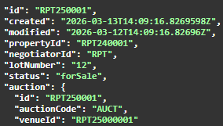

# Desktop


The Desktop API is not available during the Beta period.



To obtain a copy of Reapit's Agency Cloud CRM, you must be sponsored by a Reapit Client.


### Overview

Applications that are built on our Foundations Platform are able to communicate with Reapit's Agency Cloud CRM system. Using a well-defined API, you are able to trigger a wide variety of actions in our award-winning desktop application to augment your own applications and build a rich integration between systems.

_Note_ - apps cannot rely on cookies/local storage being available between separate instances of Agency Cloud.  Therefore any data which will need to be shared between separate sessions will need to be handled outside of these methods.

### URL Scheme

When a Marketplace application is launched and hosted within Agency Cloud, that application can interact with Agency Cloud by using our custom URI scheme. When a user triggers a link with an agencycloud: prefix, Agency Cloud will interpret that action and perform the corresponding action.

### Format

Links are structured in a REST style to provide a well-defined and descriptive mechanism for interacting with the screens and functionality that Agency Cloud offers. The primary and secondary screens that exist in the Agency Cloud user interface broadly map to the REST notion of resources and sub-resources. Some actions also accept parameters which can be applied to the URI in the usual manner. Full documentation of the available interactions is listed below, grouped by primary screen.

## Property

### Load Property

Opens the property edit screen for the property with specified id

```text
agencycloud://properties/{id}
```

### Perform Matching

Performs a property to applicant match for the applicant with specified id

```text
agencycloud://properties/{id}/match
```

### Load Journal

Opens the journal screen for the specified property

```text
agencycloud://properties/{id}/journal
```

### Load Offers

Opens the offers screen for the specified property

```text
agencycloud://properties/{id}/offers
```

### Property Search

Opens advanced search screen in property mode and runs a search with provided parameters. At least one parameter is required.

```text
agencycloud://properties?address=MK43&mode=s
```

<table>
  <thead>
    <tr>
      <th style="text-align:left">Parameter</th>
      <th style="text-align:left">Type</th>
      <th style="text-align:left">Description</th>
      <th style="text-align:left">Required</th>
    </tr>
  </thead>
  <tbody>
    <tr>
      <td style="text-align:left">name</td>
      <td style="text-align:left">string</td>
      <td style="text-align:left">A full or partial name fragment to search for</td>
      <td style="text-align:left">No</td>
    </tr>
    <tr>
      <td style="text-align:left">address</td>
      <td style="text-align:left">string</td>
      <td style="text-align:left">An address fragment to search for (eg. a postcode)</td>
      <td style="text-align:left">No</td>
    </tr>
    <tr>
      <td style="text-align:left">communication</td>
      <td style="text-align:left">string</td>
      <td style="text-align:left">An email address or phone number to search for</td>
      <td style="text-align:left">No</td>
    </tr>
    <tr>
      <td style="text-align:left">mode</td>
      <td style="text-align:left">string</td>
      <td style="text-align:left">
        <p>The marketing mode of the properties to search for:</p>
        <ul>
          <li>s or sales</li>
          <li>l or lettings</li>
        </ul>
      </td>
      <td style="text-align:left">Yes</td>
    </tr>
    <tr>
      <td style="text-align:left">appId</td>
      <td style="text-align:left">string</td>
      <td style="text-align:left">The GUID of the app to return the code of the selected property to (if
        not present then search will not return to an app)</td>
      <td style="text-align:left">No</td>
    </tr>
    <tr>
      <td style="text-align:left">appParam</td>
      <td style="text-align:left">string</td>
      <td style="text-align:left">The key to use in the query string when returning the property primary
        key to an app (required if appId is set)</td>
      <td style="text-align:left">No?</td>
    </tr>
  </tbody>
</table>## Applicants

### Load Applicant

Opens the applicant edit screen for the applicant with specified id

```text
agencycloud://applicants/{id}
```

### Perform Matching

Performs a applicant to applicant match for the applicant with specified id

```text
agencycloud://applicants/{id}/match
```

### Load Journal

Opens the journal screen for the specified applicant

```text
agencycloud://applicants/{id}/journal
```

### Applicant Search

Opens advanced search screen in applicant mode and runs a search with provided parameters. At least one parameter is required.

```text
agencycloud://applicants?name=smith&mode=lettings
```

<table>
  <thead>
    <tr>
      <th style="text-align:left">Parameter</th>
      <th style="text-align:left">Type</th>
      <th style="text-align:left">Description</th>
      <th style="text-align:left">Required</th>
    </tr>
  </thead>
  <tbody>
    <tr>
      <td style="text-align:left">name</td>
      <td style="text-align:left">string</td>
      <td style="text-align:left">A full or partial name fragment to search for</td>
      <td style="text-align:left">No</td>
    </tr>
    <tr>
      <td style="text-align:left">address</td>
      <td style="text-align:left">string</td>
      <td style="text-align:left">An address fragment to search for (eg. a postcode)</td>
      <td style="text-align:left">No</td>
    </tr>
    <tr>
      <td style="text-align:left">communication</td>
      <td style="text-align:left">string</td>
      <td style="text-align:left">An email address or phone number to search for</td>
      <td style="text-align:left">No</td>
    </tr>
    <tr>
      <td style="text-align:left">mode</td>
      <td style="text-align:left">string</td>
      <td style="text-align:left">
        <p>The marketing mode of the properties to search for:</p>
        <ul>
          <li>s or sales</li>
          <li>l or lettings</li>
        </ul>
      </td>
      <td style="text-align:left">Yes</td>
    </tr>
    <tr>
      <td style="text-align:left">appId</td>
      <td style="text-align:left">string</td>
      <td style="text-align:left">The GUID of the app to return the code of the selected property to (if
        not present then search will not return to an app)</td>
      <td style="text-align:left">No</td>
    </tr>
    <tr>
      <td style="text-align:left">appParam</td>
      <td style="text-align:left">string</td>
      <td style="text-align:left">The key to use in the query string when returning the property primary
        key to an app (required if appId is set)</td>
      <td style="text-align:left">No?</td>
    </tr>
  </tbody>
</table>## Appointments

### Load Diary

Opens the diary screen to provide a calendar view of appointments for the given date range. The dates don’t need to be set, but if you set one, you need to set both. If you don’t set a date range then the current default dates for the negotiator will be used.

```text
agencycloud://appointments?dateFrom=2019/12/25&dateTo=2019/12/26
```

| Parameter | Type | Description | Required |
| :--- | :--- | :--- | :--- |
| dateFrom | date | Only display appointments scheduled after and including this date | No |
| dateTo | date | Only display appointments scheduled before this date | No |

## Contacts

### Contact Search

Opens advanced search screen in contact mode and runs a search with provided parameters. At least one parameter is required.

```text
agencycloud://contacts?name=smith
```

| Parameter | Type | Description | Required |
| :--- | :--- | :--- | :--- |
| name | string | A full or partial name fragment to search for | No |
| address | string | An address fragment to search for \(eg. a postcode\) | No |
| communication | string | An email address or phone number to search for | No |
| appId | string | The GUID of the app to return the code of the selected contact to \(if not present then search will not return to an app\) | No |
| appParam | string | The key to use in the query string when returning the contact primary key to an app \(required if appId is set\) | No? |

### Load Contact

Opens the contact edit screen for the contact with specified id

```text
agencycloud://contacts/{id}
```

### Load Journal

Opens the journal screen for the specified contact

```text
agencycloud://contacts/{id}/journal
```

## Agency Cloud Interaction API

### Overview

Not only can Applications built on the Foundations Platform trigger events in the Agency Cloud CRM system, but installed apps can also be associated with common actions in Agency Cloud to replace the default behaviour.

The most common way that this will manifest itself is by replacing a screen in Agency Cloud with an application. For example if you want to use an App to manage all of your AML and ID checking then you can associate the app with this action in Agency Cloud and every time you click to launch the ID check screen, the associated App will be presented instead.

All apps should be able to be launched from the Installed Apps screen and be ran standalone without the need to be linked to an action. They will just be hosted in the marketplace and launched in Agency Cloud – for example the Geo Diary application.

### Desktop Types

To be able to associate an application with an action in Agency Cloud the application will need to be given a desktop type. This will be required so that Agency Cloud can be confident of the way the application will behave and that the application is agreeing to accept certain parameters when launched.  These parameters will be available inside the **`window.__REAPIT_MARKETPLACE_GLOBALS__`** javascript object which is used to identify that a page is in _Desktop_ mode.

For example – an AML or ID checking app will need to be able to accept a parameter in the dictionary with a key of **cntCode** which tells the application which contact to show the ID checks for.

There are currently seven supported application desktop types which are based on the most commonly customised parts of Agency Cloud.  This list will be extended as we learn what apps developers are building;

* Property
* Applicant
* ID Check
* Property Marketing Information
* Vendor Marketing Report
* Property Detail Generation \(print wizard\)
* Applicant Export

## Types

### Property

The type of _Property_ will be given to an application that can be launched for a specific property from Agency Cloud. The globals dictionary will contain the below key when launched by agency cloud for a specific property:

```text
{ "prpCode": "ABC200123" }
```

| Parameter | Type | Description | Required |
| :--- | :--- | :--- | :--- |
| prpCode | string | The primary key of the property to load the application for \(note that this won’t be present when the app loads from the marketplace, but the app needs to be able to accept this parameter when it is launched via the desktop type route\). | Yes |

When an app with a type of Property is installed then an Apps menu will appear on the Property screen.  Clicking on an app will launch it with the property code.


### Applicant

The type of _Applicant_ will be given to an application that can be launched for a specific applicant from Agency Cloud. The globals dictionary will contain the below key when launched by agency cloud for a specific property:

```text
{ "appCode": "ABC200123" }
```

| Parameter | Type | Description | Required |
| :--- | :--- | :--- | :--- |
| appCode | string | The primary key of the applicant to load the application for \(note that this won’t be present when the app loads from the marketplace, but the app needs to be able to accept this parameter when it is launched via the desktop type route\). | Yes |

When an app with a type of Applicant is installed then an Apps menu will appear on the Applicant screen.  Clicking on an app will launch it with the applicant code.


### Id Check

The type of _ID Check_ will be given to an application that can be used to replace the ID Check screen in Agency Cloud. The globals dictionary will contain the below key when launched by agency cloud for a specific contact:

```text
{ "cntCode": "ABC20012345" }
```

| Parameter | Type | Description | Required |
| :--- | :--- | :--- | :--- |
| cntCode | string | The primary key of the contact to load the ID checks for \(note that this won’t be present when the app loads from the marketplace, but the app needs to be able to accept this parameter when it is launched via the desktop type route\). | Yes |

This desktop type will take affect in Agency Cloud when the following button is clicked \(this will be seen on various screens, for example contact and applicant\).


### Property Marketing Information

The type of _Property Marketing Information_ can be given to an application that can replace the standard property marketing screen in Agency Cloud. This is the most commonly customised screen in Agency Cloud as it allows clients the opportunity to store bespoke information for their busness.  The globals dictionary will contain the below key when launched by agency cloud for a specific property:

```text
{ "prpCode": "ABC201023" }
```

| Parameter | Type | Description | Required |
| :--- | :--- | :--- | :--- |
| prpCode | string | The primary key of the property to load the marketing information app for \(note that this won’t be present when the app loads from the marketplace, but the app needs to be able to accept this parameter when it is launched via the app association route\). | Yes |

An application of this type can be launched from the Marketing button on the property screen in Agency Cloud:



### Vendor Marketing Report

The type of _Vendor Marketing Report_ can be given to an application that can produce a customised Vendor Marketing Report. This is also one of the most commonly customised areas of Agency Cloud as different agents have different requirements for how their vendor marketing reports should look.  The globals dictionary will contain the below key when launched by agency cloud for a specific property:

```text
{ "prpCode": "ABC201023" }
```

| Parameter | Type | Description | Required |
| :--- | :--- | :--- | :--- |
| prpCode | string | The primary key of the property to generate the report for \(note that this won’t be present when the app loads from the marketplace, but the app needs to be able to accept this parameter when it is launched via the app association route\). | Yes |

An application of this type can be launched from the Applicant Interest and Reports screen in Agency Cloud \(launched from the Property Journal window\):


### Property Detail Generation

The type of _Property Detail Generation_ can be given to an application that can replace the standard details template generation and brochure ordering process. This application could allow selection of a template as defined in the application – selection of pictures to include, what paper size to print the brochures on etc.  The globals dictionary will contain the below key when launched by agency cloud for a specific property:

```text
{ "prpCode": "ABC201023" }
```

| Parameter | Type | Description | Required |
| :--- | :--- | :--- | :--- |
| prpCode | string | The primary key of the property to load generate the brochures for \(note that this won’t be present when the app loads from the marketplace, but the app needs to be able to accept this parameter when it is launched via the app association route\). | Yes |

An application of this type can be launched from the Property Details screen in Agency Cloud:


### Applicant Export

The category of _Applicant Export_ would enable an application to be used to export the details of an applicant to a separate system.  The globals dictionary will contain the below key when launched by agency cloud for a specific property:

```text
{ "appCode": "ABC201023" }
```

| Parameter | Type | Description | Required |
| :--- | :--- | :--- | :--- |
| appCode | string | The primary key of the applicant to export \(note that this won’t be present when the app loads from the marketplace, but the app needs to be able to accept this parameter when it is launched via the app association route\). | Yes |

An application of this type would be triggered in two ways from Agency Cloud:

1. Upon first save of the applicant
2. As an option when clicking Print on the applicant screen:


