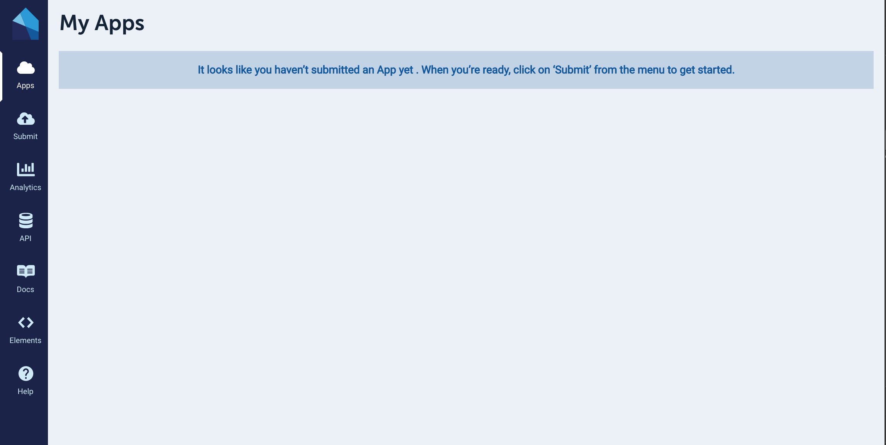
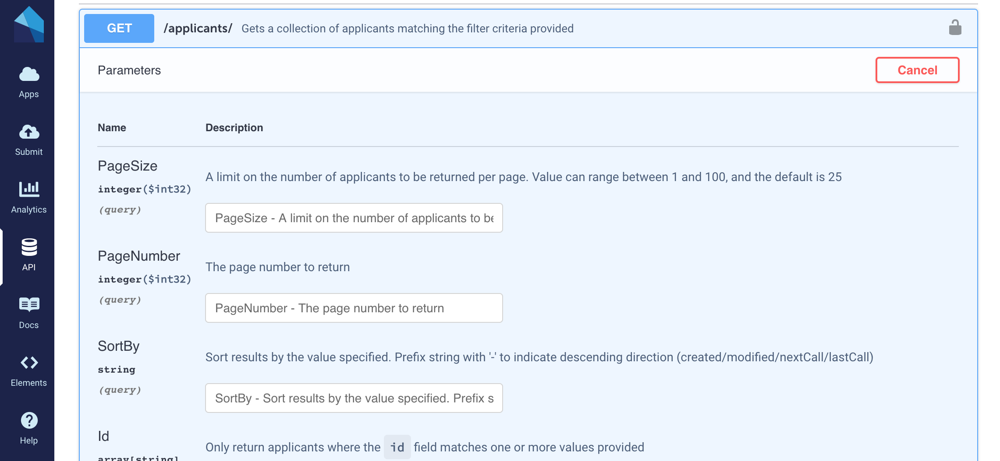
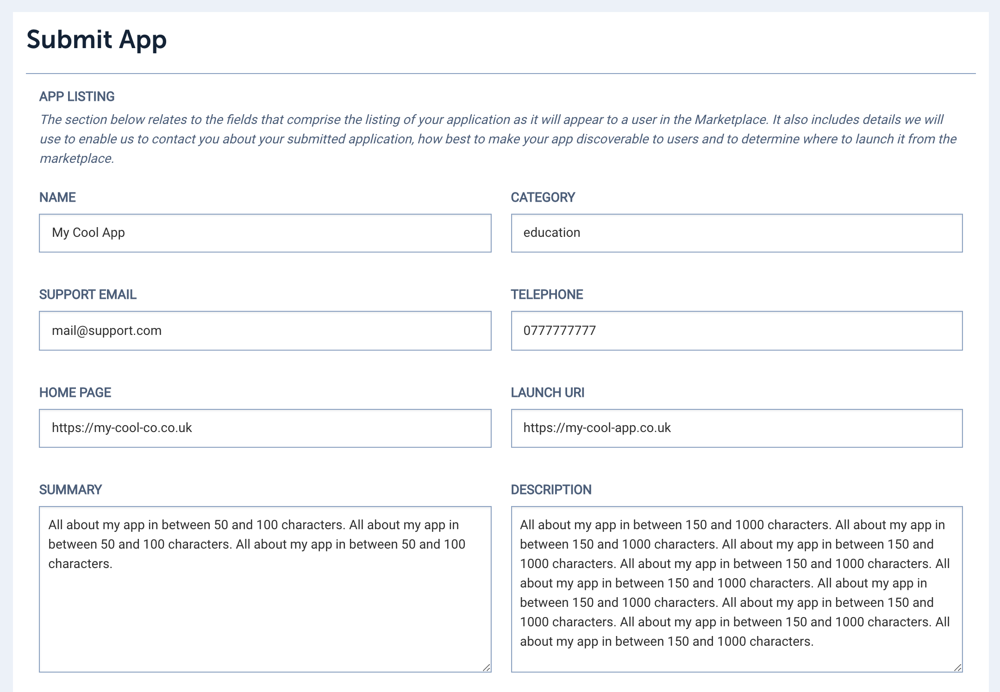
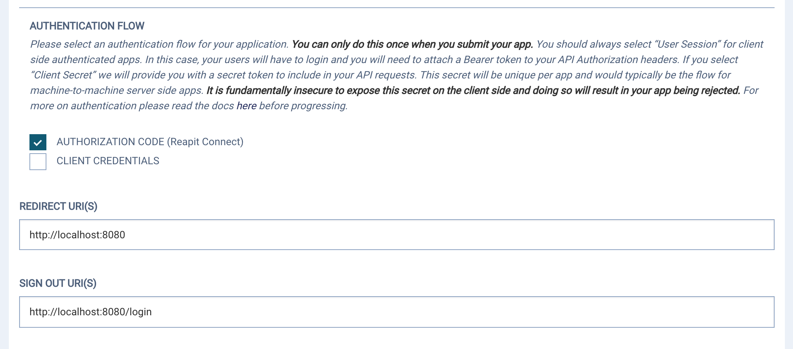
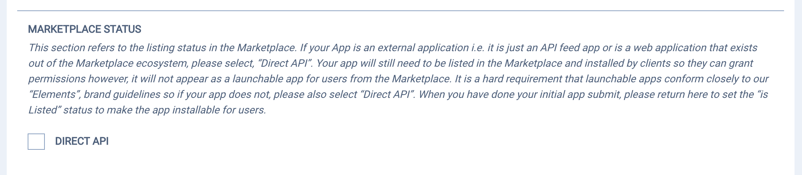
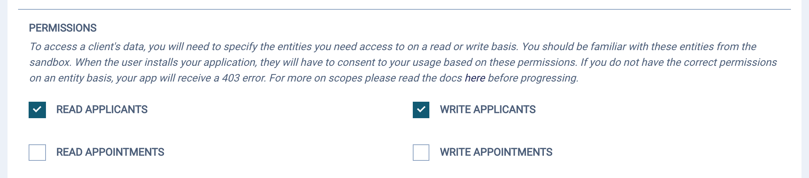

# Developer Portal

We want getting started with the Developer Portal to be as frictionless as possible. There is a lot of detail in the documentation for advanced concepts but to get started in as little as 5mins with an authenticated marketplace app, you just need to follow these steps:

### 1. Login to the Portal

You will receive an email with a link to the developer portal and temporary login credentials. The app will redirect you to the [Reapit Connect](reapit-connect.md) login screen and then back to the authenticated portal. 

The first screen you will see is the apps page which initially will be empty:

When you are in the portal, navigate to the API tab on the left hand side menu. 

### 2. Choose an API

Assuming you have an idea of the data types / entities you are interested in, ensure that the endpoints you need are available in the platform by "trying out" the API explorer. 

For the purposes of this example my app will need Applicant data. Don't worry if you find you need other endpoints later, you can add them at any time.

### 3. Register an app

The next step is to register an app. We understand you won't have any code yet, this is all about setting up a client to work with the API.

The first step is to upload the listing details of your app. Eventually they will be the client facing details of your application in the marketplace.

You then need to select an authentication flow. For web apps this is always "Authorization Code", since you will need your users to login via our OAuth service, Reapit Connect. You will need to register a main authenticated url for your app for Connect to return to, and a logout url for unauthenticated users.

Then select an icon and some screengrabs for your app listing...

...this step is for server side apps only and should be skipped...

...then select the OAuth scopes you need for your app to work. They must map to the endpoints you selected at point two above.

Finally, submit the form and you will return via a success message to the Apps page where you will see your registered application.

It is important to note, the app is not live yet, both because as we in developer beta only and because to set the live status, you need to edit your app and set the 'listed' status for approval. This behaviour is out of scope for this document.

### 4. Get your Client Id

From the apps screen above, you will need to obtain your application's client id to auth

### 5. Scaffold your app

### **6. Write some code!**

