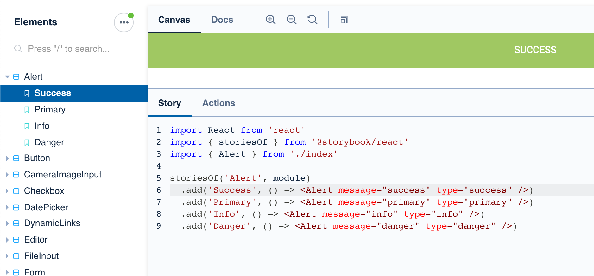
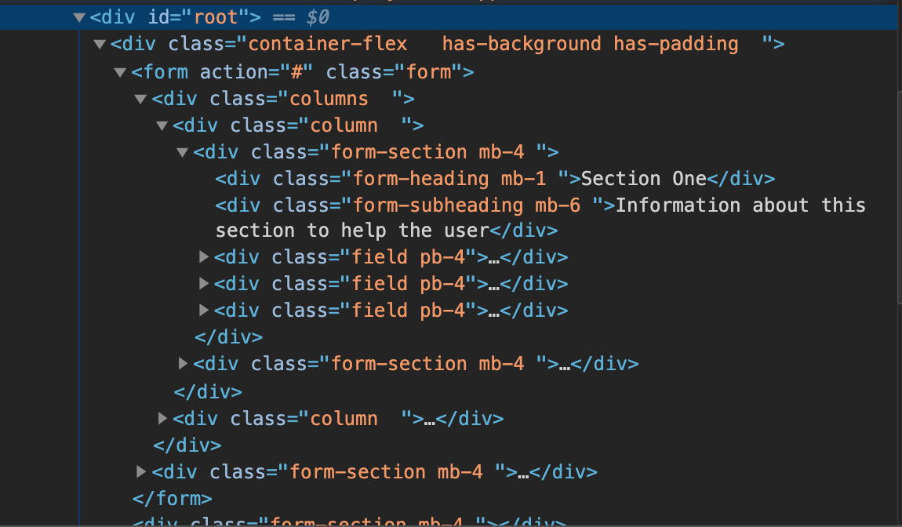
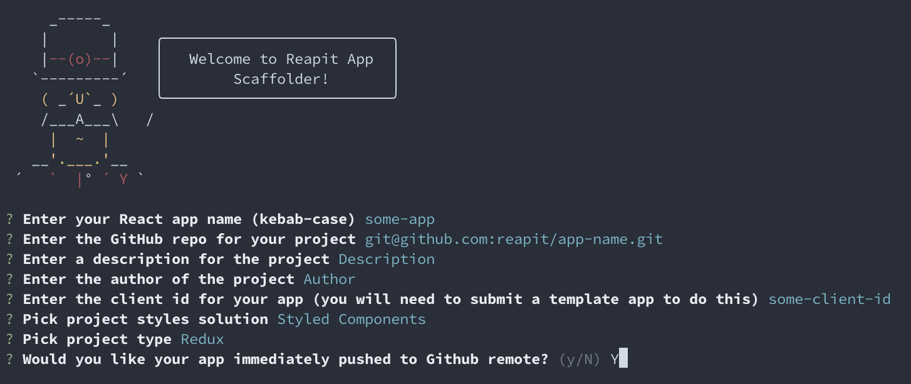

# Web

## Elements

Elements is a React UI Component and utility library we have developed internally and open sourced. The Developer Portal and Marketplace itself uses Elements extensively and if you are building a React app to be installed by clients, we recommend you do too.

The styles are based on the excellent [Bulma UI](https://bulma.io/) library to provide sensible base defaults for common patterns. Although the components themselves are based on React, the project exports a regular stylesheet you can import as normal and markup in your preferred templating language see "What if I don't use React" below.

In the future, we plan to move away from Bulma to use entirely in-house styles, supporting both Styled Components \(React CSS in JS\) and vanilla CSS. You can keep a track of Elements v2 progress against [this milestone](https://github.com/reapit/foundations/milestone/8).

As well as React Components, we also export a number of useful utilities like form validators, date-time helpers and a HTTP fetch module.

### Basic Usage

In your terminal, execute;

`yarn add @reapit/elements`

Then insert the stylesheet, either as an import into another stylesheet;

```css
@import '~@reapit/elements/dist/index.css';
```

Or into the head of your document in the normal way.

Then in your code you can either import a component with ES Modules;

```javascript
import { H1, Alert } from '@reapit/elements'
```

Or, using CommonJS

```javascript
const { H1, Alert } = require('@reapit/elements')
```

Then you can use the tags in your code as regular React Components;

```jsx
export const MyCoolComponent = () => {
    return (
        <>
            <H1>Heading!</H1>
            <Alert message="Success!" type="success"/>
        </>
    )
}
```

### Storybook: Code as documentation

All of the Elements modules are rendered out using [React Storybook](https://storybook.js.org/) and hosted inside the [Developer Portal](https://marketplace.reapit.cloud/developer/elements). If you are not familiar with Storybook as a tool, it allows the developer to interact in live time with the pre-rendered components and their variants. You can adjust the code and see how they behave in live time, as well as providing copy-paste snippets to insert into your project.

When using Storybook, you can toggle between code examples and rendered output of components by using the ‘Canvas’ and ‘Docs’ tabs. You should also toggle the "Show add ons" option from the menu to render the code below the components, and it's variants see below:



In addition to Storybook, because we have used TypeScript throughout out estate, each of our modules ships with TS definitions for free. If you use TypeScript, this is clearly a big help but even if you don't modern IDEs like VSCode will give you intelligent hints about prop types and parameters as you code.

### What if I don't use React?

Although we use React heavily at Reapit and we recommend using our tooling as the most frictionless way of building marketplace apps, we understand that it will not work for everyone.

You can still import the stylesheet as above, and simply apply same markup and selectors in the [Bulma documentation](https://bulma.io/) in most cases. Where we have made exceptions, or written custom CSS, you can inspect Storybook and apply classes as they appear in the DOM tree.



We have deliberately not diverted from Bulma's conventions where possible and where we have, we have tried to follow sensible naming conventions and predictable markup.

## Cognito Auth

Authentication with OAuth and AWS Cognito, although extensively documented can be tricky to navigate. This becomes particularly difficult when establishing a seemless authenticated journey between apps with differing client Ids and therefore scopes \(permissions\). Before progressing, please read the comprehensive documentation on [Reapit Connec](reapit-connect.md)t, our OAuth service.

The purpose of the Cognito Auth package is to make this process a little easier by offering a thin wrapper around the AWS SDK and OAuth protocol, with full out the box integration with our in house [React App Scaffolder.](web.md#react-app-scaffolder)

### Authenticating Your App

`yarn add @reapit/cognito-auth`

With the package installed, you can then import the methods using ES6 Modules or Common JS

```javascript
import { RefreshSession } from '@reapit/cognito-auth' 

// or

const { RefreshSession } = require('@reapit/cognito-auth')
```

In a typical app, you will need to do four things;

1. Establish an OAuth user session in Cognito.
2. Accept an authentication code from OAuth.
3. Exchange the code for an access token, refresh token and id token.
4. Maintain the session in the browser, refreshing it as the access token expires.

The first issue is quite simple, render a button that redirects you to the Reapit Connect login screen. The login handler tells Cognito what my client id is \(from the process.env object in this case\), and the URL I have registered to redirect back to; in this case `window.location.origin`. You can see an example of this [here.](https://github.com/reapit/foundations/blob/master/packages/geo-diary/src/components/pages/login.tsx)


Although the links to our codebase refer to React apps, the cognito-auth module is totally agnostic of technology - they are just regular JavaScript methods.


```jsx
import { redirectToLogin } from '@reapit/cognito-auth'

const loginHandler = () =>
  redirectToLogin(
    process.env.COGNITO_CLIENT_ID,
    `${window.location.origin}`
  )

//...
<Button type="button"
  onClick={loginHandler}
  loading={false}
  variant="primary"
  disabled={false} 
  fullWidth
>
    Login
</Button>
//...
```

After a successful login, I can move to step 2, accepting an auth code from my redirect.

In my redirect route, I will need to capture the token with the `getTokenFromQueryString` method and store it for exchange. You can see an example of our private route wrapper [here.](https://github.com/reapit/foundations/blob/master/packages/geo-diary/src/core/private-route-wrapper.tsx)

```javascript
import { getTokenFromQueryString } from '@reapit/cognito-auth'

// Within my private component
const cognitoClientId = process.env.COGNITO_CLIENT_ID
const refreshParams = getTokenFromQueryString(location.search, cognitoClientId)

if (refreshParams && !hasSession) {
  // A redux action in this example, but any place you want to store the refresh
  // session will work eg a cookie or localstorage
  setRefreshSession(refreshParams)
  return null
}
```

`getTokenFromQueryString` will return an object that implements the following interface:

```typescript
export interface RefreshParams {
  cognitoClientId: string
  loginType: LoginType
  mode: LoginMode
  redirectUri: string | null
  authorizationCode: string | null
  refreshToken: string | null
  userName: string | null
  state: Object | null
}
```

It is this object we use for ongoing authentication - at this point I can either use my `refreshParams` directly, or leverage a Redux update to perform the token exchange. We store it in a reducer [here](https://github.com/reapit/foundations/blob/master/packages/geo-diary/src/reducers/auth.ts) where it can be referenced in the code or fetched from a cookie in the default state.

```typescript
import { getSessionCookie } from '@reapit/cognito-auth'

export const defaultState = (): AuthState => {
  const refreshSession = getSessionCookie(COOKIE_SESSION_KEY)
  return {
    error: false,
    loginSession: null,
    refreshSession,
  }
}
```

When I next hit my private route, the `hasSession` flag is set to true and I can load my component. When I need to authenticate against the API, I simply call a method called `getSession` that will handle all the business logic to manage, code for token exchange \(point 3\), and when my session expires, refreshing the access token. You can see the below example in action [here.](https://github.com/reapit/foundations/blob/master/packages/geo-diary/src/utils/session.ts)

```typescript
import { authLoginSuccess, authLogout } from '@/actions/auth'
import { getSession } from '@reapit/cognito-auth'
import { COOKIE_SESSION_KEY_GEO_DIARY } from '@/constants/api'

export const getAccessToken = async ({ loginSession, refreshSession }): Promise<string | null> => {
  // Call get session with my current login session if I have one, my refresh session
  // from the last step and my unique cookie key, a constant
  const session = await getSession(loginSession, refreshSession, COOKIE_SESSION_KEY)

  // Returns a new session, sets to store, returns the access token I need for my
  // API call and so the process continues
  if (session) {
    // call my success method
    authLoginSuccess(session)
    return session.accessToken
  }

  // I did not receive a session, call my logout method
  authLogout()
  return null
}
```

An example usage for the above method, to get a token for use in an API request would look like;

```typescript
import { getAccessToken } from '@/utils/session'
import { APPOINTMENTS_HEADERS, API_VERSION } from '@/constants/api'

export const getHeaders = async () => ({
  ...APPOINTMENTS_HEADERS,
  'Authorization': `Bearer ${await getAccessToken()}`,
  'api-version': API_VERSION,
})
```

Back in my private route, I have a further case to handle. In some cases, I am an authenticated user but I haven't come from the login screen. Typically, this when I am navigating from app to app eg Marketplace to my app and back. In this case, we use the `redirectToOauth` method to return a code if I am successfully authenticated or redirect to login if not.

```typescript
import { redirectToOAuth } from '@reapit/cognito-auth'

if (!hasSession) {
  redirectToOAuth(cognitoClientId)
  return null
}
```

In this example, I would get a code in the redirect url I can exchange for a token and continue.

Finally, we export a logout method which will log you out in Congnito and re-route you back to your app, typically to the login screen at point one. See below for an example:

```typescript
import { redirectToLogout, removeSession } from '@reapit/cognito-auth'

export const doLogout () => {
  // Delete my local session cookie
  removeSession(COOKIE_SESSION_KEY)
  // Then redirect to OAuth, passing in my client id and my return url.
  redirectToLogout(
    process.env.COGNITO_CLIENT_ID,
    `${window.location.origin}/login`
  )
}
```

## Foundations TS Definitions

Develop in TypeScript against the Reapit Foundations Platform with confidence

If you are using TypeScript \(and we recommend you do!\), for your front end project, we provide full type definitions for the API documented in the [API explorer](https://github.com/reapit/foundations-documentation/tree/db0718c9be27b7760dfae34e69518806acf0e855/developer/swagger/README.md).

We generate these types from the Swagger contracts direct with a daily CRON job, so you can be sure that when the API changes, your types will be updated too. This allows for a much closer alignment between front and back end development, with compile time feedback on definition changes.

Ultimately this should lead to more robust applications.


The definitions are updated automatically when the API changes. As such, it is recommended strongly that you match by date stamp the correct version of the definitions to the API version you are using in your headers.


### Usage:

For the latest version;

`yarn add @reapit/foundations-ts-definitions`

For a version tied to your API version;

`yarn add @reapit/foundations-ts-definitions@2020-02-10`

Then import the required type into your code with ES6 Modules or CommonJS. The naming maps directly to the model names in the API Explorer in the developer portal.

```javascript
import { AppModel } from '@reapit/foundations-ts-definitions'

// Or

const { AppModel } = require('@reapit/foundations-ts-definitions')
```

## React App Scaffolder

A CLI application to get you started in the Reapit Marketplace with sensible but opinionated tooling and authentication out the box. The scaffolder asks for some basic meta information about your app then using templates generates an app based on the flavour of React you prefer.

Currently we support;

* **State Management:** Redux or React Hooks / Context
* **Styled Components:** Either Styled Components or CSS / Sass Modules

Coming soon... Apollo GraphQL version!

The app will be authenticated against Reapit Connect out the box and a basic logical skeleton flow for your app is provided. You also get Elements and in house scripts, unit tests, TS Definitions and other tooling for free.

### Usage

First install globally both Yeoman and React App Scaffolder itself.

`npm install yo @reapit/generator-react-app-scaffolder@latest -g`

You may need to run this with the `sudo` prefix depending on your OS.

Then;

`yo @reapit/react-app-scaffolder`

This will launch the scaffolder with the following options:



When you have selected the correct config for you, your app will build, install dependencies and start a server on `localhost:8080` . You will then be prompted to enter your developer credentials at the Reapit Connect screen to get started.

## Config Manager

Config manager is a convenience script used for managing configuration for applications in AWS Parameter Store. It is very basic but gives a simple CLI interface for performing fetch operations on your parameter store or sensitive config.

### Usage

You must have valid AWS IAM credentials in your current bash / zsh profile specifically, in the following format:

`export AWS_ACCESS_KEY_ID="<<SOME_ID_HERE>>"`

`export AWS_SECRET_ACCESS_KEY="<<SOME_KEY_HERE>>"`

You can then install to your project with;

`yarn install @reapit/config-manager --dev`

The project exports methods;

* `fetchConfig` Fetches a secret by name and outputs to a local JSON file called `config.json` at the root of your package. Example:

```
{
  "appEnv": "development",
  "sentryDns": "",
  "marketplaceApiUrl": "",
  "marketplaceApiKey": "",
  "uploadApiUrl": "",
  "swaggerUrl": "",
  "elementDocumentUrl": "",
  "cognitoClientId": "",
  "googleAnalyticsKey": "",
  "cognitoOAuthUrl": "",
  "cognitoUserPoolId": "",
  "chatbotAppId": ""
}
```


Be sure to add the reapit-config.json file to your .gitignore to avoid committing sensitive info


Usage of all methods is in the following format:

`yarn config-manager <<methodName>> <<parameter-store-name>>`

For create/update/delete config. Please go to AWS console > Systems Manager > Parameter Store

## Web Components

In addition to the Elements React component toolkit, Reapit will soon be offering a number of other downloadable Front End Resources.

These may be modular blocks of functionality that can be embedded within your site, toolsets or even CMS friendly bundles of scripts available elsewhere. The guiding principles of the project is that the components should be standalone, highly customisable and lightweight.

They are served both as NPM packages and as downloadable scripts from our CDN.

These are under active development by our team with an Alpha release in the coming months. You can check on progress [here.](https://github.com/reapit/foundations/milestone/6)

### Search Component

Coming soon...

### Book a Valuation Component

Coming soon...

