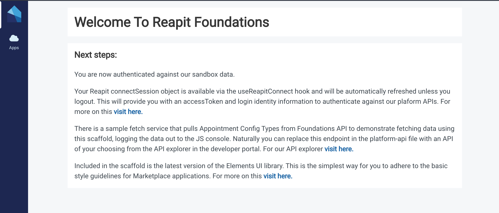

# Create React App Template

The fastest way to get started building a Reapit AppMarket App is with our [Create-React-App](https://create-react-app.dev/) template. This package extends the functionality offered by the Facebook CLI and React Scripts whilst adding Reapit Specific packages for AppMarket development. Out of the box you will have an app that;

* Is authenticated against our Platform API using Reapit Connect and Connect Session
* Has the Elements UI library installed with basic containers and a menu
* Has a login and private protected route
* Has an example API call fetching data from the Platform
* Includes TypeScript, Platform Type Definitions, and Unit Tests

### Usage

First execute 

`npx create-react-app <<your-app-name-here>> --template @reapit/cra-template-foundations`

Open the project in your text editor and insert your Reapit Connect ClientId from the Developer Portal along with the  production `connectUserPoolId,` `eu-west-2_eQ7dreNzJ` into the config file located at:

`src/reapit.config.json`

CD into your project directory and run `yarn start` or any of the CRA standard commands eg `yarn build` `yarn test`

On running `yarn start` your app will load at `http://localhost:8080,` you will first be re-directed to log in to Reapit Connect if you don't already have a session, then will return back authenticated to a landing page. 

You should have everything there to get off the ground and immediately be productive on the platform!

