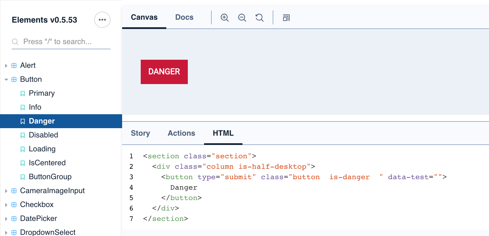

# Elements

### What is Elements?

Elements is a React UI Component and utility library we have developed internally and open sourced. The Developer Portal and Marketplace itself uses Elements extensively and if you are building a React app to be installed by clients, we recommend you do too.

Click the link below to visit the elements standalone site. More on this in the "Storybook" section below.



The styles are based on the excellent [Bulma UI](https://bulma.io/) library to provide sensible base defaults for common patterns. Although the components themselves are based on React, the project exports a regular stylesheet you can import as normal and markup in your preferred templating language see "What if I don't use React" below.

### Basic Usage

In your terminal, execute;

`yarn add @reapit/elements`

Then insert the stylesheet, either as an import into another stylesheet;

```css
@import '~@reapit/elements/dist/index.css';
```

Or into the head of your document in the normal way.

Then in your code you can either import a component with ES Modules;

```javascript
import { H1, Alert } from '@reapit/elements'
```

Or, using CommonJS

```javascript
const { H1, Alert } = require('@reapit/elements')
```

Then you can use the tags in your code as regular React Components;

```jsx
export const MyCoolComponent = () => {
    return (
        <>
            <H1>Heading!</H1>
            <Alert message="Success!" type="success"/>
        </>
    )
}
```

As well as React Components, we also export a number of useful utilities like form validators, date-time helpers and a HTTP fetch module.

### Storybook: Code as documentation

All of the Elements modules are rendered out using [React Storybook](https://storybook.js.org/) and hosted on a [standalone sit](https://elements.reapit.cloud)e. If you are not familiar with Storybook as a tool, it allows the developer to interact in live time with the pre-rendered components and their variants. You can adjust the code and see how they behave in live time, as well as providing copy-paste snippets to insert into your project.

When using Storybook, you can toggle between code examples and rendered output of components by using the ‘Canvas’ and ‘Docs’ tabs. You should also toggle the "Show add ons" option from the menu to render the code below the components, and it's variants see below:


In addition to Storybook, because we have used TypeScript throughout out estate, each of our modules ships with TS definitions for free. If you use TypeScript, this is clearly a big help but even if you don't modern IDEs like VSCode will give you intelligent hints about prop types and parameters as you code.

### What if I don't use React?

Although we use React heavily at Reapit and we recommend using our tooling as the most frictionless way of building marketplace apps, we understand that it will not work for everyone. As such our Elements Storybook also supports a vanilla HTML and CSS version, derived from the React JSX markup.

As a non-React developer you should still import the stylesheet as above, and simply apply the classes to your markup as displayed in the HTML tab in each Storybook component as per below:



You can also selectors in the [Bulma documentation](https://bulma.io/) in most cases. We have deliberately not diverted from Bulma's conventions where possible and where we have, we have tried to follow sensible naming conventions and predictable markup.

### Future Development

We are now at the first stable milestone release of Elements v1.0.x. By using the package, we will guarantee security patches and a stable API with no breaking changes for the foreseeable future.

For version 2 of Elements, there will be a ground up re-write to address feedback from our Beta developer partners. Changes will include;

* A much lighter weight solution, shipping significantly less JS and CSS
* Better documentation, with interactive components powered by Gatsby
* Better non-React support, with markup-only users supported as first class citizens of the documentation
* Simpler, more predictable API with more utility classes to allow greater flexibility

You can keep a track of Elements v2 progress against [this milestone](https://github.com/reapit/foundations/milestone/8).


