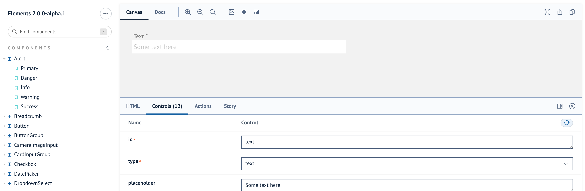

# Elements

### What is Elements?

Elements is a React UI Component and CSS library we have developed internally and open sourced. The Developer Portal and Marketplace itself uses Elements extensively and if you are building a React app to be installed by clients, we recommend you do too.

Elements v3 is a full re-write of the library that has a far better developer experience and a more flexible, lightweight approach as well as enjoying the benefits of the new Reapit Foundations Design Language.


If you are starting a new project with Elements, use v3 for a better dev experience, documentation and support


Documentation for this package has moved to the dedicated UI tab in the Reapit Developer Portal and at the public link below to the elements standalone site.



If you are looking for Elements v2 components, this has moved to it's own Storybook here:




You can use Elements v3 components in your v2 project - for more information on this see the [migration guide here](https://elements.reapit.cloud/?path=/docs/introduction--page#migrating-from-v2)


### Elements v2 - Long Term Support


Elements v2 is our new stable long term support library - you can update from v1 to v2 with very minimal changes.


Whilst Elements v1.x.x has it's limitations, we are very mindful our developers have already successfully built a number of applications with the library and as such, require both a Long Term Support schedule and a straightforward upgrade path where possible.

Elements v2.x.x is a UI theme refresh, giving the style-guide a lift to ensure better visual consistency and appeal. The release includes a new font, typography, colour pallet, form inputs, notifications and dialogue boxes. Essentially in line with the changes you will see in the Reapit Developer Portal and Marketplace from March 2021 to April 2021.

Whilst we can't guarantee that you will have no work to do upgrading v1 to v2, we have taken care not to add any breaking changes to the TypeScript / React Components and generated CSS classes in the Elements Stylesheet. Upgrading should be a case of incrementing the version number from v1.x.x to v2.x.x, running an NPM install and making any small visual tweaks required to your application.

Whilst no future development in terms of features will be added to v2, we will endeavour to provide long term support and security patches for the foreseeable future and when the time comes to deprecate the version, several months runway to upgrade before LTS ends.

### v2 Usage

The documentation in the v2 Storybook is limited so it is worth reading this guide before using the v2 library.

The styles are based on the excellent [Bulma UI](https://bulma.io/) library to provide sensible base defaults for common patterns. Although the components themselves are based on React, the project exports a regular stylesheet you can import as normal and markup in your preferred templating language see "What if I don't use React" below.

All of the Elements modules are rendered out using [React Storybook](https://storybook.js.org/) and hosted on a [standalone sit](https://elements.reapit.cloud)e. If you are not familiar with Storybook as a tool, it allows the developer to interact in live time with the pre-rendered components and their variants. You can adjust the code and see how they behave in live time, as well as providing copy-paste snippets to insert into your project.

To get started, in your terminal, execute;

`yarn add @reapit/elements@2.1.0`

Then insert the stylesheet, either as an import into another stylesheet;

```css
@import '~@reapit/elements/dist/index.css';
```

Or into the head of your document in the normal way.

Then in your code you can either import a component with ES Modules;

```javascript
import { H1, Alert } from '@reapit/elements'
```

Or, using CommonJS

```javascript
const { H1, Alert } = require('@reapit/elements')
```

Then you can use the tags in your code as regular React Components;

```jsx
export const MyCoolComponent = () => {
    return (
        <>
            <H1>Heading!</H1>
            <Alert message="Success!" type="success"/>
        </>
    )
}
```

As well as React Components, we also export a number of useful utilities like form validators, date-time helpers and a HTTP fetch module.

### Storybook: Code as documentation

When using Storybook, you can toggle between code examples and rendered output of components by using the ‘Canvas’ and ‘Docs’ tabs.

For React users we recommend very strongly using the "Docs" tab since it will give you the available props for each component and because we use TypeScript, also their expected type definitions. It also exposes a new feature in Storybook - "Controls". Controls are a list of the available props that can be edited in live time to see the effect on the mounted component.

See the image below for an example of an input rendered out in "Docs" mode, with Controls enabled:


If you prefer the old canvas view, you can still use this with controls enabled:



And see the code that generates the Component in the "Story" tab:


In this view, you should also toggle the "Show add ons" option from the menu.

As stated previously, we have used TypeScript throughout out estate, so each of our modules ships with TS definitions for free. If you use TypeScript, this is clearly a big help but even if you don't modern IDEs like VSCode will give you intelligent hints about prop types and parameters as you code.

### What if I don't use React?

Although we use React heavily at Reapit and we recommend using our tooling as the most frictionless way of building marketplace apps, we understand that it will not work for everyone. As such our Elements Storybook also supports a vanilla HTML and CSS version, derived from the React JSX markup.

As a non-React developer you should navigate to the Canvas, HTML tab in each Storybook component as per below:


To use in your code, you would import the stylesheet as above, and simply apply the classes to your markup as displayed in the image above.

You can also selectors in the [Bulma documentation](https://bulma.io/) in most cases. We have deliberately not diverted from Bulma's conventions where possible and where we have, we have tried to follow sensible naming conventions and predictable markup.


