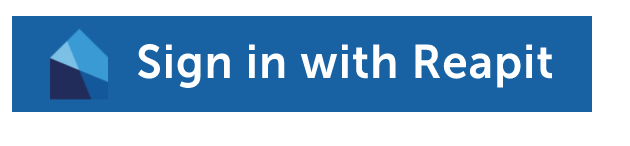

# Web Components

In addition to the Elements React component toolkit, Reapit will soon be offering a number of other distributed web components.

These may be modular blocks of functionality that can be embedded within your site, toolsets or even CMS friendly bundles of scripts available elsewhere. The guiding principles of the project is that the components should be standalone, highly customisable and lightweight. They are written in Svelte which compiles to Vanilla JS, CSS and HTML so are framework agnostic and can be used with any other front end tech of your choosing.

All web components are served both as NPM packages and as downloadable scripts from our CDN. These are under active development by our team with an Alpha release in the coming months. You can check on progress [here.](https://github.com/reapit/foundations/milestone/6)

### Sign In With Reapit

The first component we have shipped is a small but powerful "Sign In With Reapit" button. The button leverages the Connect Session to handle the OAuth flow and returns a session object in a callback you provide.



The Component is a single script served from our CDN, you instantiate with a target div, your client credentials as per the browser API and pass in a callback to receive your session object. As per the NPM module, all caching, redirection and refreshing is taken care of by the package. When you have a session, the button will change function to be a logout which will clear your cache and end your session in Reapit Connect.

The below example shows how to embed on any static or dynamic page with a single script. In the connectHasSessionCallback function we fetch a list of appointments from the Platform API to demonstrate the full flow. The  production `connectUserPoolId` is `eu-west-2_eQ7dreNzJ`.

```markup
<div id="reapit-connect-component"></div>
<script src="https://web-components.prod.paas.reapit.cloud/reapit-connect-component.js"></script>
<script>

  const connectHasSessionCallback = (reapitConnectBrowserSession) => {
    reapitConnectBrowserSession.connectSession().then(session => {
      console.log('Session is', session)
      fetch('https://platform.reapit.cloud/appointments', {
        headers: {
          'Content-Type': 'application/json',
          'Authorization': `Bearer ${session.accessToken}`,
          'api-version': '2020-01-31'
        }
      })
      .then(res => res.json())
      .then(appointments => console.log('Appointmemts are', appointments))
    })
  }

  ReapitConnectComponent && new ReapitConnectComponent({
    connectClientId: '<<clientId here>>>',
    connectUserPoolId: '<<userpool id here>>'
    connectOAuthUrl: 'https://connect.reapit.cloud',
    connectLoginRedirectPath: '',
    connectLogoutRedirectPath: '/login',
    connectContainerId: '#reapit-connect-component',
    connectHasSessionCallback
  })
</script>
```

### Search Component

Coming soon...

### Book a Valuation Component

Coming soon...

### Book a Viewing Component

Coming soon...

