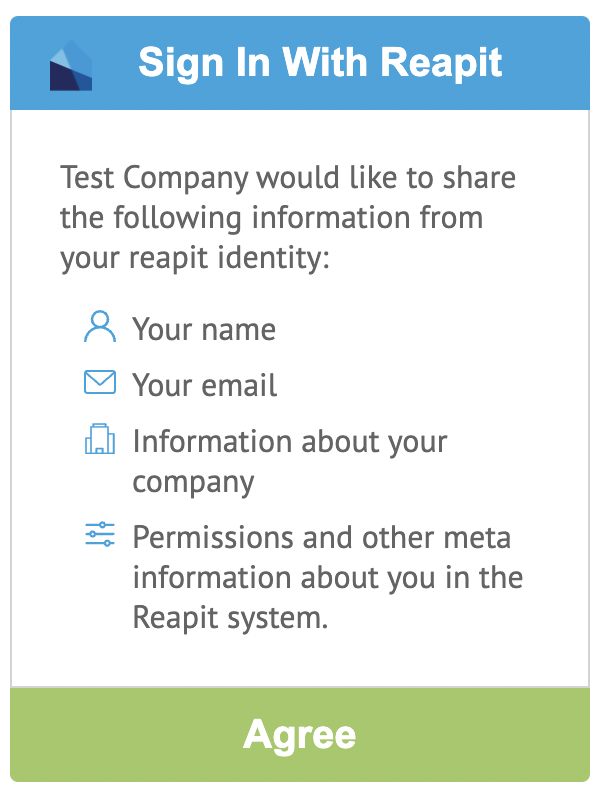

# Login With Reapit

The login With Reapit button is a singular stand alone component which can be utilised in any project on it's own. The component is written with Svelte which compiles Vanilla JS, CSS and HTML so are framework agnostic and be used with any other front end tech of your choosing.

### The Sign In With Reapit Button

The button leverages the Connect Session to handle the OAuth flow and returns a session object in a callback you provide.


The Component is a single script provided by NPM package, you instantiate with a target div, your client credentials as per the browser API and pass in a callback to receive your session object. As per the NPM module, all caching, redirection and refreshing is taken care of by the package. When you have a session, the button will change function to be a logout which will clear your cache and end your session in Reapit Connect.

### Agreeing to Permissions

When clicking the Sign In With Reapit button, a dialog window will appear with the following details




#### Yarn

Use the script tag below in your code base to use the ReapitConnectComponent.

```markup
yarn add @reapit/login-with-reapit
```

#### NPM

Install the `login-with-reapit` package using npm.

```bash
npm i --save @reapit/login-with-reapit
```

Below is an example of how to use the `ReapitConnectComponent` . In the connectHasSessionCallback function we fetch a list of appointments from the Platform API to demonstrate the full flow. The  production `connectUserPoolId` is `eu-west-2_eQ7dreNzJ`.

```markup
<div id="reapit-connect-component"></div>

<script>
  import { reapitConnectComponent } from '@reapit/login-with-reapit'
  
  const connectHasSessionCallback = (reapitConnectBrowserSession) => {
    reapitConnectBrowserSession.connectSession().then(session => {
      console.log('Session is', session)
      fetch('https://platform.reapit.cloud/appointments', {
        headers: {
          'Content-Type': 'application/json',
          'Authorization': `Bearer ${session.accessToken}`,
          'api-version': '2020-01-31'
        }
      })
      .then(res => res.json())
      .then(appointments => console.log('Appointments are', appointments))
    })
  }

  reapitConnectComponent && reapitConnectComponent({
    connectClientId: '<<clientId here>>>',
    connectUserPoolId: '<<userpool id here>>',
    connectOAuthUrl: 'https://connect.reapit.cloud',
    connectLoginRedirectPath: '',
    connectLogoutRedirectPath: '/login',
    rootElement: '#reapit-connect-component',
    connectHasSessionCallback,
    companyName: 'My Company',
  })
</script>
```
