# Developer Portal

We want getting started with the Developer Portal to be as frictionless as possible. There is a lot of detail in the documentation for advanced concepts but to get started in as little as 5 mins with an authenticated marketplace app, you just need to follow these steps:

### 1. Login to the Portal

You will receive an email with a link to the developer portal and temporary login credentials. The app will redirect you to the [Reapit Connect](api/reapit-connect.md) login screen and then back to the authenticated portal. 

The first screen you will see is a welcome wizard. You will only see this at the first login, although you can access from the help section later if you wish to revisit. It will walk you through some basic concepts when working with the developer portal.

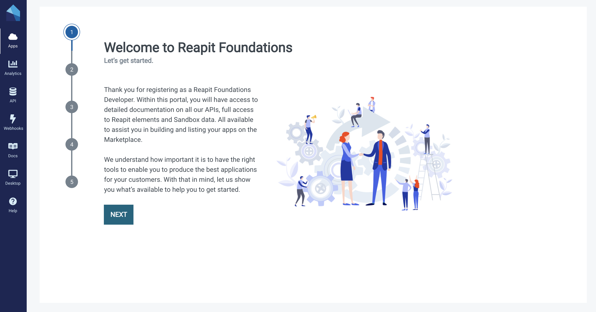

You will then see the "My Apps" page which will initially be empty. There is also a button in the top right hand corner to submit a new app. More on that at point 3 of this guide.

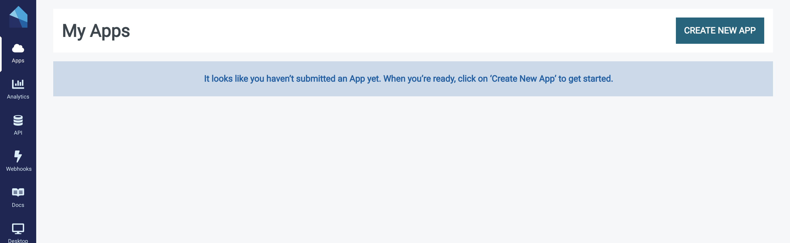

When you are in the portal, navigate to the API tab on the left hand side menu. 

### 2. Choose an API

Assuming you have an idea of the data types / entities you are interested in, ensure that the endpoints you need are available in the platform by "trying out" the API explorer. 

For the purposes of this example my app will need Applicant data. Don't worry if you find you need other endpoints later, you can add them at any time.

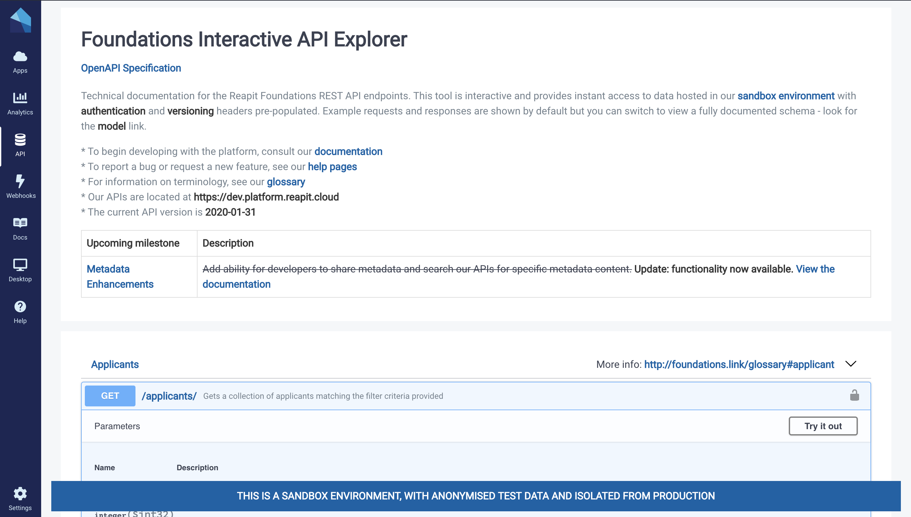

### 3. Register an app

The next step is to register an app. We understand you won't have any code yet, this is all about setting up a client to work with the API. Firstly click on the "create app" button on the apps page from step 1. This will load a wizard asking you for your application name. This can be edited later on.

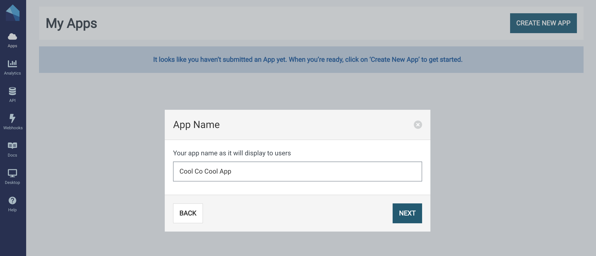

The wizard will then ask you if you want to create a Marketplace App. It is worth taking the time to consider here if you wish your application to be launched from within the Agency Cloud CRM. For the purposes of this example, we will assume that you do.

The next step is to provide routes for our OAuth service Reapit Connect to redirect back to your app. You can add production routes later but for now, we will add localhost for development.

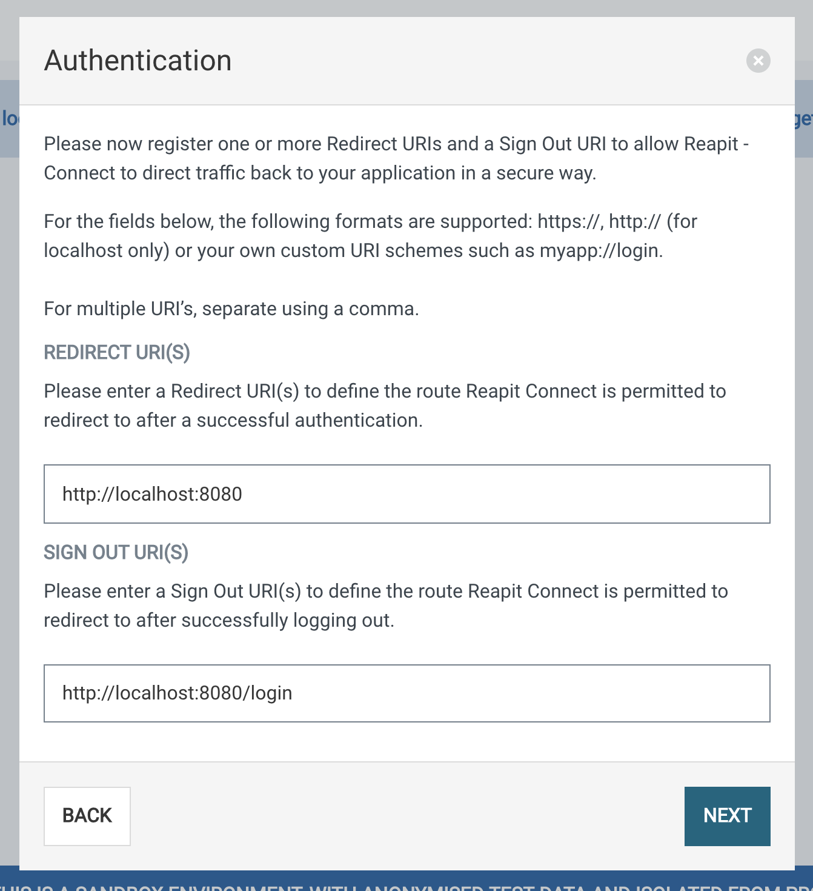

You will be then asked to select permissions that map directly to OAuth Scopes, and also the endpoints you selected at stage two of this guide.

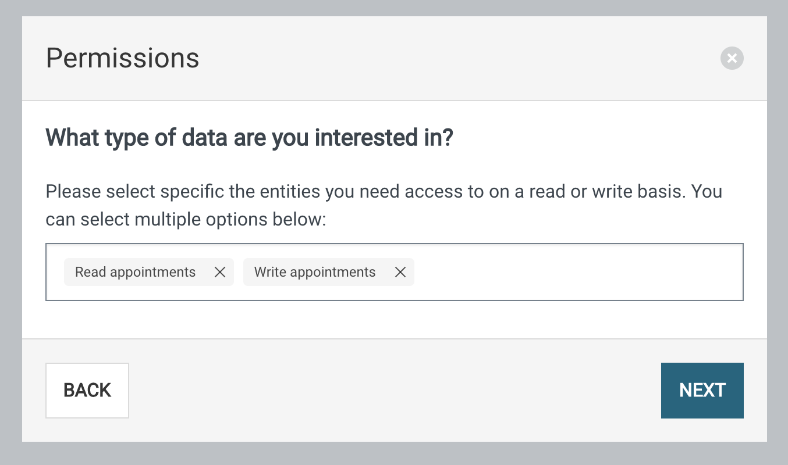

On completion of this step, your skeleton app will be generated and you will get your App Client Id. You will need this for authenticating via Reapit Connect OAuth.

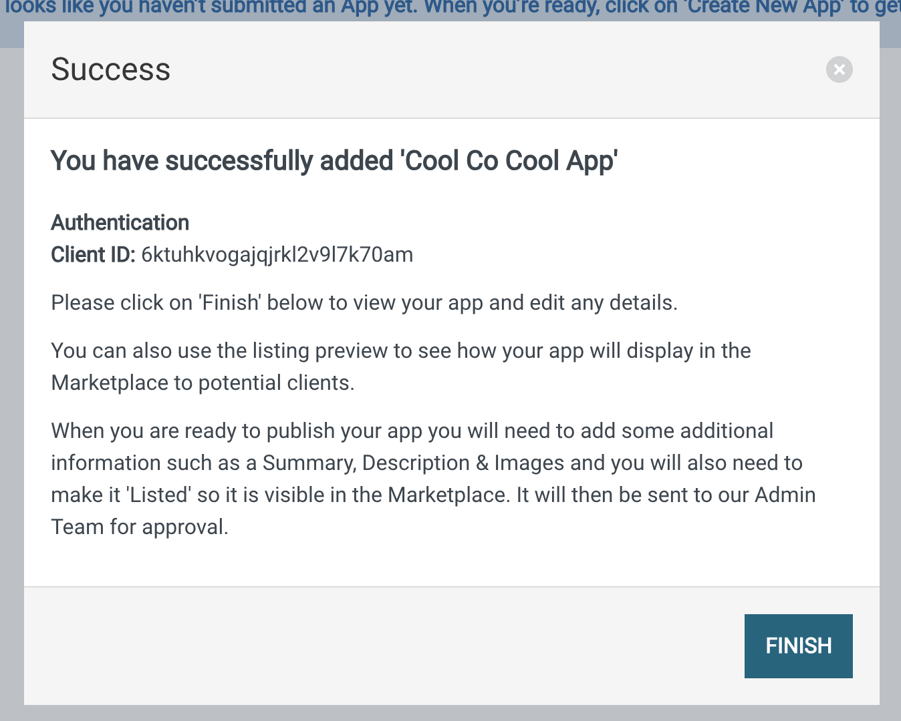

Clicking finish, will take you back to the apps page where you can see your first application. Clicking on it will load the app detail page where you can edit and populate more listing information about your app.

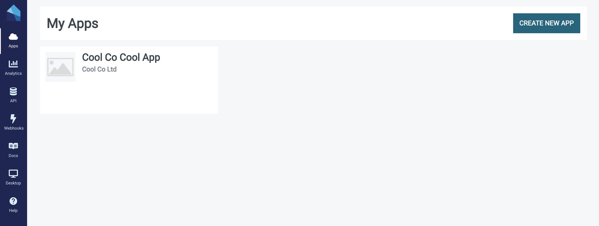

### 4. Populate your app listing \(optional\)

The previous section of this guide gives us enough detail to allow you to authenticate against our APIs and for you to be productive on the platform. When your app is in development, you will however want to get it ready to be listed in the Marketplace. To do this you will need to provide some additional information.

From the App Detail Page below, select "Edit Details".

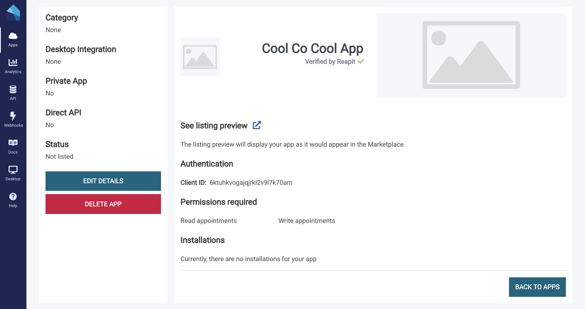

You will be asked in the first section to provide details that populate your app listing, tell us how to launch your app and how your customers should contact you for support.

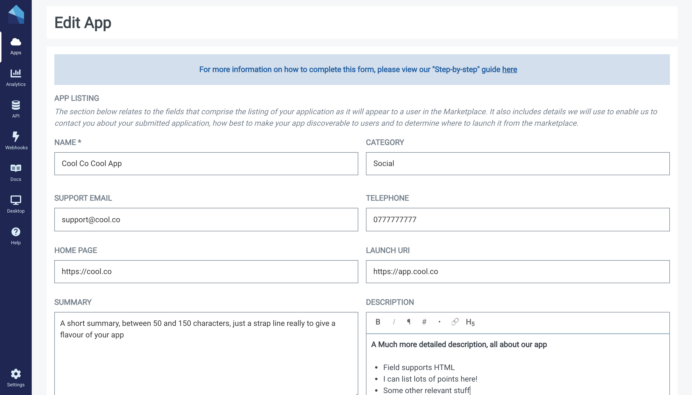

Moving on, you will be asked if you wish to integrate with the Agency Cloud CRM and if so, what page you would like to integrate with. This will allow your app to be launched as a screen direct from Agency Cloud by a user. It is an optional step and is in addition to being able to launch from the top level "apps" menu in the CRM. More on this behaviour in the [Desktop](api/desktop-api.md#desktop-types) docs.

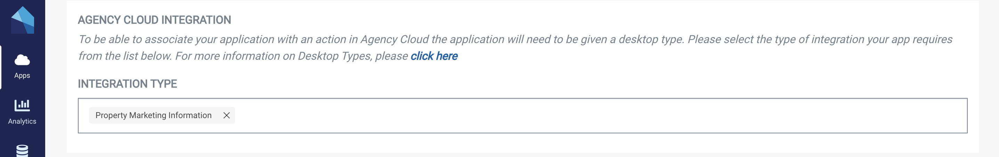

You will then see the OAuth Authentication flow you selected in the initial wizard. This step is not editable so if you need to change it, you will be required to register a new application.

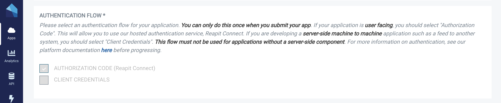

If your application is **user facing**, you should have selected "Authorization Code". This will allow you to use our hosted authentication service, [Reapit Connect](api/reapit-connect.md#overview). As part of this flow, you need will need to register one or more call back URLs and a log out URL to allow Reapit Connect to direct traffic back to your application in a secure way.

If you are developing a **server-side machine to machine** application such as a feed to another system, you should have selected "Client Credentials". You can find details on how this flow works in our [platform documentation](api/api-documentation.md#authentication).

For the purposes of this example, because we are building a client side app, we will select "Authorization Code".

The next section is applicable only if you want to restrict the marketplace listing to a single or limited sub-set of clients, for example if you are building some private in-house tooling. For the public beta we don't support surfacing the client ids you wish to restrict to since the marketplace is not live however, if you want your app to be private, you can select "yes" and ignore the customer code list. For most users, you will select "no".

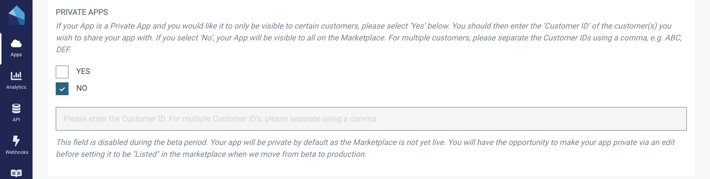

Then select an icon and a featured image for your app listing. You will be asked to crop these to the ideal dimensions for the listings page. Optionally you can other images about your app like screenshots.

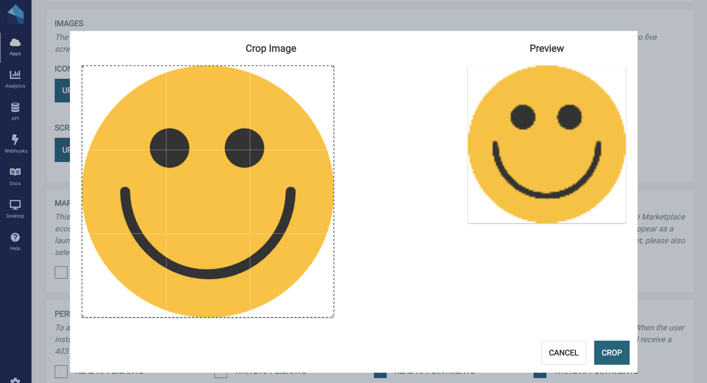

The next step is for external, non Marketplace apps and should be skipped if you are building a web-based marketplace listed app; if however you are building an integration that you don't want to appear in the marketplace, you can select this option. You app will still be listed for permission only purposes however, it will not be possible to launch from within the Agency Cloud desktop app. For the purposes of this example, we will leave unchecked.

The last step is to select any additional permissions \(OAuth scopes\) you need for your app to work. They must map to the endpoints you selected at point two above.

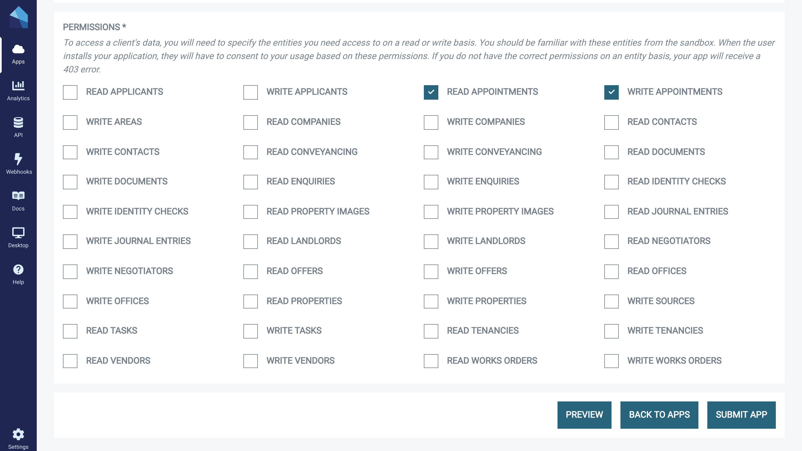

Finally, submit the form and you will return via a success message to the Apps page where you will see your registered application.

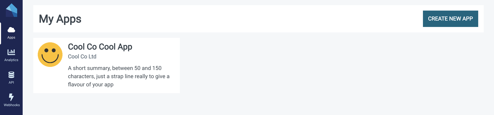

It is important to note, the app is not live yet, both because as we in developer beta only and because to set the live status, you need to edit your app and set the 'listed' status for approval. This behaviour is out of scope for this document.

### 5. Get your Client Id

From the Apps screen above, you will need to obtain your application's client id to authenticate your new app. To do this, click on the app to bring up the App Detail page as per below.

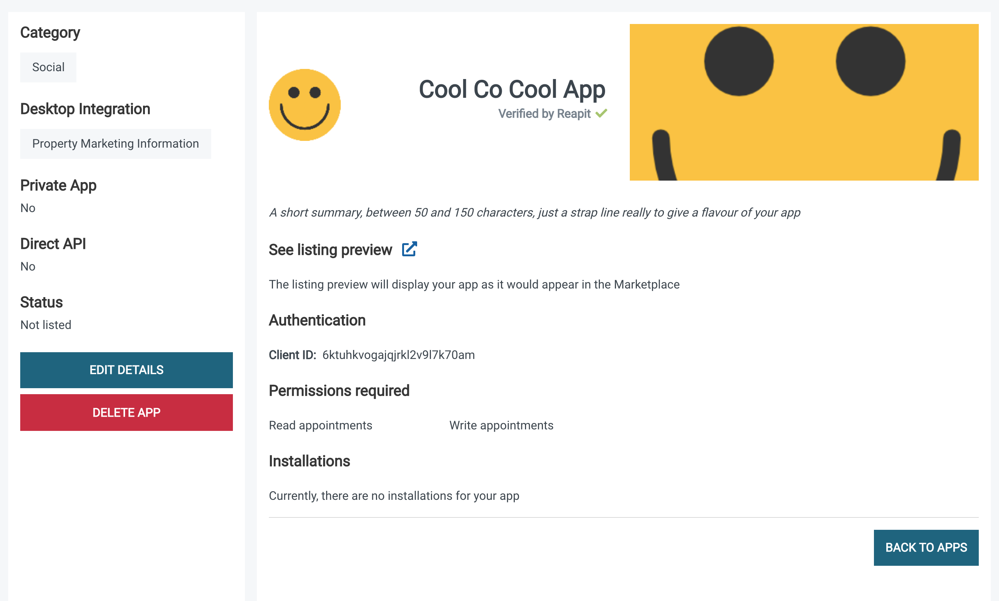

The Client Id should now be visible. Keep this page open so you can copy the Client Id at the next step. Please note, if you have selected "Client Credentials" as your authentication flow, you will also see your client secret \(hidden\), on this page.

### 6. **Write some code!**

The first step with your application will be to authenticate it against our Platform APIs. To do this you will need to use our authentication service [Reapit Connec](api/reapit-connect.md)t which supports the OAuth protocol. To make this easier on the client side, we have some JavaScript helpers you might find useful in our [Connect Session](app-development/connect-session.md) module, however, if you are familiar with OAuth, you can just roll your own.

### 7. Scaffolding an app \(optional\)

Even if you don't use React or intend to write your own React app from scratch, it is worth scaffolding an app with our new Create React App Template as initial playground, until you feel comfortable working with the platform. You can get full [documentation on this step here.](app-development/create-react-app-template.md)

### 8. A word on hosting...

Whilst Marketplace apps are "submitted", "listed" and "installed" by clients, they are still hosted by you, the developer. This is both to ensure the integrity of your IP / source code, and so that you maintain control over your deployment pipelines.

Optional hosting as a service is something we are looking at in detail for future iterations of the platform however it is not on our immediate roadmap. You should continue to use your existing web hosting platform for your app and just submit the launch uri on the submit app form as above. 

### 9. Organisation

To complete your Organisation information, click on ‘Settings’ and select ‘Organisation’  
  
 You will then be required to fill in the following information:

* Company Name
* Telephone Number
* Website Address
* VAT/Company Reg and or National Insurance Number
* About Us – The section will be displayed on any app listing in the Marketplace in addition to information about the app. 
* Company Address

Please then complete the information on the 'Billing' tab.

### 10. Billing

If you have an existing relationship with Reapit, you will already have a 'Reapit Reference' assigned to your company. You can find your reference on any previous accounting correspondence. Simply enter your account contact information, your reference and click 'Submit'.  

You account status will be updated to 'Pending' whilst we verify the  information with our Accounts Department. This is normally completed the same day.

You will receive an email once your account has been set to ‘Confirmed’.

If you do not have a Reapit Reference, please then complete a Direct Debit mandate. It is an online form that will open in another tab. For those of you that have cookies disabled by default, and we know most developers do, you will need to enable them to complete the form. It’s an Adobe requirement, you can of course, disable as soon as you’ve signed the form.

Again, our Accounts Department will setup your account and you’ll receive an email with your new Reapit Reference. No need to do anything with the reference,  as we will add this on your account automatically. Once received, you’ll be able to submit your app for approval or make any additional subscriptions.

### 11. Listing your app in the Marketplace

When you are ready to list your app in the Marketplace, either publicly or as a private app, it will first need to submitted for approval. For Marketplace apps, please see information on additional testing [here](whats-new.md#additional-testing). The approval process is started when you select the 'Submit for Approval' check box and 'Submit': 

Our Admin Department will be notified and will carry out the necessary checks. This will include content for your app listing, UI compliance \(if building an application that is launched within Agency Cloud\), authentication & permissions/scopes requests. Please see below the steps to follow: 

#### 1. First, make sure your app listing is ready

Description, Images, Icon, Screenshots & Bullet points etc. Remember the content you add to your app will be one of the first things an agent will see when viewing apps in the Marketplace. 

To help with ensuring you are ready, have a look at our guide on adding your content [here](https://foundations-documentation.reapit.cloud/whats-new#summary)

#### 2. Submit for Approval

Ticking the ‘Submit for Approval’ check box on your app listing, will let us know you are ready for our Admin Team to review and we will be notified immediately of your request.

  
Depending on your app listing or integration, this may take a couple of days.

If your app is launchable inside of Agency Cloud or has a Client facing user interface, we will ask you to set your app to private, using Customer ID ‘RES’. We can then install your app as an external client \(still using sandbox data\). This step will give us the ability to test and view the following:

#### Full Integrations - launchable inside of Agency Cloud

* Authentication Ensuring an agent is not required to login with additional credentials or is presented with an additional login screen.
* Onboarding Understanding the flow for existing and new users.
* Branding We will look at your use of Elements, our UI Library, ensuring you have built the integration according to our branding guidelines
* Functionality  Using the app in accordance with the service it is providing

#### Integrations 

For integrations, after installing, we may request a user account to login into your website/app or arrange a demo. This will provide us with the ability to check:

* Authentication If you have implemented Reapit Connect ‘Sign in with Reapit’ on your website, we will test with our user account to ensure that it is functional
* Onboarding Understanding the flow for existing and new users
* Functionality Using your website or app in accordance with the service it is providing

#### 3. Submission Declined

If the request to publish your app has been declined, you will be informed of the reason via email or we will give you a call to discuss. Sometimes, it could just be as simple as providing clearer images or that you may be missing some vital contact information. We will be on hand to help and advise you to quickly resolve any issues.

#### 4. Submission Approved

As soon as your app has been approved, it will be available in the Marketplace and you will be informed via email automatically. If it has been set to Private for testing, simply remove ‘RES’ from the Private section and re submit. 

For more information about the requirements for listing an app in the Marketplace, please refer to your Developer Terms and Conditions. 

If any changes are required you will be contacted by a member of the team.  The approval process is dependent on the level of complexity with your integration but in most cases, you will be contacted the same day. 

Once your listing has been approved, you will receive an email confirming your app has been approved and will be set to a status of 'Listed'.  You app will then be listed in the Reapit Marketplace ready for client installation. 

