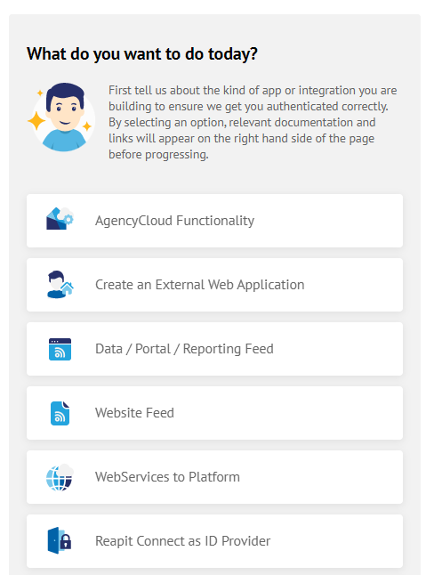
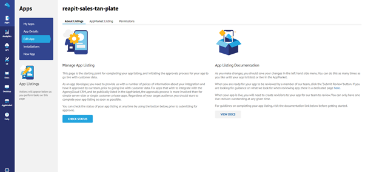

# Developer Portal

We want getting started with the Developer Portal to be as frictionless as possible. There is a lot of detail in the documentation for advanced concepts but to get started in as little as 5 mins with an authenticated AppMarket app, you just need to follow these steps:

### 1. Login to the Portal

You will receive an email with a link to the developer portal and temporary login credentials. The app will redirect you to the [Reapit Connect](api/reapit-connect.md) login screen and then back to the authenticated portal.&#x20;

The first screen you will see is a the 'About Foundations' page. You will only see this at the first login:&#x20;

Also on this page you will have the option to 'View Docs' and to 'Create App'.&#x20;

When you are in the portal, navigate to the API tab on the left hand side menu.

### 2. Choose an API

Assuming you have an idea of the data types / entities you are interested in, ensure that the endpoints you need are available in the platform by "trying out" the API explorer.&#x20;

For the purposes of this example my app will need Applicant data. Don't worry if you find you need other endpoints later, you can add them at any time.

### 3. Register an app

The next step is to register an app. We understand you won't have any code yet, this is all about setting up a client to work with the API. Firstly click on the "Create App" button on the apps page from step 1. This will load a wizard asking you to select from the options the type of app or integration you are building.&#x20;

Depending on your use case you will be presented with various options. For this example, we will be selecting the option for 'AgencyCloud Functionality'. You will see on the right-hand side all information relating to this selection, helpful documentation and links.&#x20;

The next step is to provide routes for our OAuth service Reapit Connect to redirect back to your app. You can add production routes later but for now, we will add localhost for development.

You will be then asked to select permissions that map directly to OAuth Scopes, and also the endpoints you selected at stage two of this guide.

On completion of this step, you will be taken to your App Details page which will provide you with your App Client Id. You will need this for authenticating via Reapit Connect OAuth.

Clicking on 'Edit Details' on the left hand-side will present you with more information about your app, where to amend your app details. permissions etc. Please note, the app name is pre-populated based on your company name and can be changed at any stage.&#x20;

### 4. Populate your app listing (optional)

The previous section of this guide gives us enough detail to allow you to authenticate against our APIs and for you to be productive on the platform. When your app is in development, you will however want to get it ready to be listed in the AppMarket. To do this you will need to provide some additional information.

From the 'App Details' Page below, select "Edit App" and select 'AppMarket Listing':

You will be asked in the first section to provide details that populate your app listing, tell us how to launch your app and how your customers should contact you for support. As you go through the form we will ask for images such as an icon, featured image and screenshots. Fore more information on the requirements, please [click here](listing-your-app/app-listing-review.md).

### Other Sections

Based on our selection from the wizard, will may  see a tab for 'AgencyCloud Integration' and a toggle if you wish to integrate with the AgencyCloud CRM and if so, what page you would like to integrate with. This will allow your app to be launched as a screen direct from AgencyCloud by a user. It is an optional step and is in addition to being able to launch from the top level "apps" menu in the CRM. More on this behaviour in the [Desktop](api/desktop-api.md#desktop-types) docs.

You will also then see the 'Authentication' tab, as this example is a user facing integration this section will allow you to use our hosted authentication service, [Reapit Connect](api/reapit-connect.md#overview). As part of this flow, you need will need to register one or more call back URLs and a log out URL to allow Reapit Connect to direct traffic back to your application in a secure way.

If you are developing a **server-side machine to machine** application such as a feed to another system, the tab will not be visible. You can find details on how this flow works in our [platform documentation](api/api-documentation.md#authentication).

The next tab is 'Permissions', here you can select any additional permissions (OAuth scopes) you need for your app to work.&#x20;

Here you can also set the visibility of your app using the 'Private Apps' toggle. This is used if you wanted to restrict the AppMarket listing to a single or limited sub-set of clients, for example if you are building some private in-house tooling.&#x20;

Finally, one you have completed the relevant details, simply click 'Save Changes' on the left-hand side.

It is important to note, the app is not live yet. You can check the status of your app at any stage by going to 'About Listings' and click on 'Check Status'.

The check status button is a very quick and easy way to see the current status of your app, what information is missing, your AppMarket status and to see if have any changes that require saving.

The process for submitting your app for review is the same as before. Simply check the status of your app and once all checks have been completed (see example below):

A button on the left-hand side will appear ‘Submit Review’. This will create a revision to our Admin team.

&#x20;

Once your app has been approved (please [click here](listing-your-app.md) for more information on the reviewal process) the button will change to present the option to ‘Delist’ your app.

### 5. Get your Client Id

From the 'App Details' page, you will need to obtain your application's client id to authenticate your new app.

Please note, if you have selected "Client Credentials" as your authentication flow, you will also see your client secret also, on this page.

### 6. **Write some code!**

The first step with your application will be to authenticate it against our Platform APIs. To do this you will need to use our authentication service [Reapit Connec](api/reapit-connect.md)t which supports the OAuth protocol. To make this easier on the client side, we have some JavaScript helpers you might find useful in our [Connect Session](app-development/connect-session.md) module, however, if you are familiar with OAuth, you can just roll your own.

### 7. Scaffolding an app (optional)

Even if you don't use React or intend to write your own React app from scratch, it is worth scaffolding an app with our new Create React App Template as initial playground, until you feel comfortable working with the platform. You can get full [documentation on this step here.](app-development/create-react-app-template.md)

### 8. A word on hosting...

Whilst marketplace apps are "submitted", "listed" and "installed" by clients, they are still hosted by you, the developer. This is both to ensure the integrity of your IP / source code, and so that you maintain control over your deployment pipelines.

Optional hosting as a service is something we are looking at in detail for future iterations of the platform however it is not on our immediate roadmap. You should continue to use your existing web hosting platform for your app and just submit the launch uri on the submit app form as above.&#x20;

### 9. Organisation

To complete your Organisation information, click on ‘Settings’ and select ‘Organisation’\
\
&#x20;You will then be required to fill in the following information:

* Company Name
* Telephone Number
* Website Address
* VAT/Company Reg and or National Insurance Number
* About Us – The section will be displayed on any app listing in the AppMarket in addition to information about the app.&#x20;
* Company Address

In order to list your App, please see the guidelines within the '[Listing your App](https://app.gitbook.com/@reapit-1/s/reapit-foundations/\~/drafts/-MQMdhdEIqniO2BQbO\_g/listing-your-app)' section&#x20;
