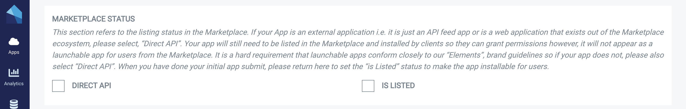
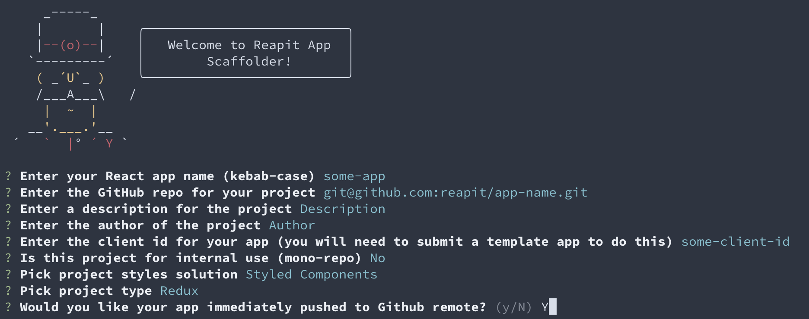

# Developer Portal

We want getting started with the Developer Portal to be as frictionless as possible. There is a lot of detail in the documentation for advanced concepts but to get started in as little as 5 mins with an authenticated marketplace app, you just need to follow these steps:

### 1. Login to the Portal

You will receive an email with a link to the developer portal and temporary login credentials. The app will redirect you to the [Reapit Connect](api/reapit-connect.md) login screen and then back to the authenticated portal. 

The first screen you will see is a welcome wizard. You will only see this at the first login, although you can access from the help section later if you wish to revisit. It will walk you through some basic concepts when working with the developer portal.

You will then see the "My Apps" page which will initially be empty. There is also a button in the top right hand corner to submit a new app. More on that at point 3 of this guide.

When you are in the portal, navigate to the API tab on the left hand side menu. 

### 2. Choose an API

Assuming you have an idea of the data types / entities you are interested in, ensure that the endpoints you need are available in the platform by "trying out" the API explorer. 

For the purposes of this example my app will need Applicant data. Don't worry if you find you need other endpoints later, you can add them at any time.

### 3. Register an app

The next step is to register an app. We understand you won't have any code yet, this is all about setting up a client to work with the API. Firstly click on the "create app" button on the apps page from step 1. This will load a wizard asking you for your application name. This can be edited later on.

The wizard will then ask you if you want to create a Marketplace App. It is worth taking the time to consider here if you wish your application to be launched from within the Agency Cloud CRM. For the purposes of this example, we will assume that you do.

The next step is to provide routes for our OAuth service Reapit Connect to redirect back to your app. You can add production routes later but for now, we will add localhost for development.

You will be then asked to select permissions that map directly to OAuth Scopes, and also the endpoints you selected at stage two of this guide.

On completion of this step, your skeleton app will be generated and you will get your App Client Id. You will need this for authenticating via Reapit Connect OAuth.

Clicking finish, will take you back to the apps page where you can see your first application. Clicking on it will load the app detail page where you can edit and populate more listing information about your app.

### 4. Populate your app listing \(optional\)

The previous section of this guide gives us enough detail to allow you to authenticate against our APIs and for you to be productive on the platform. When your app is in development, you will however want to get it ready to be listed in the Marketplace. To do this you will need to provide some additional information.

From the App Detail Page below, select "Edit Details".

You will be asked in the first section to provide details that populate your app listing, tell us how to launch your app and how your customers should contact you for support.

Moving on, you will be asked if you wish to integrate with the Agency Cloud CRM and if so, what page you would like to integrate with. This will allow your app to be launched as a screen direct from Agency Cloud by a user. It is an optional step and is in addition to being able to launch from the top level "apps" menu in the CRM. More on this behaviour in the [Desktop](api/desktop-api.md#desktop-types) docs.

You will then see the OAuth Authentication flow you selected in the initial wizard. This step is not editable so if you need to change it, you will be required to register a new application.

If your application is **user facing**, you should have selected "Authorization Code". This will allow you to use our hosted authentication service, [Reapit Connect](api/reapit-connect.md#overview). As part of this flow, you need will need to register one or more call back URLs and a log out URL to allow Reapit Connect to direct traffic back to your application in a secure way.

If you are developing a **server-side machine to machine** application such as a feed to another system, you should have selected "Client Credentials". You can find details on how this flow works in our [platform documentation](api/api-documentation.md#authentication).

For the purposes of this example, because we are building a client side app, we will select "Authorization Code".

The next section is applicable only if you want to restrict the marketplace listing to a single or limited sub-set of clients, for example if you are building some private in-house tooling. For the public beta we don't support surfacing the client ids you wish to restrict to since the marketplace is not live however, if you want your app to be private, you can select "yes" and ignore the customer code list. For most users, you will select "no".

Then select an icon and a featured image for your app listing. You will be asked to crop these to the ideal dimensions for the listings page. Optionally you can other images about your app like screenshots.

The next step is for external, non Marketplace apps and should be skipped if you are building a web-based marketplace listed app; if however you are building an integration that you don't want to appear in the marketplace, you can select this option. You app will still be listed for permission only purposes however, it will not be possible to launch from within the Agency Cloud desktop app. For the purposes of this example, we will leave unchecked.

The is listed check box is a critical step. This is the trigger for us at Reapit to review your application for approval and eventual listing in the Marketplace. By selecting "Is Listing", some additional validations will kick in on the form to ensure we have everything we need to properly review your app.

The last step is to select any additional permissions \(OAuth scopes\) you need for your app to work. They must map to the endpoints you selected at point two above.

Finally, submit the form and you will return via a success message to the Apps page where you will see your registered application.

It is important to note, the app is not live yet, both because as we in developer beta only and because to set the live status, you need to edit your app and set the 'listed' status for approval. This behaviour is out of scope for this document.

### 5. Get your Client Id

From the Apps screen above, you will need to obtain your application's client id to authenticate your new app. To do this, click on the app to bring up the App Detail page as per below.

The Client Id should now be visible. Keep this page open so you can copy the Client Id at the next step. Please note, if you have selected "Client Credentials" as your authentication flow, you will also see your client secret \(hidden\), on this page.

### 6. **Write some code!**

The first step with your application will be to authenticate it against our Platform APIs. To do this you will need to use our authentication service [Reapit Connec](api/reapit-connect.md)t which supports the OAuth protocol. To make this easier on the client side, we have some JavaScript helpers you might find useful in our [Cognito Auth ](api/web.md#cognito-auth)module, however, if you are familiar with OAuth, you can just roll your own.

If you intend to use React for your Web Application, or are just interested in how we handle client side authentication at Reapit, you may want to read on as this article continues with our [React App Scaffolder.](api/web.md#react-app-scaffolder) 

### 7. Scaffolding an app \(optional\)

Even if you intend to write your own React app from scratch, it is worth scaffolding an app as an initial playground until you feel comfortable working with the platform. There are more docs explaining the flavours of React App [here](api/web.md#react-app-scaffolder) but the basic steps are;

First install globally both Yeoman and React App Scaffolder itself.

`npm install yo @reapit/generator-react-app-scaffolder@latest -g`

You may need to run this with the `sudo` prefix depending on your OS.

Then;

`yo @reapit/react-app-scaffolder`

This will launch the scaffolder with the following options:

Having entered the basic meta data for your app, ensure you enter the Client Id from step four before selecting the styling and state management solutions you want to work with. Hit return and the app will start building.

This will launch an app at localhost:8080. You will be redirected again to Reapit Connect and then back to the app as an authenticated user.

You should now be good to go. The basic app structure and authentication are all set up to start building components and working with the platform API. 

### 8. A word on hosting...

Whilst Marketplace apps are "submitted", "listed" and "installed" by clients, they are still hosted by you, the developer. This is both to ensure the integrity of your IP / source code, and so that you maintain control over your deployment pipelines.

Optional hosting as a service is something we are looking at in detail for future iterations of the platform however it is not on our immediate roadmap. You should continue to use your existing web hosting platform for your app and just submit the launch uri on the submit app form as above. 

