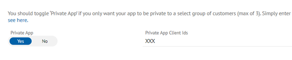
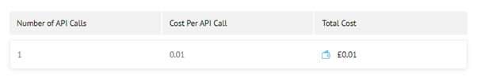
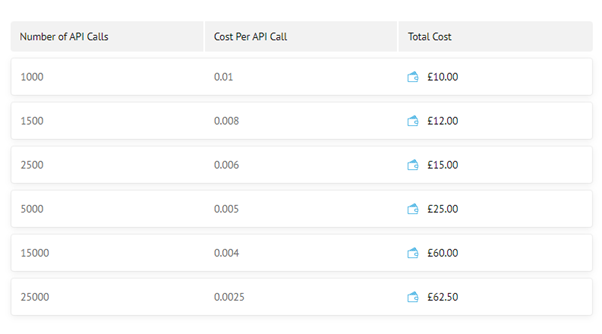
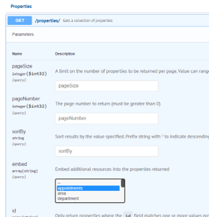

# FAQ's

## **General**

### How do I find a ‘Customer ID’?

An agent can locate their Customer ID via the AppMarket inside of AgencyCloud.

* Within AgencyCloud, click on ‘Apps’ and select ‘Browse’
* Click on the ‘Settings’ icon in the bottom left-hand corner
* The Customer ID can be located on the right-hand side of the screen.

.png>)

### I just want to access my data, do I still need to create an app?&#x20;

Yes, the app registration process gives you the required authentication, either to use as a client side/server-side integration or as an app that launches inside of the Desktop CRM (AgencyCloud).

In order to access customer data, an installation will need to occur. This is done by creating and listing an app in the AppMarket. It can either be public or private to a specific agent.&#x20;

Please [click here](faqs.md#listing-your-app) for more information on Listing an App in AppMarket.

### How to privately list your app/integration in the AppMarket

If you are building an app or integration for a specific customer or a subset of customers, you can set your app as a ‘Private App’. This means it will only be visible in the AppMarket to those customers.

To set your app to private, you will need to navigate to the ‘Permissions’ tab which can be accessed when you ‘Edit App’: &#x20;

<figure><figcaption></figcaption></figure>

Simply set the toggle to ‘Yes’ and enter the client IDs (Customer IDs), for more information on how to obtain Customer IDs, please [click here](faqs.md#how-do-i-find-a-customer-id).

You will still need to submit your app for approval and once approved, the app will be visible for the customer to install.

For more information on listing your app, please [click here.](listing-your-app.md)

### When will my requested feature be available?

You can track the status of your issue [directly in GitHub](https://github.com/reapit/foundations/issues).&#x20;

Please [click here](dev-requests.md) for details on our development processes.

### What are ‘Office Groups’?

Office Groups are present when an organisation is using the Reapit Marketplace Management App They will setup specific office groups that provide data boundaries between offices. The management app also allows organisational level control for installations.

Offices that are part of a group will have a distinct ‘Customer ID’. For example, Reapit Sales is an organisation comprised of 20 offices. Their customer ID is ‘RES’. However, they wish to set data boundaries between certain offices and create 2 office groups:

**Office Group 1**

This contains a list of 8 offices/branches within the organisation.

The customer ID is now RES-GOGO

**Office Group 2**

This contains a list of 12 offices/branches within the organisation

The customer ID is now RES-GOGT

Using either the Management App or via the AppMarket, an Admin can choose to install an app for the whole organisation (Customer ID: RES) which will grant access to all 20 offices, or a specific group.

If they choose to install for Office Group 1 (Customer ID: RES-GOGO) for example, an app will only have access to data for those 8 offices.

They can install for multiple groups but the data boundaries for each group will be respected and exist across our core entities.

You will be notified of the Customer ID at the point of installation. For more information, please [click here](https://foundations-documentation.reapit.cloud/faqs#installation).

## Registration

### We have created multiple accounts but want to work on the same app, what can we do?&#x20;

You can invite members to collaboratively work within the same Developer Portal organisation from the '[Organisations](https://developers.reapit.cloud/settings/organisation)' page using the 'Invite Member' option.

### **Notification Email**

The email address you entered when registering for the Developer Portal, is used by default to receive email notifications,. For example, when your app is installed from the AppMarket, you will receive an email with the details (see more information [here](https://foundations-documentation.reapit.cloud/faqs#installation))

As you cannot change the email address that registered your organisation, we have now provided the ability to supply an alternative ‘Notifications Email’.

.png>)

If you want to setup an alternative email address, simply go to ‘[Organisation](https://developers.reapit.cloud/settings/organisation)’ page.&#x20;

**Please note:** Only an Admin will have the correct permissions to update this information.

### **How to Invite New Members**

To invite members to join your organisation, simply click on the ‘Invite Developer’ button from the '[Members](https://developers.reapit.cloud/settings/members)' page in the Developer Portal. The recipient will receive your invitation via email and will have the option to reject or accept. You can track the status of any members in the ‘Members’ table:

.png>)

Within the members section you will also have the ability to disable members and to set other members as ‘Admins’.

**Please note:** Only Admins of the Developer Organisation will have access to the Organisation page.&#x20;


**Testing**
-----------

### **How can I test my App or Integration?**

The Developer Edition of AgencyCloud allows you to test your apps/integration within the desktop application using Sandbox data.

Please [click here](https://developers.reapit.cloud/desktop) for more information on testing your App or Integration.

### How can I test my Integration without a customer installation?

You can use **authorization code flow** by providing your developer portal credentials to our Reapit Connect service

You can use **client credentials flow** by providing `SBOX` as your `reapit-customer` request header

Please [click here](https://foundations-documentation.reapit.cloud/api/api-documentation#sandbox-mode) for more information on using Sandbox data

### How do I Test my App/Integration with a specific agent?

To test with a specific agent your app will need to be set to private and submitted for approval.

Using the ‘Private App’ section on your app listing, you will need to provide the Customer ID of the agent. However, it will first need to be approved and tested by our Admin department.&#x20;

Once the app has been approved it will be available to the selected agent(s) to ‘Install’ from the AppMarket.

Please [click here](faqs.md#how-do-i-find-a-customer-id) for information on finding the Customer ID\
Please [click here](faqs.md#listing-your-app) for more information on Listing your app\
Please [click here](faqs.md#app-approvals) for more information on App Approvals

## **Developer Edition of AgencyCloud**

### I need help with using AgencyCloud (Desktop CRM)

We do not provide online or telephone support for the Developer Edition of AgencyCloud.

Please [click here](https://developers.dev.paas.reapit.cloud/developer-edition-guide.pdf) to view the Developer Edition Guide

### How can I update details of a Negotiator in AgencyCloud using the desktop application?&#x20;

You cannot update negotiator information using the desktop CRM as Negotiator information is part of the the system configuration and is not available in the Developer Edition. However, you can use the Negotiators `PATCH`endpoint to update the required fields. Once you have made a valid request, you may need to restart AgencyCloud to see the changes reflected.&#x20;

## **Listing your App in the AppMarket**

### I’m ready to list my app, what do I need to do?

When you are ready to list your app in the AppMarket, either publicly or as a private app, it will first need to be submitted for approval privately to our testing environment 'RES'. \
\
First, ensure your app is ready to be listed, please [click here](listing-your-app.md) to see a guide on what information is required.&#x20;

Once the content of your app has been added:&#x20;

* Enter Customer ID 'RES-GTRA' in the 'Private Apps' section on your app listing
* Select the 'Submit for Approval' check box and 'Submit'&#x20;

Please [click here ](https://foundations-documentation.reapit.cloud/listing-your-app#apps-launchable-inside-of-agency-cloud)for more information on testing

## **App Approvals**

### I have submitted my App for approval. How long is the approval process?

Depending on your app listing or integration and its complexity, from start to finish can typically take between 2-7 weeks.  A member of the reviewal team will make direct contact with you within 24 – 48 hours. &#x20;

Please [click here](https://foundations-documentation.reapit.cloud/listing-your-app#2-submit-for-approval) for more information on the App Approval Process&#x20;

## **Authentication**

### How do I change the authentication method on my app?

Once your app has been created, you cannot change the authentication flow. You will need to register a new app using your preferred flow.

Please [click here](https://foundations-documentation.reapit.cloud/api/reapit-connect#authentication-flow) for more information on Authentication Flows

## **Webhooks**

### How can I setup an alert to know when a new action or information has occurred or been added?

Our Webhooks system allows your application to directly subscribe to events happening in our customers data. You can manage Webhook subscriptions [here](https://developers.reapit.cloud/webhooks).

Please [click here](https://foundations-documentation.reapit.cloud/api/webhooks) to see more information on Webhooks

## **Billing/Accounts**

### What is a Reapit Account Reference?

It is a reference that is assigned to your organisation/company and would have been setup with our Accounts Department. If you have an existing relationship with Reapit, you should be able to obtain your reference on previous correspondence. If you do not have an existing relationship, you will be required to complete a Direct Debit mandate.

### My billing information is with accounts - how long will this take to process?

Once you have submitted your billing information, it will be sent to our Accounts Department to verify/setup and your account status will be set to 'Pending'.&#x20;

This setup process is usually completed within 24-48 hours. Once the information has been verified you will receive an email confirmation and your account status will be set to 'Confirmed'

## Pricing/Costs

### Do you have information regarding pricing?

You can find information regarding pricing using either the documentation listed below or on the [Analytics](https://developers.reapit.cloud/analytics/costexplorer) page.

Please [click here](developer-terms-and-conditions.md#schedule-2-fees) to see pricing information on our Terms and Conditions

### I have looked at your pricing information and I have a query - who do I speak to?

Should you have any questions or queries regarding the cost or pricing structure, please [click here ](mailto:dmann@reapit.com)to contact a member of the team

## Reapit Connect

### &#xD;**How do I find out information about a user?**

When a user successfully logs in using Reapit Connect and your application has performed the code exchange, you will receive a JSON payload which will include an ‘id\_token’.

The ID Token will contain information about the user and their organisation.

See an example below for user [hollyjoyphillips+res@gmail.com](mailto:hollyjoyphillips+res@gmail.com), you can obtain the following information:

* Email Address ‘email’
* Negotiator ID ‘userCode’
* Customer ID ‘clientCode’
* Office ID ‘officeId’

For more information on Reapit Connect, please click [here](https://foundations-documentation.reapit.cloud/api/reapit-connect)

If you want to find out more information about an office, you can use the ‘officeId’ and make a request to the GET /offices/{id}

If you want to find out more information about an individual negotiator, you can use the ‘userCode’ and make a request to GET /negotiators/{id}

### &#xD;**I’m unsure what some of the fields in the id\_token relate to?**

**Cognito Groups**

Reapit User\
A level 1 user in AgencyCloud. Will have access to the AppMarket but do not have permissions to install or uninstall apps.

**Reapit User Admin**\
A level 2 user in AgencyCloud. Will have the permissions to install and uninstall apps from the AppMarket.

**Organisation Admin**\
Users assigned to this group will have the same permissions as a Reapit User Admin/Marketplace Admin but will also have access to the Reapit Marketplace Management App

**Marketplace Admin**\
Will have permissions to install and uninstall apps from the AppMarket

**offGrouping**\
****‘offGrouping’ refers to Office Grouping. If present and set to ‘True’, the organisation will be using the Reapit Marketplace Management App. The app provides organisations the ability to control app visibility, setup office groups (setup data boundaries between offices) and control installs and uninstalls at an organisation level.

**officeID**\
****The ID of the induvial office the user is associated to.

**orgName**\
****The name of the organisation.

**orgID**\
****The ID of the organisation (mainly used for internal services)

**clientCode**\
****The Customer ID of the organisation

**userCode**\
****The ID of the user in Reapit Connect

**agencyCloudNegId**\
****The ID of the user in AgencyCloud

**agenyCloudId**\
****The ID of the organisation in AgencyCloud

## Installation

### &#xD;W**hat information can I obtain when my app is installed?**

You will receive (at the point of installation) the following information:

### **Email**

An email will be sent to the email address used to register your [developer organisation](https://developers.reapit.cloud/settings/organisation) (office email) and to the support email address you have provided on your app listing. It will contain the following:

* The Name of the organisation
* The Customer ID of the organisation
* The Address of the organisation
* The Email Address of the user who installed your app

**Example Email:**

_Hi Joe Blogs,_

_We just wanted to let you know that ‘Your App Name’ has just been installed by '_[_example@email.com_](mailto:example@email.com%20)_' for the following client:_

_Sandbox Estates (SBOX)_\
_Third Floor, 67-74 Saffron Hill, London, EC1N 8QX, GB_

_A record of all installations can be viewed on your app in the Developers Portal under 'Installations'._

_Best Regards,_\
_****Reapit Team_

### **Webhook**

If you have setup a webhook for 'Application Install', you will receive a payload with the following information:

* The Name of the organisation (customerName)
* The Customer ID of the organisation (customerID)
* The Name of the application that has been installed (applicationName)
* The Address of the organisation (customerAddress)
* The Email Address of the user who installed your app (customerEmail)

**Example payload:**

.png>)

For more information on webhooks, please click [here](https://foundations-documentation.reapit.cloud/api/webhooks)

### **Installations Table**

On your app listing in the Developer Portal and via ‘[Analytics](https://developers.reapit.cloud/analytics)’, you will see a full record of all installations. The table will contain the following information:

* The Customer ID of the organisation (Client)
* The Name of the organisation (Company Name)
* The Address of the organisation (Company Address)
* The date the installation occurred (Date of Installation)
* The Email Address of the user who installed your app (Installed By)\

**Example Installations table:**

.png>)

## AppMarket

### Why is my app not showing in the AppMarket?&#x20;

Before your app can be listed in the AppMarket, it first needs to be submitted for approval, please see more information on listing your app [here](listing-your-app.md).&#x20;

If your app has been approved and you have chosen to list it privately, ensure the Customer ID you have provided in the 'Private Apps' section is correct. For more information on obtaining a Customer ID, please click [here](faqs.md#how-do-i-find-a-customer-id).&#x20;

If your app is public and is not visible to some customers, it is because your app is using data webhooks. Apps/Integrations that's have data webhooks (not including application install and application uninstall) will not be visible to customers still on the Rackspace environment. For more information on webhooks, please click [here](api/webhooks.md).&#x20;

### Launching an App

AgencyCloud apps (an an app that loads inside of the AgencyCloud desktop application), can be launched direct from the 'Installed' page. This is also true when viewing the app within a web browser. AgencyCloud apps also work standalone. This means that you can still benefit from the product or service when out of the office and from outside of the Agency cloud desktop application.&#x20;

To launch an app, click on 'Apps' and 'Installed'. Click on your app to launch.&#x20;

'Integrations' will not be launched from the 'Installed' page and instead will be accessed by a URL provided by the third-party.&#x20;

As an 'Admin' you can view and manage your integrations from the '[Manage](https://marketplace.reapit.cloud/manage)' page.

## What is an API call?&#x20;

There are 3 ways to interact with our Platform API:

* A direct request to the Platform API using one of the following methods:\
  GET, POST, PUT, PATCH & DELETE
* Receiving a payload via a Webhook
* Embedding data in a request

All methods to interact with our Platform API are API calls and are chargeable in accordance with our [Terms and Conditions](https://foundations-documentation.reapit.cloud/developer-terms-and-conditions#schedule-2-fees).&#x20;

&#x20;

### **API Direct Requests**

As an example, a single request might be to call our ‘Properties’ endpoint (GET /Properties). This is calculated as follows:

1-5 Endpoints & 1 Request

When you increase the amount of requests you make and the number of endpoints you are using, the cost of an API call will decrease.

For example, multiple requests would be calculated as follows:

1-5 Endpoints & 50,000 Requests

This is because you will be charged a certain rate for the first 1000 requests, a reduced rate for the next 2500 and so on.

&#x20;

### **Webhooks**

Webhooks are calculated the same as making a request. It’s important to note, that when making a direct request to our Platform API, you are in control of how many requests you are making. Webhooks, however, are events that are emitted and controlled by the end user (the customer).

We provide the ability to set general and granular levels of topics (events that you are interested in). For example, ‘Properties Modified’ will send an event when _any_ property has been modified. Or you could set a more specific request such as ‘Selling Property Exchanged’, which will emit a webhook when a property status has been set to ‘Exchanged’.

As mentioned above, the rate and number of events that are emitted are based on the customer and their negotiators. It’s worth being mindful that bulk updates do occur. For example, if you are listening on event’s for ‘Properties Modified’ and a negotiator leaves that company, all of their properties will be transferred to a new negotiator, resulting in several properties being ‘Modified’.

&#x20;

### **Embedding**

Embedding data allows to you make a single query to our Platform and also include related data from other endpoints.

For example, you can make a query to our ‘Properties’ endpoint to search for a single property:

‘GET /properties{ID}’ & also embed ‘Appointments’. This will show you all appointments related to that property.

The core request to ‘Properties’ would be 1 endpoint and the embed ‘Appointments’ endpoint would be 1 endpoint, but the default page size for data returned is 25. If there are more than 25 associated appointments for that property, each page request is calculated as an additional request.

You can reduce this by applying the maximum page size on the initial request, for example:

‘Get /properties?pageSize=100\&embed=appointments’

The page size you set would also be applied to any endpoints you have embedded. You will not be able to pass any other query string parameters to your embedded endpoints.

This is apparent if you were, for example, only interested in associated appointments with the type ‘Viewings’, as it will return all appointments associated to that property.

Therefore, it’s important to note that whilst using this mechanism can result in improved application performance with less API interaction code required, when embedding data, you will not know how many pages of data (requests) are required and therefore will not be able to forecast the API consumption accurately.

### My app is live and has been installed, how do I request a new permission?

When your app is installed, the end user agrees to the permissions you have specified at the point of installation. If you later need/request new additional permissions, we must give the end user the ability to agree to the new data requirements to ensure we adhere to client data protection.

When you select a new permission and submit your changes for ‘Review’, a modal will pop up providing the ability to send a request to the person that installed your app. Once all who have installed your app have agreed, you’re app will be approved. You can monitor the status of each request by visiting ‘App Consents’ on your app listing.

Please note, if you have submitted any other changes, the normal approval process will still be applied.

For more information, please [click here](listing-your-app/app-permissions.md).

### I have an issue that requires sharing private/sensitive information that I do not wish to be made public? &#x20;

We understand that in some cases you may need to share screenshots and or personal information which may aid in the resolution of an issue or feature request.  \
&#x20;\
You must still raise the issue on GitHub first excluding any sensitive information, but highlighting you wish to share this information securely; after we have reviewed your issue, we will then ask you to send an accompanying email with the GitHub issue number as the subject.&#x20;

Please note, the GitHub issue will be the main form of communication. The secure mailbox should only be used for sharing information that cannot be publicly visible. The address of this mailbox will be provided to you once we have reviewed your GitHub issue as above. When sharing sensitive information using this mailbox, your issue will still be prioritised as per our [documented Development Processes.](https://foundations-documentation.reapit.cloud/dev-requests)&#x20;

**What is considered private/sensitive data:** &#x20;

Any personal, personally identifiable, financial, sensitive or regulated information (including credit or debit card information, bank account information or usernames and passwords).&#x20;

### **Certain fields are not exposed by default in the Platform**

Platform APIs are designed to be customer agnostic to make them easier for multiple external developers to work with them across different customers, unlike our legacy APIs which had customer specific customisations.

Therefore, to ensure we adhere to this design, we do not automatically expose customers custom fields. Custom data is stored in a different place called ‘Extras’ and are stored as semi structured fields. They are unique to the customer.

If you require access to those fields, you will need to make a request using [this ](https://github.com/reapit/foundations/issues/new?assignees=\&labels=back-end%2C+needs-triage\&template=extras\_field.md\&title=)template. We will then make the fields available to that customer only.

We will provide you the field name which you can add to your query as an additional parameter using the filter ‘extrasfield=FIELDNAME’

Example query: [https://platform.reapit.cloud/properties/ABC00000?extrasfield=pDirections](https://platform.reapit.cloud/properties/ABC00000?extrasfield=pDirections)

Semi Structured filed requests are not usually assigned to a sprint and can be completed within a few days.
