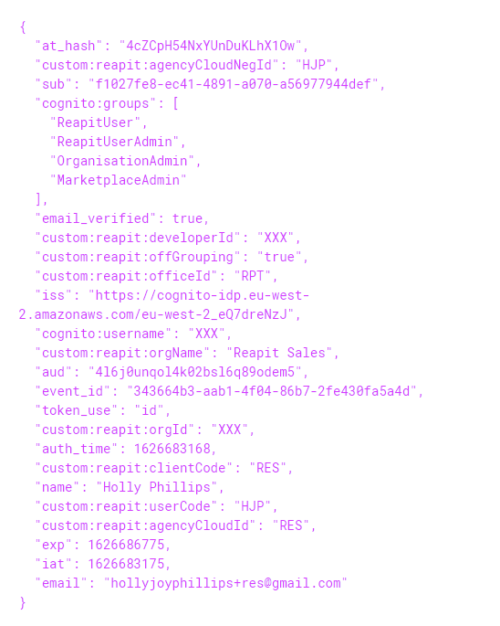

# FAQ's

## **General**

### How do I find a ‘Customer ID’?

An agent can locate their Customer ID via the Marketplace inside of Agency Cloud.

* Within Agency Cloud, click on ‘Apps’ and select ‘Browse’
* Click on the ‘Settings’ icon in the bottom left-hand corner
* The Customer ID can be located on the right-hand side of the screen.

### I just want to access my data, do I still need to create an app? 

Yes, the app registration process gives you the required authentication, either to use as a client side/server-side integration or as an app that launches inside of the Desktop CRM \(Agency Cloud\).

In order to access customer data, an installation will need to occur. This is done by creating and listing an app in the Marketplace. It can either be public or private to a specific agent. 

Please [click here](faqs.md#listing-your-app) for more information on Listing an App in Marketplace

### When will my requested feature be available?

You can track the status of your issue [directly in GitHub](https://github.com/reapit/foundations/issues). 

Please [click here](dev-requests.md) for details on our development processes.

## Registration

### We have created multiple accounts but want to work on the same app, what can we do? 

You can invite members to collaboratively work within the same Developer Portal organisation from the '[Organisations](https://developers.reapit.cloud/settings/organisation)' page using the 'Invite Member' option.

## 
**Testing**

### **How can I test my App or Integration?**

The Developer Edition of Agency Cloud allows you to test your apps/integration within the desktop application using Sandbox data.

Please [click here](https://developers.reapit.cloud/desktop) for more information on testing your App or Integration.

### How can I test my Integration without a customer installation?

You can use **authorization code flow** by providing your developer portal credentials to our Reapit Connect service

You can use **client credentials flow** by providing `SBOX` as your `reapit-customer` request header

Please [click here](https://foundations-documentation.reapit.cloud/api/api-documentation#sandbox-mode) for more information on using Sandbox data

### How do I Test my App/Integration with a specific agent?

To test with a specific agent your app will need to be set to private and submitted for approval.

Using the ‘Private App’ section on your app listing, you will need to provide the Customer ID of the agent. However, it will first need to be approved and tested by our Admin department. 

Once the app has been approved it will be available to the selected agent\(s\) to ‘Install’ from the Marketplace.

Please [click here](faqs.md#how-do-i-find-a-customer-id) for information on finding the Customer ID  
Please [click here](faqs.md#listing-your-app) for more information on Listing your app  
Please [click here](faqs.md#app-approvals) for more information on App Approvals

## **Developer Edition of Agency Cloud**

### I need help with using Agency Cloud \(Desktop CRM\)

We do not provide online or telephone support for the Developer Edition of Agency Cloud.

Please [click here](https://developers.dev.paas.reapit.cloud/developer-edition-guide.pdf) to view the Developer Edition Guide

### How can I update details of a Negotiator in Agency Cloud using the desktop application? 

You cannot update negotiator information using the desktop CRM as Negotiator information is part of the the system configuration and is not available in the Developer Edition. However, you can use the Negotiators `PATCH`endpoint to update the required fields. Once you have made a valid request, you may need to restart Agency Cloud to see the changes reflected. 

## **Listing your App in the Marketplace**

### I’m ready to list my app, what do I need to do?

When you are ready to list your app in the Marketplace, either publicly or as a private app, it will first need to be submitted for approval privately to our testing environment 'RES'.   
  
First, ensure your app is ready to be listed, please [click here](listing-your-app.md) to see a guide on what information is required. 

Once the content of your app has been added: 

* Enter Customer ID 'RES' in the 'Private Apps' section on your app listing
* Select the 'Submit for Approval' check box and Submit' 

Please [click here ](https://foundations-documentation.reapit.cloud/listing-your-app#apps-launchable-inside-of-agency-cloud)for more information on testing

## **App Approvals**

### I have submitted my App for approval. How long is the approval process?

Depending on your app listing or integration and its complexity, from start to finish can typically take between 2-7 weeks.  A member of the reviewal team will make direct contact with you within 24 – 48 hours.  

Please [click here](https://foundations-documentation.reapit.cloud/listing-your-app#2-submit-for-approval) for more information on the App Approval Process 

## **Authentication**

### How do I change the authentication method on my app?

Once your app has been created, you cannot change the authentication flow. You will need to register a new app using your preferred flow.

Please [click here](https://foundations-documentation.reapit.cloud/api/reapit-connect#authentication-flow) for more information on Authentication Flows

## **Webhooks**

### How can I setup an alert to know when a new action or information has occurred or been added?

Our Webhooks system allows your application to directly subscribe to events happening in our customers data. You can manage Webhook subscriptions [here](https://developers.reapit.cloud/webhooks).

Please [click here](https://foundations-documentation.reapit.cloud/api/webhooks) to see more information on Webhooks

## **Billing/Accounts**

### What is a Reapit Account Reference?

It is a reference that is assigned to your organisation/company and would have been setup with our Accounts Department. If you have an existing relationship with Reapit, you should be able to obtain your reference on previous correspondence. If you do not have an existing relationship, you will be required to complete a Direct Debit mandate.

Please [click here](https://foundations-documentation.reapit.cloud/developer-portal#10-billing) for more information on setting up your Billing Information.

### My billing information is with accounts - how long will this take to process?

Once you have submitted your billing information, it will be sent to our Accounts Department to verify/setup and your account status will be set to 'Pending'. 

This setup process is usually completed within 24-48 hours. Once the information has been verified you will receive an email confirmation and your account status will be set to 'Confirmed'

Please [click here](https://foundations-documentation.reapit.cloud/developer-portal#10-billing) for more information on setting up your billing information.

## Pricing/Costs

### Do you have information regarding pricing?

You can find information regarding pricing using either the documentation listed below or using our ‘API Cost Calculator’ on the [Analytics](https://developers.reapit.cloud/analytics/costexplorer) page.

Please [click here]() for more information on pricing  
Please [click here](developer-terms-and-conditions.md#schedule-2-fees) to see pricing information on our Terms and Conditions

### I am an agency building a website for a Reapit Customer - will I be charged for using this service?

Please [click here]() for more information regarding pricing for website integrations

### I have looked at your pricing information and I have a query - who do I speak to?

Should you have any questions or queries regarding the cost or pricing structure, please [click here](mailto:mgoddard@reapit.com?subject=Foundations%20Pricing%20Query) to contact a member of the team

## Reapit Connect

### 
**How do I find out information about a user?**

When a user successfully logs in using Reapit Connect and your application has performed the code exchange, you will receive a JSON payload which will include an ‘id\_token’.

The ID Token will contain information about the user and their organisation.

See an example below for user [hollyjoyphillips+res@gmail.com](mailto:hollyjoyphillips+res@gmail.com), you can obtain the following information:

* Email Address ‘email’
* Negotiator ID ‘userCode’
* Customer ID ‘clientCode’
* Office ID ‘officeId’

For more information on Reapit Connect, please click [here](https://foundations-documentation.reapit.cloud/api/reapit-connect)

If you want to find out more information about an office, you can use the ‘officeId’ and make a request to the GET /offices/{id}

If you want to find out more information about an individual negotiator, you can use the ‘userCode’ and make a request to GET /negotiators/{id}

### 
**I’m unsure what some of the fields in the id\_token relate to?**

**Cognito Groups**

Reapit User  
A level 1 user in Agency Cloud. Will have access to the AppMarketplace but do not have permissions to install or uninstall apps.

**Reapit User Admin**  
A level 2 user in Agency Cloud. Will have the permissions to install and uninstall apps from the AppMarketplace

**Organisation Admin**  
Users assigned to this group will have the same permissions as a Reapit User Admin/Marketplace Admin but will also have access to the Reapit Marketplace Management App

**Marketplace Admin**  
Will have permissions to install and uninstall apps from the AppMarkeplace

**offGrouping**  
‘offGrouping’ refers to Office Grouping. If present and set to ‘True’, the organisation will be using the Reapit Marketplace Management App. The app provides organisations the ability to control app visibility, setup office groups \(setup data boundaries between offices\) and control installs and uninstalls at an organisation level.

**officeID**  
The ID of the induvial office the user is associated to.

**orgName**  
The name of the organisation.

**orgID**  
The ID of the organisation \(mainly used for internal services\)

**clientCode**  
The Customer ID of the organisation

**userCode**  
The ID of the user in Reapit Connect

**agencyCloudNegId**  
The ID of the user in Agency Cloud

**agenyCloudId**  
The ID of the organisation in Agency Cloud

## Installation

### 
W**hat information can I obtain when my app is installed?**

You will receive \(at the point of installation\) the following information:

### **Email**

An email will be sent to the email address used to register your [developer organisation](https://developers.reapit.cloud/settings/organisation) \(office email\) and to the support email address you have provided on your app listing. It will contain the following:

* The Name of the organisation
* The Customer ID of the organisation
* The Address of the organisation
* The Email Address of the user who installed your app

**Example Email:**

_Hi Joe Blogs,_

_We just wanted to let you know that ‘Your App Name’ has just been installed by '_[_example@email.com_](mailto:example@email.com%20)_' for the following client:_

_Sandbox Estates \(SBOX\)  
Third Floor, 67-74 Saffron Hill, London, EC1N 8QX, GB_

_A record of all installations can be viewed on your app in the Developers Portal under 'Installations'._

_Best Regards,  
****Reapit Team_

### **Webhook**

If you have setup a webhook for 'Application Install', you will receive a payload with the following information:

* The Name of the organisation \(customerName\)
* The Customer ID of the organisation \(customerID\)
* The Name of the application that has been installed \(applicationName\)
* The Address of the organisation \(customerAddress\)
* The Email Address of the user who installed your app \(customerEmail\)

**Example payload:**

For more information on webhooks, please click [here](https://foundations-documentation.reapit.cloud/api/webhooks)

### **Installations Table**

On your app listing in the Developer Portal and via ‘[Analytics](https://developers.reapit.cloud/analytics)’, you will see a full record of all installations. The table will contain the following information:

* The Customer ID of the organisation \(Client\)
* The Name of the organisation \(Company Name\)
* The Address of the organisation \(Company Address\)
* The date the installation occurred \(Date of Installation\)
* The Email Address of the user who installed your app \(Installed By\) 

**Example Installations table:**

## AppMarketplace

### Why is my app not showing in the AppMarketplace? 

Before your app can be listed in the AppMarketplace, it first needs to be submitted for approval, please see more information on listing your app [here](listing-your-app.md). 

If your app has been approved and you have chosen to list it privately, ensure the Customer ID you have provided in the 'Private Apps' section is correct. For more information on obtaining a Customer ID, please click [here](faqs.md#how-do-i-find-a-customer-id). 

If your app is public and is not visible to some customers, it is because your app is using data webhooks. Apps/Integrations that's have data webhooks \(not including application install and application uninstall\) will not be visible to customers still on the Rackspace environment. For more information on webhooks, please click [here](api/webhooks.md). 

