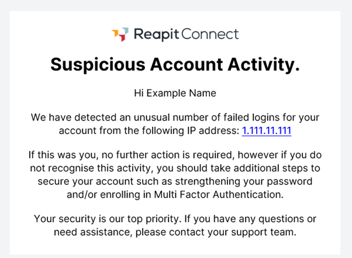
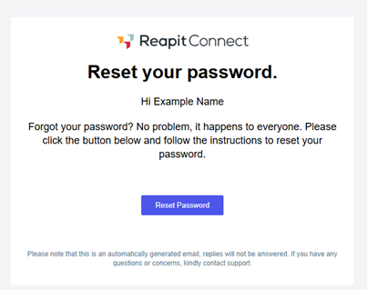
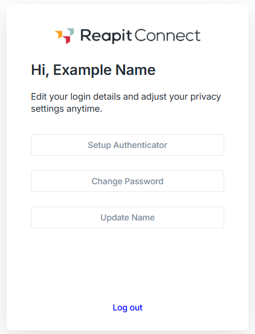

# Reapit Connect Emails

### I have received a ‘Suspicious Account Activity’ email

If Reapit Connect detects multiple failed login attempts against your account, you will be notified via email (see example below).

Failed login attempts are categorized as one of the of the following events, occurring more than 10 times:

* Entering the wrong password&#x20;
* Clicking on ‘Forgot Password’

If the login attempts were made by you, you do not need to do anything.

However, if you have not entered an incorrect password or clicked on forgot password multiple times, we suggest sharing the IP address contained within the email with your IT department and changing your password and/or enrolling in Multi Factor Authentication (MFA) for an added level of security.

**Checking your IP Address:**

You can use various websites to check your IP Address against the one provided in the email or by simply typing into Google ‘what is my IP’. However, some businesses use VPN’s or public networks so if you are concerned and do not recognise the IP provided in the email, please speak with your IT department.  &#x20;

<figure><figcaption>
Example 'Suspicious Account Activity' email
</figcaption></figure>

&#x20;

### I have received a ‘Reset your password’ email that I did not request

<figure><figcaption>
Example 'Reset your Password' email
</figcaption></figure>

If you have received a 'Reset your Password’ email that you did not request, it’s possible that someone accidentally entered your email address while trying to reset their own password, or it could be an automated attempt by someone trying to access your account.

Rest assured, your account remains secure unless the reset link in the email is used to change your password. If you’re concerned, you can update your password and enable additional security measures like two-factor authentication to further protect your account via the secure ‘My Account’ section in Reapit Connect.

To change your password, log in to ‘[My Account](https://connect.reapit.cloud/my-account/)’ and select ‘Change Password’.&#x20;

<figure><figcaption>
Example ‘My Account’ page
</figcaption></figure>

\
\
&#x20;
