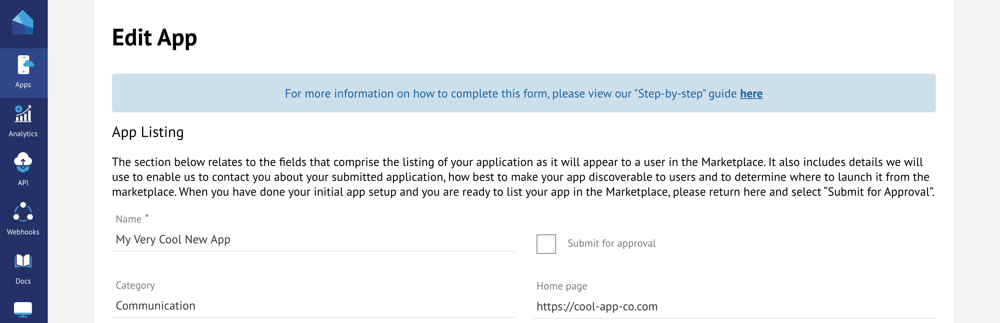

# Listing your App

Listing your app in the Marketplace


The review process from start to finish can typically take between 2-7 weeks. Please allow plenty of time as we often have a backlog of apps and integrations to review.


When you are ready to list your app in the AppMarket, either publicly or as a private app, it will first need to be submitted for approval. For AppMarket apps, please see information on additional testing [here](whats-new.md#additional-testing). The approval process is started when you select the 'Submit for Approval' check box and 'Submit':&#x20;

Our Admin Department will be notified and will carry out the necessary checks. This includes but is not limited to content for your app listing, UI compliance (if building an application that is launched within AgencyCloud), authentication and permissions/scopes as well as architecture and security. There are other guidelines that also need to be followed, please refer to '[Schedule 3](developer-terms-and-conditions.md#schedule-3-developer-obligations)' on your Developer Terms and Conditions and make sure to read them carefully.

Please see below the steps to follow to submit your app for approval:&#x20;

### 1. First, make sure your app listing is ready

Description, Images, Icon, Screenshots & Bullet points etc. Remember the content you add to your app will be one of the first things an agent will see when viewing apps in the Marketplace.&#x20;

To help with ensuring you are ready, have a look at our guide on adding your content [here](https://foundations-documentation.reapit.cloud/whats-new#summary)

### 2. Submit for Approval

Ticking the ‘Submit for Approval’ check box on your app listing, will let us know you are ready for our Admin Team to review and we will be notified immediately of your request.

&#x20;

Depending on your app or integration and its complexity, the review process from start to finish can typically take between 2-7 weeks. However, there are circumstances in which this may not apply.

To make it easier to understand, we have put together the following as a guide:

**Publicly listed: App or Integration**

Review time: Typically, 2 – 7 weeks

&#x20;

**Privately listed: Integration**

Review Time: Typically, 1 – 2 days

&#x20;

**Privately listed: App**

Review Time: Typically, 2-3 days

If your app is launchable inside of AgencyCloud or has a Client facing user interface, we will ask you to set your app to private, using Customer ID 'RES-GRTA’. We can then install your app as an external client (still using sandbox data). This step will give us the ability to test and view the following:

### Apps - launchable inside of AgencyCloud

* Authentication\
  Ensuring an agent is not required to login with additional credentials or is presented with an additional login screen.
* Onboarding\
  Understanding the flow for existing and new users.
* Branding\
  We will look at your use of Elements, our UI Library, ensuring you have built the integration according to our branding guidelines
* Functionality \
  Using the app in accordance with the service it is providing

### Integrations&#x20;

For integrations, after installing, we will require a test and production user account to login into your website/app so our admin team can test its functionality. This will provide us with the ability to check:

* Authentication\
  If you have implemented Reapit Connect ‘Sign in with Reapit’ on your website, we will test with our user account to ensure that it is functional
* Onboarding\
  Understanding the flow for existing and new users
* Functionality\
  Using your website or app in accordance with the service it is providing

There are also other guidelines that need to be followed, please refer to '[Schedule 3](developer-terms-and-conditions.md#schedule-3-developer-obligations)' on your Developer Terms and Conditions.&#x20;

### 3. Submission Declined

If the request to publish your app has been declined, you will be informed of the reason via email or we will give you a call to discuss. Sometimes, it could just be as simple as providing clearer images or that you may be missing some vital contact information. We will be on hand to help and advise you how to resolve any issues.

### 4. Submission Approved

As soon as your app has been approved, it will be available in the AppMarket and you will be informed via email automatically. If it has been set to Private for testing, simply remove ‘RES-GRTA’ from the Private section and re submit.&#x20;

For more information about the requirements for listing an app in the AppMarket, please refer to your Developer Terms and Conditions.&#x20;

If any changes are required you will be contacted by a member of the team.

Once your listing has been approved, you will receive an email confirming your app has been approved and will be set to a status of 'Listed'.  You app will then be listed in the Reapit AppMarket ready for client installation.&#x20;

