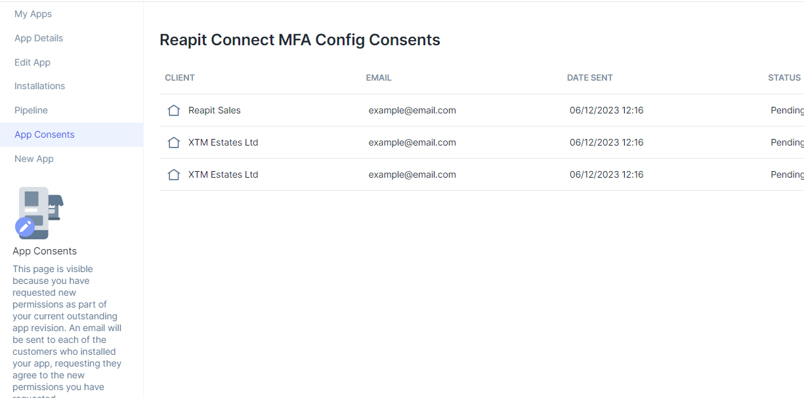

# App Permissions

External developers (Partners) are required to contact the Reapit Partnerships team (partners@reapit.com) before any app revision is submitted for access to new permissions. Please refer to the [Reapit Partner Business Service Catalogue](https://www.reapit.com/legal/terms-and-conditions/reapit-partner-business-service-catalogue) for response times.&#x20;

The Partnerships team will request additional information regarding the new permission, such as the business purpose, what info will be used from the new permission, how it fits into your product process, how you will use the data etc.&#x20;

Once approved by the Partnerships team, the following process will need to be followed;&#x20;

#### **Step 1:**

Add the new permissions and click ‘Create Revision’.

#### **Step 2:**

A modal will appear presenting you with the option to ‘Send Requests’. If you choose to send the requests, an email will be sent to the person that installed your app.

<figure><figcaption></figcaption></figure>

Every customer who has installed your app must agree to the new permission before our team can approve your revision.&#x20;

You can track this process on the ‘App Consents’ page or reach out to your customer to expedite their response to our message.

<figure><figcaption></figcaption></figure>

If you decide not to send the requests, our Partnerships team will send the requests on your behalf.&#x20;

Please see an example email the customer will receive:

“Dear ‘CUSTOMER ORGANISATION’,

An App you have installed from the AppMarket ‘YOUR APP NAME’ has requested the following additional permissions to your data:

PERMISSION

To agree to the requested data, please click accept below where you’ll be redirected to the AppMarket. If you are unsure of this request or you have questions, please contact 'YOUR EMAIL ADDRESS’ for more information.

ACCEPT

Kind regards

Reapit Ltd”

Please note, the email address for the customer to contact will be your own email address should they wish to discuss the requested permissions.&#x20;

#### **Step 3:**

The customer will be redirected to the AppMarket and will be need to ‘Accept’ the request. This is to ensure data security.

#### **Step 4:**

The admin team will be able to monitor the status of each request and once you have received approval from all customers, we will approve your request.&#x20;

