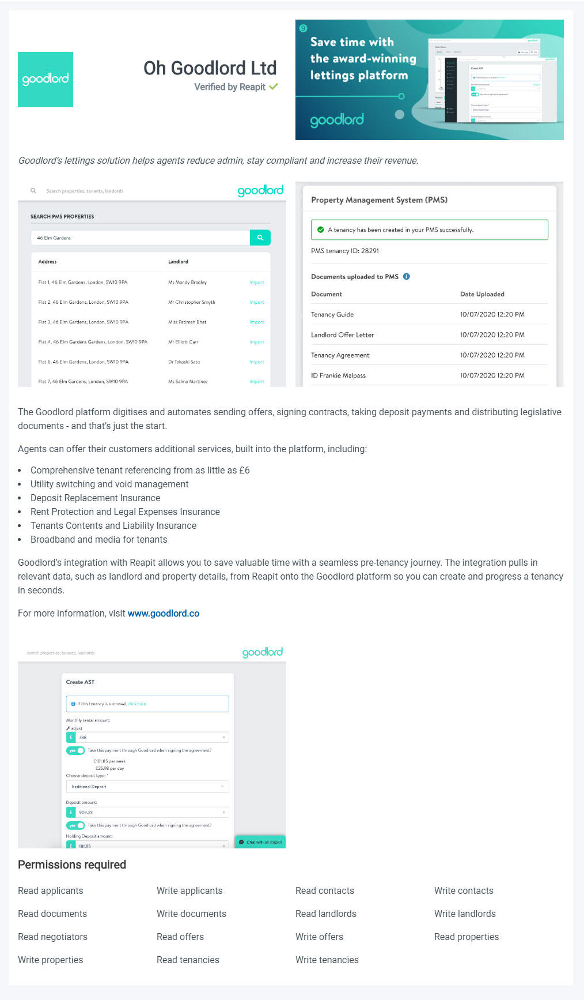

# What’s New

## 
28/08/20

### What’s New with the Developers Portal?

Well, quite a lot actually! We are now in full production, which is a huge milestone for all of us. It does also mean with the new production environment, we have been able introduce quite a few new features.

### **Organisations**

With the production environment in full effect, we now have the concept of organisations. Previously, if you were building or testing in the developers portal for the same company, you would have needed to share an account or setup additional users under a separate account. Now, you can setup your own organisation and invite members to join you.

This means you can collaboratively build and test your integrations under one account. It’s worth mentioning that only an ‘Admin’ will have the ability to view your organisation information.

### **Invite New Members**

To invite members to join your organisation, simply click on the ‘Invite New Member’ button. The recipient will receive your invitation via email and will have the option to reject or accept. You can track the status of any members in the ‘Members’ table on the organisations tab:

Within the members section you will also have the ability to disable members and to set other members as ‘Admins’.

### **About your Organisation**

The ‘About’ field is a text box provided for you to give a bit of information about your company. This will then be automatically included on your app listings and will be visible to users viewing your app in the Marketplace:

### **Account Information – Billing**

Admins will also have access to setup and manage the account information for their organisation.

Account information will be required before an app can be listed in the Marketplace or before any subscriptions can commence.  

If you are an existing customer of Reapit and already have an provided your account information, you can simply add your Reapit Reference \(you will still need to submit some additional account information such as a contact name, email address etc\). We will then send your information to our accounts department to be verified.

Once verified, your account status will be set to 'Confirmed' and you can continue with any subscriptions.

If you do have a Reapit Reference, you will be asked to complete an online Direct Debit mandate. Again, your information will be sent to our accounts department to be setup and once complete, you account status will be set to ‘Confirmed’ and you will automatically be provided with a unique Reapit Reference which we will add the billing page for you. 

All subscriptions such as the annual App Listing fee, annual Developer registration & API Consumption Costs will then be added to your monthly Direct Debit. A break down of any subscription costs can be found on the ‘Cost Explorer’.

### **Description Field**

We have now increased the character limit for the ‘Description’ field on your app listings. This will provide more room for additional formatting. The character limit has been set to 1,500. Remember, as the description field is using HTML, some special characters will count against the total, so we still advise on keeping the content as direct and concise as possible.

## 10/08/20

### Reapit Foundations App Developer Experience

Over the Reapit Foundations public beta period, we have been working to improve the experience for Marketplace App Developers. Today we are announcing some significant updates to our front end tooling for web developers.

#### **New Create React App template**

Firstly we have released a new Create React App template to replace the scaffolder we demoed at the November launch. As before the template represents the quickest way to get started building Marketplace Apps, now with the added benefit of long term support, familiar CLI and stability from the React Scripts package.

#### Reapit Connect OAuth enhancements

We have also given a lot of attention to making the Reapit Connect OAuth flow as smooth and simple as possible. This has taken the form of a new, lightweight NPM Package, Connect Session. The module handles all OAuth re-directs, session caching and refreshing. There is a browser version that works with any front end, a Node version for server-side apps and a convenient Hook for React users. We have also integrated Connect Session into an embeddable “Sign in With Reapit”, button that is served from a CDN and returns a Reapit Connect Session without the need for any package installation or tooling.

#### Stable v1 Elements UI library

Finally, we have released a stable v1 of the Elements UI library. This will guarantee long term support and a stable API for our React Components and style guide package. We haven’t stopped there though, Elements v2 is coming later this year with a much better experience for non-React users, simpler API, improved documentation and smaller bundle sizes.

For full details visit the new App Development section of our documentation [here](https://developers.reapit.cloud/api-docs/app-development).

## 27/07/20

### 
New Webhooks Available

From today, you will now be able to subscribe to 2 new Webhooks. ‘Application Install’ and ‘Application Uninstall’.

Each Webhook will trigger a notification when your app is installed or uninstalled and the payload will include the following information: 

Customer ID \(ID of Estate Agent\)  
Customer Name \(Name of Estate Agent\)  
Customer Address \(Address of Estate Agent\)

Setting up a Webhook is simple and easy to do. For more information on Webhooks please visit the documentation [here](https://foundations-documentation.reapit.cloud/api/webhooks)

### Testing your app inside of Agency Cloud Developer Edition

Following the recent successful launch of the Developer Edition of Agency Cloud, we have been gathering feedback on what we can do to help you further test your integration within our Desktop Software.

 For the last couple of weeks, our Desktop Team have been working hard behind the scenes and we are pleased to announce a brand-new feature, ‘Remote Debugging’.

With the remote debugger you can inspect, in real time, Chromium Developer Tools. You will notice the button appear on your app and simply clicking this button will launch a separate window which hosts the developer tools.

For more information on the Desktop API, please click [here](https://foundations-documentation.reapit.cloud/api/desktop-api#debugging-your-app)

## 23/07/20

### New Agency Cloud Integration types

The list of available Agency Cloud Integration types has been updated and now include the following additional options:

* Landlord
* Contact
* Company
* Tenancy
* Offer
* Sales Progression
* Chain Management

You can select the type of integration your app requires on the ‘Agency Cloud Integration’ section when you edit your app listing.

The list will continue to grow as we understand more about what our developers are building and how they wish to integrate within Agency Cloud.

For more information on Integration Types, please click [here](https://foundations-documentation.reapit.cloud/api/desktop-api#desktop-types).

## 06/07/20

### Agency Cloud Developer Edition

The highly anticipated Developer Edition of the Reapit Agency Cloud CRM is now available to download. This is an incredible milestone that we have been working very hard to deliver and is now available to our developers free of charge during the Beta Phase.

You will have the ability to test your app and interact with sandbox data using the CRM interface. Seeing in real time how customers will use and view your app inside the desktop application.

For more information, please visit the ‘[Desktop](https://marketplace.reapit.cloud/developer/desktop)’ page within the Developers Portal.

### New App Registration

The latest release has redesigned the way you submit an app. It is now easier to get building & testing through Foundations.

When you submit an app through the Developers Portal, you will be presented with a step-by-step wizard and will only need to provide an App Name, select/provide the authentication method & permissions \(scopes\). Once completed you will be presented the relevant access tokens/ID's to work with our APIs.  

There is no requirement at this stage to add an icon/images/description etc until you are ready to list your app in the Marketplace.

When your app is ready to be listed, simple tick the ‘Is Listed’ box on the ‘Edit Details’ page. This will then let you know what information is needed to ensure your listing is meets the requirements to be available in the Marketplace. You can find more information on providing your app listing content, [here](https://foundations-documentation.reapit.cloud/developer-portal#3-register-an-app). 

For more information on submitting an app, please click [here. ](https://foundations-documentation.reapit.cloud/developer-portal#3-register-an-app)

## 29/06/20

### 
App Revisions

We have changed how we handle app revisions. Previously, any revision \(edit\) would need to be approved by our Admin team. This understandably meant a slight delay and prevented any further revisions as your app was in a ‘Pending Revision’ state.

Thanks to the recent update in the Developers Portal, general revisions no longer require Admin approval, meaning no more delays.

The only time your app will be required to be approved by our Admin team, will be when you are ready to list your app in the Marketplace. This is triggered by the ‘Is Listed’ status when editing your App. 

Along with the new app listing pages, as mentioned below, we are currently working on a simplified submit app wizard, which will change how we handle the requirements when editing your app. More on this to follow soon.

## 18/06/20

### 
**New App Listing Pages**

We are pleased to announce that the App listing pages in the Developers Portal have been updated. This means you will now be able to add a more detailed description including bullet points, paragraphs, external links, and a featured image.

The description and imagery you upload, are incredibly important to help capture the user’s attention.  

With that in mind we have also added a ‘Preview’ feature. When you next open your app, you will see a ‘See Listing Preview’ option. It will open a new tab displaying your app listing exactly as it will be seen by users inside the Marketplace.

To maximise the space and to truly showcase your app, we have put together the following tips/guide to help.

### **Summary**

The summary is a short description about your app and will be one of the first things shown in the Marketplace before a user clicks through for more information.

Users should be able to clearly see what your app is about when browsing. You have a maximum of 150 character to utilise which will be displayed on both the app tiles and on your app listing.

### **Icon**

We will soon be adding the ability to upload a company icon in addition to your app icon. You company icon will be shown in a new section \(About Developer\) on the left hand side of your app listing.

Therefore, we suggest uploading an icon relating to the app rather than your company logo.

The suggested image size is 96px x 96px and the app icon is the first opportunity to communicate, along with the app summary, what you are offering. We recommend keeping the logo simple but should be recognisable and understandable. The icon will be placed on a white tile and background so ideally avoid text, screenshots or photos.

### **Featured Image**

The featured image is 495px x 222px and it will appear at the top of your listing page as the first graphic representations of your app before any screenshots.  
  
It may also be used for marketing within the portal under our ‘Recommended Apps’ or ‘Featured Apps’ sections as well as potentially used for external communications.

With that in mind, we are looking for the Featured Image to be more of a graphic/advert style rather than a screen shot of the application. Ideally it should convey your app’s value proposition.

### **Description**

The next step after a user discovers your app in the Marketplace, is to read more about it.

Creating a detailed and accurate description of your app is what will give users the full understanding of what your app has to offer. Appealing enough to encourage users to install.

The description field on the app listing has been converted to support HTML. This means that you can now use paragraphs, bullet or numbered lists, headings and external links.

The focus should be on conveying the value of your app and should work alongside the images you provide.

A great way to think about how to format your description is to picture yourself as the user and what would appeal to you about your application, what problem exists and the solution it provides.

### **Imagery**

You have the option of uploading 4 screenshots on your app listing and we recommend images sizes of 598px x 457px

Whilst screenshots give the user the ability to see your app in action, you can create the screenshots to include text to highlight the important features. Really maximise the space and visual impact of your app listing

2 screenshots are placed directly under the ‘Summary’ and the other 2 are placed below the ‘Description’.

### **Highlight Key Features**

You can add a bulleted or numbered list of key features within the description.

Key features should be quick, short paragraphs. Help your users to easily see the main value that your app provides.  Focus on the benefits. For example: 

* Mobile Friendly
* Easy to Install
* Helpful Hints
* Simple Reporting

### **External Links**

We are now supporting external links which allows you to navigate your users to your own website.

You can use this feature to perhaps link to your own website with a dedicated page with more information or video demos of your application.

Maybe even provide instructions on how to register an account with you or details on how to get in touch to your sales/support team.

If you have more information you want to share with the users, external links are a great way to achieve this.  

## 22/05/20

With the launch of the Beta Phase for the Foundations Developers Portal and with several more developers and PropTechs joining the Platform, we have been pretty busy the last few weeks. It has been great to see some of the applications that are being developed and also having the opportunity to see them in action with live demos . Our Development team have been concentrating on delivering the following new features in the Developers Portal which we are excited to share with you.

### Webhooks

With Foundations, you can now create a Webhook subscription which will allow you to be notified about changes as they happen to your chosen Endpoint.

Setting up a Webhook is very simple and can be created from the new ‘Webhooks’ page in the Developers Portal [here ](https://marketplace.reapit.cloud/developer/webhooks)

It will give you the ability to chose which events to listen to with the option to select specific customers or all customers \(once installed\) for your selected applications.

We currently support subscriptions to events for a wide range of entities. For each type, you can choose to subscribe to created events, modified events \(changes\) or both. You will only be able to select topics based on the permissions assigned to your app.

Also, another very neat feature is the new ‘Ping’ option. Allowing you to test, in real time, your subscriptions to your chosen secure URL.

For more information on Webhooks please click [here](https://marketplace.reapit.cloud/developer/webhooks)

### Desktop Integration Types

Now you may have seen how our demonstration of how the desktop integration types will work when the Desktop API is ready, if not, you can see it in action here: 



In the video, it is showing how the Homeflow application set a desktop type of ‘Property’. This means that within Agency cloud, the application \(after being installed\) will appear within the native Property Screen.

You can set your Integration Type when Submitting or Editing your app in the Developers Portal. Whilst we are still in Beta Phase the current Integration Types are still in development but you can follow the progress [here](https://foundations-documentation.reapit.cloud/api/desktop-api#desktop-types) 

### Cost Explorer

An additional tab has been added on the ‘Analytics’ page, the ‘Cost Explorer’. This will provide you with detailed information on the individual costs for each Resource, Webhook & Service.

The ‘Services’ bar chart will give you a month to month total of your cost \(excluding VAT\).

But for a more detailed breakdown you can use the ‘Cost Explorer: Usage & Cost’. This will provide the ability to see on a granular level, the amount you are spending on each Resource. Notably, until the Marketplace is live and you have app installations, you won’t see any traffic but you can an example below:

Selecting the ‘Configuration’ entity from the table, I can see the breakdown of the specific endpoint my apps have been interacting with, how many API calls have been made and the total cost for that month.

You will also be able to download a CSV file with the full ‘Transaction History’ per month for all your applications.

Finally, with the Cost Explorer we have also added a new feature the ‘Cost Calculator’. The calculator is interactive and provides a quick way to see the estimated cost for endpoints used against Monthly API Calls.

### Description Box

As we are working on developing the Client Portal \(Marketplace\) we want to ensure your app will be presented in the best way, this means providing the ability to add a better formatted description.

The ‘Description’ box when submitting or editing an App, has now been updated to support HTML. You can create headers, bulleted or numbered lists, line breaks and paragraphs.

We are also supporting ‘External Links’ which will no doubt be very handy to provide more information about your company and your app for potential clients.

### HTML feature in Elements

Elements Storybook now also supports a vanilla HTML. Simply apply the classes to your markup as displayed in the HTML tab in each Storybook component as per below:

### Changes

The ‘Submit’ button has moved to the ‘Apps’ page. To submit your app, click on ‘Apps’ from the navigation bar and use the ‘Create New App’ button.

## 15/04/20

### Bring on the Beta.

We have officially started the Beta Phase! If you had signed up to the  Alpha Phase, you will be able to continue using the platform with no interruption, this is simply the next phase for the Developers Portal.   
  
For our new Beta Developers, welcome to Reapit Foundations. If you didn't get the chance, have a look at our on-boarding video [here](https://youtu.be/YSsy5-XonHI). It has been created to help you navigate the portal and to demonstrate what is available. Remember, if you have any questions or need any assistance, you can visit the 'Help' section. 



What’s New has been designed to give you a high-level overview of the latest features and fixes that have been included over the last couple of weeks.

With that said, let us take a look at what we’ve been working on:

### New Features

#### Private Apps

A new section is now available in on the Submit and Edit app forms, giving you the ability to specify which customers you would like to share your application with. You can enter the Customer ID or IDs and when the Marketplace is live, only those customers will see your application in the Marketplace. It is especially helpful to those building in private in-house applications. 

For more information, please [click here ](https://foundations-documentation.reapit.cloud/developer-portal#3-register-an-app)

####  Analytics

The Analytics section has had a significant update, you can now see the specific Endpoints and ‘Total’ number of hits for your App\(s\) as well as a graph displaying your ‘Hits Per Day’. As the data is Sandbox data you will see ‘SBOX’ in your client filter list, but this will include Client IDs when your app has been installed in the Marketplace.

In addition, you can now search the data using a date range filter or simply select a predefined option of ‘Yesterday’, ‘Last Week’ or ‘Last Month’. More to come on the Analytics page in the coming weeks.

#### Tags Input

A new ‘Tags Input’ component has been added to Elements. We will be using this on the Submit and Edit app forms shortly, but it is available for you to use, as are all the components in Elements. Selecting an item from a drop-down list, it will automatically add as a tag in the field. It also offers a hover over state allowing the user to clearly see a brief description regarding each selection.  

To see the new the component, please [click here](https://elements.reapit.cloud/?path=/story/dropdownselect--primary) 

## 31/03/20

Over the last couple of weeks we have been working on implementing a couple of new features, for example the Pending Revision modal as mentioned below. In addition and coming soon a new update to the 'Analytics' page within the developers portal which will provide additional and useful app statistics.  

### 
Changes

**Pending Revisions**

We have now introduced the ability to view what revisions are currently pending and the option to ‘Cancel Pending Revision’.

When you have submitted a revision on your app, you will now be able to click on the ‘Pending Revision’ button \(previously disabled\) which will present a modal with the changes you have made highlighted.

For text or selections that has been added it will be highlighted in GREEN and for text deleted or options deselected, it will be highlighted in RED.

If you wish to cancel your pending revision to make additional changes for example, click ‘Cancel Pending Revision’. It will immediately cancel the revision and you will be able make any edits as usual.

### Fixes

#### Checkbox group feature in Elements

There was a slight issue with the ‘Checkbox’ component in Elements not behaving correctly. This has been fixed and is now working as expected.

### New

#### Journal and Enquires API

The Journal API is now read and write and available within the Interactive API explorer. It has the ability to read and write dated event information into the Reapit Journal system and automatic generation of these events from other services.  

In addition, the Enquiries API is also available and gives the ability to read and write information about new leads into Agency Cloud.

## 11/03/20


I’m pleased to confirm it has been another successful week in the Alpha Phase, not only have we been able to deliver ahead of schedule in terms of a few of our [Milestones](https://github.com/reapit/foundations/milestones), I have also had the pleasure of speaking with you all and gathering your feedback regarding the Foundations Platform. We still have a few weeks to go until the end of the Alpha and already we have had quite a few entries for the Early App Program. 

Towards the end of March, we will be contacting those wishing to participate to confirm the specific details but if it is something you wish to take part in, please be sure to get in contact with our Marketing team. Remember, this is a great opportunity for your application and brand to be visible in the Marketplace.

Now let’s look at what we’ve been doing:

### Changes

**The release of the of Tenancies API**  
The ‘read’ functionality of the Tenancies API is now available. We are still developing the ‘updating’ and ‘creating’ functionality, but you should now get great visibility what is available and what information you can use within your application.


To follow the milestone to see what is still to come and follow the progress, please [**click here**](https://github.com/reapit/foundations/milestone/13)

**Works Orders API**  
In addition and ahead of schedule, the ‘Works Order API’ is now up and running and fully interactive, read, write and update with the Sandbox data to see exactly what information you can use within Property Management.


  
**Embedding Data**  
Now available in the Interactive API Documentation, the option to request additional resources when making a GET request on our APIs.

If your application requires data from one or more related endpoints, you can simply specify the name of the related resource from the list provide in ‘Embed’ section and our APIs will do the rest.  

For more information of this feature, please [click here](https://foundations-documentation.reapit.cloud/api/api-documentation#embedding-data)

### Fixes

**Custom URL Schemes**  
We are now supporting Custom URL Schemes for your App, for the ‘Redirect URI’ and ‘Sign Out URI’ fields.

For example, ‘myapp://’ is now an accepted format, previously it was causing an issue when trying to save on a ‘Submit’ or ‘Edit’ app page unless the format was https:// or http://localhost

Don’t forget, whilst the ‘What’s New’ page will give you a brief look at some of the things we have been working on, the Platform Change Log and coming soon ‘Web Change Log’, will give a more detailed list on the issues we have been addressing.   
  
[Click here](https://foundations-documentation.reapit.cloud/whats-new/platform-changelog) to the view the ‘Platform Change Log’

To follow the release of our  Web Change Log, please [click here](https://github.com/reapit/foundations/issues/599)   

## 28/02/20

Firstly, thank you to all our Alpha partners for your feedback during the first week of the Alpha Phase. It has been incredibly useful in helping us make the necessary changes and updates that ultimately deliver a better experience for you.

Whilst we continue to update the system in the background, here are the highlights of the things we’ve been doing:  

**Changes**  
We have added a more informative way to display if the incorrect number of characters had been used in the ‘Summary’ and ‘Description’ fields on the ‘Submit’ app form. Previously, this wasn’t very obvious and resulted in delay when submitting an App.


**Fixes**  
Thanks to **Navin Mahendran** who reported an issue with the Scaffolder when trying to scaffold an app in the Windows Shell. I’m pleased to confirm this has been fixed and is ready to use immediately.


**Bugs - Interactive API Explorer**   
  
An issue was detected with the ‘CURL’ response, resulting in seeing an ‘Undefined’ error. This is now displaying the correct response.

A missing comma from the JSON response has been found and is now back in place. A well spotted bug from **Erol Ziya**.  

Also, we would like to give a quick thumbs up to those that have used the Live Chat feature and reported a bug directly on our board. It’s proving to be a great way for us to stay in communication and hopefully helping you navigate through the Developers Portal.

## 19-02-2020

What’s new? Well… everything! We have officially gone live with Reapit Foundations. Not only have we decided to create an independent Marketplace for all our Agency Cloud Users but it comes complete with a fully stocked Developers Portal, plus we’ve open sourced everything!

We want to share with you all we can in order to help you develop and interact with our Foundations Platform.

So, let's recap on a few things that we've been up to since the initial launch in Nov 19…

* Open sourced code ✔
* Easy to understand and follow documentation ✔
* Interactive APIs ✔
* Single-sign on and identity service ✔
* New cloud infrastructure ✔
* UI Storybook of usable components ✔
* Feature requesting ✔
* Public Roadmap. ✔

I think it's fair to say, we’ve been busy!

Our Developers have been working incredibly hard and we are all excited to see Reapit Foundations come to life. Each week, I’ll be featuring the best of our releases and talking about the exciting new features we have introduced into the Foundations Platform, as well as sharing updates on our APIs as they happen.

So, this week is the start of the very much anticipated Alpha launch. With that in mind, let me talk you through just a few of the features our new Developer Portal has to offer:

### GitBook Integration

Those of you familiar with [GitBook, ](https://www.gitbook.com)will know they are the leader in the industry for organising and detailing technical documentation. We’ve used the best of the best to ensure you can find and reference what you need as easily as possible. We know the importance of documentation and want you to have the right tools. You can access the documentation from within the developers' portal from the '[Docs](https://marketplace.reapit.cloud/developer/api-docs)' page. 

### Instant Support

Available for a **limited time only**, direct access to our Foundations Platform Product Owners and Developers. You can access this feature from the ‘[Help](http://marketplace.reapit.cloud/developer/help)’ section in the developer portal. We hope you won’t need us and that everything you need can be found within our documentation but it’s nice to know we’re here if you do.

### Full Visibility \([Roadmap](https://github.com/reapit/foundations/milestones?direction=asc&sort=due_date&state=open)\)

From every issue raised through to completion, you’ll have full visibility on what we’re doing. We want you to be a part of this exciting new platform, which is why we’ve opened sourced not only our cloud applications but also our developer portal! Giving you the ability to submit feature requests or to raise bugs directly on our Foundation Repo and track the progress.

These are only a but a few of the features we have included with many more still yet to come.    
  
If you're interested, we will also soon be including a release note section, giving you detailed information on everything that has been changed, fixed or showcasing something new.    

#### Finally... 

Feedback is important!  We have spent a long time creating the Developer Portal and we know it inside out but it helps to hear what you think. So, whilst you are reading through the Documentation, testing the endpoints, or simply navigating through the Portal, we want your feedback. We don't even mind bugs! It's the Alpha Launch, all feedback is welcome. Remember, you can use the [Request a Feature](https://github.com/reapit/foundations/issues/new?labels=feature-request&projects=reapit/foundations/3&body=Summary%20of%20Request:%0d%0dExpected%20Behaviour) or [Report a Bug](https://github.com/reapit/foundations/issues/new?labels=bug&projects=reapit/foundations/2&body=Summary:%0d%0dSteps%20to%20reproduce:%0d%0dExpected%20Results:%0d%0dActual%20Results) from the 'Help' section to get in contact. 

