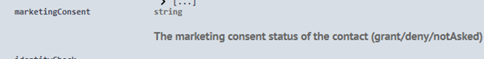
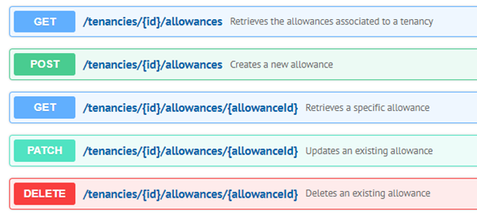
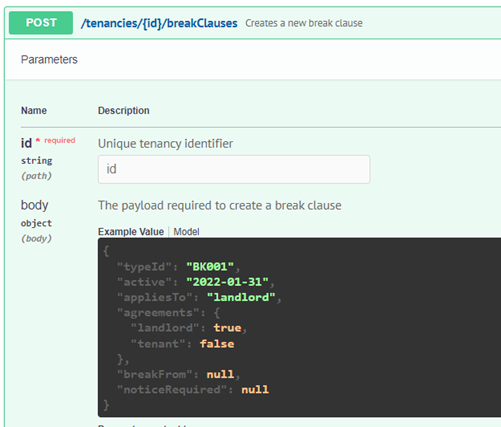
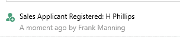
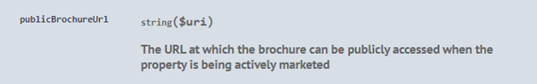

# What’s New

## 31/05/23

### Tenancies

We have added the field ‘checkTypeId’ to the POST /tenancies/{ID}/checks endpoint:&#x20;

<figure><figcaption><p>Example payload showing 'checkTypeId' field</p></figcaption></figure>

&#x20;

### Developer Portal

It is now possible to view more information about an office group installation through the DeveloperPortal.

If your app is installed by an office group, you will receive an email and a webhook (if configured) with the customer ID, for example XXX-XXXX. The first 3 characters represent the organisation, the remaining 4 characters represent the office group ID. For more information on office groups please visit: [https://foundations-documentation.reapit.cloud/faqs#what-are-office-groups](https://foundations-documentation.reapit.cloud/faqs#what-are-office-groups)&#x20;

To see which offices are within that group, open your app in the developer portal and navigate to ‘Installations’:

<figure><figcaption><p>'Installations' section on an App</p></figcaption></figure>

&#x20;

This will display all active installations for your app. If you have an office group installation, for example RES-GRTA:

&#x20;

<figure><figcaption><p>Example customer installation </p></figcaption></figure>

You will have the option under the dropdown menu to ‘Show installed offices’:

<figure><figcaption><p>Example office group installation information</p></figcaption></figure>

This will provide you the name of the office group ‘Office Name’ and the office ID’s that form that group. From the example above, only office ‘BCK’ is in the office group ‘Market Town’.

To retrieve further information about an office, you can use the ‘ID’ in conjunction with the ‘Offices’ endpoint.


### Additional Contact Details

**Related services**: Applicants, Landlords, Tenancies, Offers & Vendors

AgencyCloud provides the option of a free text field to record additional contact information, such as ‘Wife’s Mobile’ in addition to the core fields such as Mobile, Home & E-mail.

By default, we will now return those additional contact details under the ‘additionalContactDetails’ array on the above related services.

<figure><figcaption><p>Example AgencyCloud Applicant Record</p></figcaption></figure>

<figure><figcaption><p>Example core fields on the Applicants API</p></figcaption></figure>

<figure><figcaption><p>Example 'additionalContactDetails' array on the Applicants API</p></figcaption></figure>


&#x20;

## 30/04/23

### Tenancies

The ‘Details/Notes’ field is now available on a tenancy under ‘feeNotes’:

<figure><figcaption><p>Details/Notes field in AgencyCloud</p></figcaption></figure>

<figure><figcaption><p>Example 'feeNotes' field</p></figcaption></figure>

&#x20;

&#x20;

### Journal Entries

A new POST /bulk endpoint has been added to allow a creation of multiple journal entries:

<figure><figcaption><p>POST endpoint for Journal Entries </p></figcaption></figure>

&#x20;

### Configuration

We have added a new configuration endpoint ‘terminology’ to help developers understand customer specific terminology.

For example, some customers prefer to use 'Sold STC' instead of 'Under Offer' or 'Market Appraisal' instead of 'Valuation'.

Using the new configuration endpoint, this will make it easier to understand for each customer. Please see example for our Sandbox configuration:

<figure><figcaption><p>Example 'Terminology' payload </p></figcaption></figure>

&#x20;

It is now possible to filter by ‘Active’ status and by ‘OfficeIDs’ on the `/preTenancyCheckTypes` and `/renewalCheckTypes` configuration endpoints:

<figure><figcaption><p>New filtering options</p></figcaption></figure>

&#x20;

### Appointments

It is now possible to both read and write to the ‘Repeat’ field on appointments:

<figure><figcaption><p>Example 'Repeat' field in AgencyCloud</p></figcaption></figure>

&#x20;

### Properties

By default, the property payload will now return the name of the local authority ‘localAuthorityCompanyName’. Previously, it only returned the ID:&#x20;

<figure><figcaption><p>Local Authority field in AgencyCloud</p></figcaption></figure>

&#x20;

<figure><figcaption><p>'localAuthorityCompanyName' field </p></figcaption></figure>

## 31/03/23

### **DeveloperPortal**

Added Authentication Security: By default, the ‘Authentication Client Secret’ will now be hidden and only accessible by an ‘Admin’:

<figure><figcaption><p>Client Secret - Admin only</p></figcaption></figure>

\
Non Admin users will see the following:

<figure><figcaption><p>Client Secret - Non Admins</p></figcaption></figure>

As an Admin, you can check or change the role of a user within your organisation by simply navigating to the ‘[Members](https://developers.reapit.cloud/settings/members)’ area.\
&#x20;

### **Applicants**

We now support the option for 'Four Weekly' rent frequency on Applicants:

<figure><figcaption><p>Rent frequency in AgencyCloud</p></figcaption></figure>

<figure><figcaption><p>Rent frequency example </p></figcaption></figure>

&#x20;\
&#x20;\


### **Properties**

Agreement signed is now available under the Property Letting Model:

<figure><figcaption><p>Agreement Signed field in AgencyCloud</p></figcaption></figure>

### **Appointments**

Other Agent information has now been added to appointments `otherAgent` with the otheragentId available in the \_links collection

### **Journal Entries**

The list of allowed journal entry types has been expanded to now include ON (offerNote):

<figure><figcaption><p>Example offer note</p></figcaption></figure>


## 28/02/23

### Applicants

Two new filters have been applied to the Applicants endpoint to allow filtering by ‘Last Call’ (`hasLastCall`) and ‘Next Call’ (`hasNextCall`):

<figure><figcaption><p>'Next Call' section in AgencyCloud</p></figcaption></figure>

<figure><figcaption><p>Filtering options </p></figcaption></figure>

### Configuration

We have added additional information on the ‘preTenancyCheckTypes’ configuration endpoint to surface if a check is ‘active or inactive’ and which offices the check applies to e.g. OXF, MKN:&#x20;

<figure><figcaption><p>Example payload showing 'active' and 'officeIds' fields</p></figcaption></figure>

&#x20;

### Analytics Schema

Management Fee information (percentage & amount) is now available in the Analytics Schema under the Tenancy Renewal table:

<figure><figcaption><p>Fields available in the Analytics Schema</p></figcaption></figure>

### Developer Edition&#x20;

The Developer Edition has been upgraded to 12.160 which now includes a new desktop integration type of ‘Renewal Negotiation Check’

‘Renewal Negotiation Check’ can be given to an application that will replace the checks section on a Renewal Negotiation screen in AgencyCloud.

<figure><figcaption><p>Checks section in AgencyCloud</p></figcaption></figure>

For more information on this desktop integration type, please [visit](https://foundations-documentation.reapit.cloud/api/desktop-api#renewal-negotiation-check).&#x20;

Also coming soon, the ability to launch apps from the images section in AgencyCloud.

## 31/01/23

### Property Images

The property images endpoint now respects the maximum dimensions that are set in a customer's configuration. &#x20;

### Tenancies

When a tenancy is in an arranging status, we now expose the contacts associated to the attached applicant in the `related` collection.&#x20;

### Contacts

Company information is now returned on a contact under the company link.

### Properties

Converted room dimensions are now returned on a property under ‘`dimensionsAlt`’.&#x20;

<figure><figcaption><p>Property Rooms and Accommodation screen in AgencyCloud</p></figcaption></figure>

<figure><figcaption><p>Example 'dimensionsAlt'</p></figcaption></figure>

### Design System

Release 4.0.0

<figure><figcaption></figcaption></figure>

**New Features**

* Visual Language has been revamped with detailed rules for icons, fresh new icons and improved styling for better visual consistency.
* Iconography (Visual Language section) has been reorganised into new categories.
* Product Brand Imagery (Visual Language section): a full set of illustrations was added to the collection.
* Mobile navigation has been added to UI Elements&#x20;

**Bug Fixes**

* Reapit and ReapitConnect logo sizes have been adjusted
* ReapitConnect logo is now a vectorial image
* One Choice Chips (Segmented Control) has been renamed to Toggle Button. Its width size changed from static to dynamic.
* Desktop - Full Options Expansion Panel style has been changed (shadow and outline)

## 30/12/22

### Applicants API

Custom applicant attributes that are usually captured on the requirements screen under ‘Must Have’ or ‘Special/Special Requirements’, are now surfaced for applicants under ‘specialFeatures’:

<figure><figcaption><p>Applicant Requirements screen in AgencyCloud</p></figcaption></figure>

<figure><figcaption><p>Example Special Features Data</p></figcaption></figure>

&#x20;The ‘Renting Position’ is now surfaced on an applicant under ‘`renting.positionId`’:

<figure><figcaption><p>Applicant status screen in AgencyCloud</p></figcaption></figure>

<figure><figcaption><p>Example 'positionId'</p></figcaption></figure>

**Note:** The renting position list is configurable and can be cross referenced against a new sub-resource under the Configuration endpoint ‘GET /configuration/rentingPositions’.

&#x20;

### Transactions API

You can now create pending supplier invoices using the new sub-resource under the Transactions endpoint ‘POST /transactions/supplierInvoices’:&#x20;

<figure><figcaption></figcaption></figure>

For the full specification, validation, and behaviours, please review ticket [https://github.com/reapit/foundations/issues/7764](https://github.com/reapit/foundations/issues/7764) in conjunction with the swagger documentation.

&#x20;

### Analytics Schema

‘Tenancy Alterations’ data is now included in the Analytics Schema:

<figure><figcaption><p>Analytics Schema </p></figcaption></figure>

## 30/11/22

### Applicants API

It is now possible to set an applicant as a Potential Client (`potentialClient`):

<figure><figcaption><p>Applicant Status screen showing the 'Potential Client' field In AgencyCloud</p></figcaption></figure>

<figure><figcaption><p>Potential Client field</p></figcaption></figure>

We are now surfacing remaining lease (`leaseRemaining`) information on Applicants:

<figure><figcaption><p>Applicant Requirements screen showing the 'Remaining Lease' fields in AgencyCloud  </p></figcaption></figure>

<figure><figcaption><p>Reaming Lease field</p></figcaption></figure>

&#x20;

### Analytics Schema&#x20;

'Pre Instruction Checks' data is now included in the Analytics Schema:  &#x20;

<figure><figcaption></figcaption></figure>

### Journal API

We now support the option to POST to the Journals endpoint the following letter types:&#x20;

Arrears Letter (AL),\
Notice to Quit Letter (NQ),\
Tenancy Renewal Letter (TR),\
Letter Sent (LE)&#x20;

**Please note**: In the case of AL/NQ/TR the associated type MUST be ‘tenancy’.&#x20;


### Properties API

&#x20;The ‘Text’ field (`urlcaption`) is now both read and write:

<figure><figcaption><p>Marketing Screen showing the 'Text' field in AgencyCloud </p></figcaption></figure>

<figure><figcaption><p>Text field</p></figcaption></figure>

## 31/10/22

### Analytics Schema

'Referral' data is now available within the Analytics Schema:

<figure><figcaption></figcaption></figure>

### Contacts API&#x20;

It is now possible to update the ‘marketingConsent’ field on an archived contact record:&#x20;

<figure><figcaption></figcaption></figure>

**Please note:** Only the Marketing Consent field on an archived record can be updated.&#x20;

### AppMarket 2.0

As you may have already seen, on Wednesday 26th, we launched the latest version of the AppMarket. The updated AppMarket includes and now supports, app name & developer searching, new categories and filter options plus featured apps and app collections:

<figure><figcaption><p><a href="https://marketplace.reapit.cloud/">https://marketplace.reapit.cloud/</a></p></figcaption></figure>

Part of the redesign will now allow customers on Rackspace, to view apps that were previously hidden due to the compatibility with AWS. Whilst they still will not be able to install or enable integrations that use data Webhooks, they will now be able to enquire about the app/integration, view the marketing materials and videos.

The new AppMarket now also includes the ability for Developers to add videos to their app listings. ‘Getting Started’ & a ‘Why’ video. For information on how to add a video to your app listing, please [click here](whats-new.md#developer-portal).


###

### Applicants API

Applicant Tenure information is now available in the Applicants ‘Buying’ modal:

<figure><figcaption></figcaption></figure>

### Companies API

We now support filtering on the Companies endpoint by Office Groups.

For more information on office groups, please visit [https://foundations-documentation.reapit.cloud/faqs#what-are-office-groups](https://foundations-documentation.reapit.cloud/faqs#what-are-office-groups)

&#x20;

### Tenancies API

‘Allowances’ can now be created and updated:

<figure><figcaption></figcaption></figure>

‘Break Clauses’ can also be created and updated:

<figure><figcaption></figcaption></figure>

And also for ‘Responsibilities’:

<figure><figcaption></figcaption></figure>

### Metadata API

It is now possible to patch nested objects in the Metadata API

### Properties API

We have exposed the `ValuationDate` & `AgreementExpiry` dates under the property selling model

### Developer Portal

**Videos**

Applistings now support the ability to add video URL's. Under the section 'AppMarket Listing', you'll see 2 new fields:&#x20;

<figure><figcaption></figcaption></figure>

The video's will then be rendered in the AppMarket:&#x20;

<figure><figcaption></figcaption></figure>

**Please note:** We recommend strongly that if you do upload videos, to use the online streaming site YouTube.

**App Deletion**

To prevent accidental data loss, we have added an additional layer of protection for apps. On each app, under the section ‘AppMarket Listing’, you will now see the following check box:

<figure><figcaption></figcaption></figure>

If you should then accidentally select ‘Delete’, you’ll be prompted the following message and will need to disable the additional protection before you can delete the app:

<figure><figcaption></figcaption></figure>

**Please Note:** The app data protection check box is not selected by default so, to ensure your apps and its associated data are protected, please review your app listing.

&#x20;

## 30/09/22

### Properties API

Unmapped attributes:

Property and Applicant attributes/requirements (department data) is completely customisable for each agent and subsequently it can be difficult to understand how to interpret this data as it comes out of the various APIs that expose it.

As the Platform APIs are standardised across all our customers, Department data has also been standardised where possible using a mapping mechanism to map the customisable values from our CRM into standard values in the API.

Any options that do not have a corresponding mapping and are selected on a Property or Applicant entity will be included in the `unmappedAttributes` and `unmappedRequirements` collections in their respective APIs. Additionally, the _Special_ attributes column in the CRM is mapped explicitly.

Example payload:

<figure><figcaption><p> </p></figcaption></figure>

Fields:

<figure><figcaption></figcaption></figure>

To view the latest version of the mappings, please visit: [https://foundations-documentation.reapit.cloud/platform-glossary#interpreting-department-data](https://foundations-documentation.reapit.cloud/platform-glossary#interpreting-department-data)

&#x20;

The Properties API now displays the Maximum Reception/Bathroom ranges:

<figure><figcaption></figcaption></figure>

### Journals API

It is now possible to create a Works Orders journal entry:

<figure><figcaption></figcaption></figure>

**Note**: TypeID must be set to 'WO' when passing worksOrder

### Companies API

We now support filtering on the Companies endpoint by Negotiator and Office:

<figure><figcaption></figcaption></figure>

### Applicant API

Applicant ReasonID and SellingPosition now available using POST and PATCH methods:

<figure><figcaption></figcaption></figure>

<figure><figcaption></figcaption></figure>

### Integration Types

New ‘Diary’ desktop integration type now available from version 12.152.3. App’s that have selected ‘Dairy’ as the integration type will be launched from an existing appointment. For more information, please [click here](https://foundations-documentation.reapit.cloud/api/desktop-api#diary).&#x20;

<figure><figcaption></figcaption></figure>

## &#x20;30/08/22

### Tenancies API

It is now possible to read deposit and deposit holder information via the tenancies API. This information can also be written back up to a certain status:

<figure><figcaption></figcaption></figure>

&#x20;It is now possible to filter tenancy checks by type:

<figure><figcaption></figcaption></figure>

### Properties API

Market Appraisal (valuation) price now available:

<figure><figcaption></figcaption></figure>

Pre-Instruction checks can now be managed via /properties/{id}/checks:

<figure><figcaption></figcaption></figure>

### Applicants API

It is now possible to find applicants by phone number (and any other contact detail):

<figure><figcaption></figcaption></figure>

### Webhooks API

Webhook transactions can now be filtered much more granularly to allow you to find transactions more easily (Topic name, Entity ID & Event ID):

<figure><figcaption></figcaption></figure>

### Enquiries API

The validation has been updated to more closely match the contacts API&#x20;

## 29/07/22

### Referrals API - Phase 2

The Referrals API has now been enhanced to support updating (PATCH) and the ability to store metadata:&#x20;


### Properties API

It is now possible to see the Id’s of disabled portals set against a property:


&#x20;You can now filter properties by AreaId:&#x20;


Our multi currency support milestone has been completed. It will be most beneficial for UK customers that advertise international properties. For more information, please review our milestone [here](https://github.com/reapit/foundations/milestone/142?closed=1).

### **Enquiries API**

When creating a new enquiry (which is visible on the Internet Registration panel in AgencyCloud) you can now pass price/bedroom requirements for sales and lettings applicant enquiries:


### Journal API

We have added support to allow retrieval of ‘tenancy’ journal entries.&#x20;

## 27/06/22

**Rural** property data is now exposed with certain fields writeable under the ‘rural’ section on a property:


**Lettings management fees**, type and amount now available under the ‘managementFee’ section:&#x20;


**Number of units** (numberOfUnits) in a development now available:&#x20;


**Minimum tenancy term** (minimumTerm) now available for lettings properties:&#x20;


‘**smallHolding**’, ‘**estate**’ & ‘**developmentOpportunity**’ property types are now available via the Properties, Departments & Applicants endpoints. Please note, the additional types are only available in some customer's systems. The 'Departments' endpoint should be used to understand the configuration of a specific customer.

**Contact categories** can now be retrieved using the ‘Configuration’ endpoint ‘contactCategories/{id} and can also be set on a ‘Contact’**:** &#x20;


&#x20;**Public brochure URLs** (publicBrochureUrl) are now available in the Properties API under either the ‘Selling’ or ‘Letting’ object:&#x20;



A **works order note** (worksOrderNote) can now be added at the property level which will cascade down to any works order for that property in Agency Cloud:&#x20;


**Office status** can now be obtained from the Offices API so you can understand whether an office is open or closed based on the field type ‘active’:&#x20;


&#x20;

## 24/05/22

### **Referrals - Phase 1**

Last week, we released the first phase of the ‘Referrals’ endpoint which includes the following:


The second phase will include the ability to write to the endpoint, metadata & associated webhooks. You can track the phase 2 milestone [here](https://github.com/reapit/foundations/milestone/136)

### **New features**

**Journal Entries**: You can now store a journal entry of Match (MA) against a property or applicant record\
\
**Bedroom Range**: The ‘Max’ bedroom range is now exposed in the Properties API – this is most useful for marketing of property developments.\
\
**Properties**: We have added support for Juliette Balcony (property situation), Studio (property style) and Villa (property type).\
\
**Companies**: Additional contact information is now available for companies. The additional information is available in ‘additionalContactDetails' object:&#x20;


**Transactions**: It is now possible to filter transactions by ‘Outstanding’ amount.

### **Developer Portal Release**

The latest release of the Developer Portal (v3.0.5) included the re design of the following pages…\
\
**Settings**: We have updated the UI within the settings section in accordance with our design system and the other pages within the portal. The options available to you when accessing settings will be dependent on your user level:


Admins of an organisation can set the level of users (members) on the ‘[Members](https://developers.reapit.cloud/settings/members)’ page.\
&#x20;\
**Analytics**: We have separated the features and information available to you in specific sections: ‘API Usage’, ‘Costs’ & ‘Installations’.


\
You can use the filters on the left-hand side to set the data results for each page.

### **Design System**

In the latest release of our Design System Figma file, we introduced new button states and a new component. We have also fixed a few bugs and revised/added additional documentation for buttons.\
&#x20;\
New Features

* Disable and hover states for desktop buttons


* Disable state for mobile buttons


* New medium size infographic icon (Manage App Listing)


* File Upload component


### **Bug Fixes**

* Measurements: misspelling on the red static button; it was 38px, now it’s 40px&#x20;
* Measurements: misspelling on the ‘One Choice Chips’ component - active state, selected chip, padding was 4px and now it’s 3x, margins were 3px and now it’s 4px
* Documentation about button types was added to all components that use them
* Static button with icon has been documented
* Static button width size for mobile has been increased to 120px
* Guidelines for static and dynamic buttons have been revised
* Desktop - Full Options Expansion Panel: button margins and distance between buttons and content have been revised


## 01/04/22

### Trading Standards – Material Information Requirement

We are pleased to confirm, the Properties API has been updated to provide the following information ahead of the Material Information requirement by the end of May 2022. Related information [here](https://www.nationaltradingstandards.uk/news/material-information-for-property-listings-announced/).&#x20;

The following fields are available:

* Council Tax Band (`councilTax`)
* Local Authority (`localAuthorityCompanyId`)
* Ground rent for leasehold properties (`groundRent` & `groundRentComment`)
* Maintenance charges for leasehold properties (`serviceCharge` & `serviceChargeComment`)
* Leasehold length (`tenure.expiry`)

### Webhook Enhancements

Last week, we updated our Webhook functionality to increase throughput and to reduce latency. We have seen a significant improvement already. We have enhanced the way in which we process webhook events. Nothing has changed for you in how you create or manage your webhooks but the background service has been re developed to better increase the rate in which they are emitted.

### Additional fields

Deposit Data (Type & Amount) is now available inside the Lettings object on Properties API under ‘deposit’:


### Additional Filtering

Properties by Negotiator ID(s)


Properties by Country ID:


### GitHub Username Field

To better help us identify the company you are associated to and help with triaging tickets that are raised via GitHub, you can now save your GitHub username on your ‘[Profile](https://developers.reapit.cloud/settings/profile)’ page in the DeveloperPortal:

&#x20;


### Help is moving

The 'Help' page is moving into our main documentation. The 'Help' icon on the main navigation will soon no longer be visible but you can still access help by going to '[Docs](https://foundations-documentation.reapit.cloud/) > [Help](help.md)'.&#x20;

## 24/03/22

### New Release

This week, we have released a new version of the Developer Portal, specifically an updated version of the app creation flow and app edit pages.

The new design has been developed to improve the UI (now using Elements V3) and to improve the user experience. We’ve also added a very helpful new feature. Read below to find out more.

### App Creation

To better help you navigate the app creation process, we have included a helpful app creation wizard. The wizard is designed to make creating an app as straightforward as possible by preselecting/populating certain fields based on your use case.

You can select the type of integration from the list below:


Or if none of the above suit your requirements, simply scroll down and select either a Client-side app or Server-side Integration:


With every selection, we will present the associated documentation on the right-hand side to help you with the process.

You’ll find helpful links for more information or on certain selections, a short video.

When you have completed the wizard, you’ll be directed to the ‘App Details’ page. This page will contain all the information you need to get started developing right away, such as the Client ID and or Client Secret:


The app name will be pre-populated based on your company name. You can change this at any stage.

To edit your app, simply click ‘Edit App’ from the left-hand navigation.

Depending on what type of app you have selected from the wizard, you’ll be presented with various tabs. The first tab for all types is the ‘About Listings’.

### **New Feature**

On the ‘Edit App’ page is where we have introduced a new feature ‘Check Status’.


The check status button is a very quick and easy way to see the current status of your app, what information is missing, your AppMarket status and to see if have any changes that require saving.


The process for submitting your app for review is the same as before. Simply check the status of your app and once all checks have been completed (see example below):


A button on the left-hand side will appear ‘Submit Review’. This will create a revision to our Admin team.


&#x20;

Once your app has been approved (please [click here](listing-your-app.md) for more information on the reviewal process) the button will change to present the option to ‘Delist’ your app.


The additional tabs, as mentioned previously, will depend on your app type but in all cases, you will have an ‘AppMarket Listing’ and a ‘Permissions’ tab.

The ‘AppMarket Listing’ tab captures the app listing content for the AppMarket and will need to be completed before submitting your app. Images, description, contact information etc.


The ‘Permissions’ tab will relate to the endpoints and data sets you wish to interact with and the visibility of your app (either public or private).


For other types of integrations, you will see the tabs for AgencyCloud Integration and Authentication.

We will be continuing to update the Developer Portal in the coming months to further enhance the user experience and features available to you. &#x20;

## 14/03/22

### Works Orders&#x20;

You can now interact and launch with the native works orders screen and pre populate certain search criteria using the newly added AgencyCloud scheme:&#x20;

```
agencycloud://worksorders/{id} 
```


For more information on Works Orders, please click [here](https://foundations-documentation.reapit.cloud/api/desktop-api#works-orders)

### Match Output Integration Type

The category of _Match Output_ would enable an application to be used to export the details of a match either from an applicant to a property or a property to an applicant.

An app with the integration type 'Match Output' will be visible by selecting 'Print' after running a match:&#x20;


For more information on Match Output, please click [here](https://foundations-documentation.reapit.cloud/api/desktop-api#match-output)

## 10/03/22

### Property URL

We are now returning (when manually entered) the Property URL, which is accessible from the 'Marketing' screen:&#x20;

 (1).png>)


**Please note:** The URL will only be returned when it has been explicitly set. Default URLs' will not be available.&#x20;

## 23/02/22

### Property Featured Image

The featured property image (featuredImageUrl) is now being returned in the properties object, without the need to embed or make an additional call to the property images endpoint. This will be mostly beneficial for website integrations for property results.


### Property Manager Information

We are now returning the Property Manager ID (propertyManagerId) within the lettings object on a property.&#x20;


### Additional Extras support for Landlords and Works Orders

We have now added the ability for users to request additional extras fields for Works Orders and Landlords.&#x20;

&#x20;Also, you can now filter by ‘QuoteAccepted’ on Works Orders.

### Code generation

We have now updated our code generation mechanism to now support office specific referencing.

## 10/12/21

We have recently updated our [Development Request documentation](https://foundations-documentation.reapit.cloud/dev-requests) to now include a [FAQ’s](https://github.com/reapit/foundations/milestone/105) section.\
\
Part of the update to the documentation includes a detailed description on each label, column and board.\
\
Please take the time to review the updated documentation and ensure you understand how feature requests and bugs are triaged via the Platform.\
\
In addition to the updated documentation, we will shortly be implementing a ‘GitBot’. The GitBot is designed to auto reply to specific issues raised, when issues are moved to certain columns, assigned specific project boards or certain labels added.\
\
Essentially, an automated comment to will be added to the issue which will help explain the reason a specific label was added, why it was moved to a certain column and the time frame in which we expect the work to be completed by. The automated email will be sent the person that raised the issue or anyone that has subscribed.\
\
If you would like to receive a notification (email) to an issue you are following but have not raised, please make sure you are subscribed, using the ‘Subscribe’ option from the right-hand navigation.\
\
Please do not contact our service desk, customer success managers or any other channels within Reapit with regard to the status or timeline of an issue. Please first refer to the [documentation](https://foundations-documentation.reapit.cloud/dev-requests) and communicate with developers directly in GitHub.

## 13/09/21

### Troubleshooting

We have introduced a new section in our documentation ‘[Troubleshooting](troubleshooting/)’.

The documentation is intended to provide guidance to our Developers when building apps and integrations through the Developer Portal.

Currently, it offers support on the following topics:

[Accessing Customer Data](troubleshooting/accessing-customer-data.md)\
[Authentication Issues](troubleshooting/authentication-issues.md)\
[Installation](broken-reference)\
[REST API](troubleshooting/platform-api.md)\
[Reapit Connect](troubleshooting/reapit-connect.md)

We will continue to add and update this section but don’t forget, we also have a dedicated page for FAQ's, which can be found [here](faqs.md).

Remember, if you are having an issue not covered in the documentation or you have discovered a bug, please raise an issue on our public board by clicking [here](https://github.com/reapit/foundations/issues/new/choose).

### **Notification Email**

The email address you entered when registering for the Developer Portal, is used by default to receive email notifications,. For example, when your app is installed from the AppMarket, you will receive an email with the details (see more information [here](https://foundations-documentation.reapit.cloud/faqs#installation))

As you cannot change the email address that registered your organisation, we have now provided the ability to supply an alternative ‘Notifications Email’.

.png>)

If you want to setup an alternative email address, simply go to ‘[Organisation](https://developers.reapit.cloud/settings/organisation)’ page.&#x20;

**Please note:** Only an Admin will have the correct permissions to update this information.

### **Certificates**

We are pleased to announce have added new endpoints to the Properties endpoint to now allow for reading and writing of ‘Certificates’.&#x20;

.png>)

In conjunction with the new entities, we have also added to our Configuration endpoint, the ability to surface CertificateTypes.

## 25/06/2021

### **Webhooks Transaction Logs**

We have now included a ‘Transactions Logs’ section on the ‘Webhooks’ page, to allow you to filter your transactional Webhook history by date and app. \
\
To view your webhook transaction logs, simply navigate to the ‘Webhooks’ page inside of the Developer Portal, select a date range (will default to the last 7 days) and select an app:&#x20;


From each log item, you will be able to see the URL, the selected topic, status and the option to ‘Download’.

Selecting ‘Download’ will save a copy of the specific payload as a JSON file.\


### **New Webhook Topics**

We have added the following new Webhook topics:\
\
appointments.cancelled\
appointments.confirmed\
contacts.optedout\
enquiries.accepted\
enquiries.rejected\
offers.rejected\
offers.withdrawn\
offers.accepted\
properties.selling.askingpricechanged\
properties.selling.completed\
properties.selling.exchanged\
properties.selling.withdrawn\
properties.selling.instructed\
properties.selling.lostinstruction\
properties.selling.underoffer\
worksorders.cancelled\
worksorders.complete\
worksorders.raised\
&#x20;\
If you wish to setup subscriptions to any of the new the topics listed above, you will need to have selected the associated scopes.\
\
For more information on the required scopes, please visit the associated documentation [here](https://foundations-documentation.reapit.cloud/api/webhooks#available-topics).\


### **New REST Hooks Endpoint**

We have introduced a new REST Hooks Endpoint. This functionality allows you to programmatically set up webhook notifications for your application rather than needing to do this manually using the ‘Webhooks’ page in the developer portal which can help you automate onboarding of customers.


### **Updated Terms and Conditions**

We continue to develop new features and products on the Foundations Platform and have updated our Terms and Conditions to reflect these changes.\
\
From 25th June, when you next login to the Developer Portal, you will be presented with the latest updated terms and will need to accept before continuing to use the Developer Portal.\
\
Our current and revised terms can be accessed through the Developer Portal documentation under ‘[**Developer Terms and Conditions**](https://foundations-documentation.reapit.cloud/developer-terms-and-conditions)’.

## 04/05/2021

### New Desktop Integration Types

Our desktop integration types have been extended to now include the following communication types included in AgencyCloud from version 12.130.1 :

* Outbound – Email
* Outbound – Landline
* Outbound – Mobile

On each communication type, the Desktop API will provide a 'cntCode' and relevant communication information, either email, landline number or mobile number.

App that’s have any of the above desktop integration types will be visible in AgencyCloud when right clicking on the relevant icon, please see example below:

.png>)

The Developer Edition of AgencyCloud has automatically been updated to include the new communication types.&#x20;

## 19/04/2021

### Setting Predefined Property Brochure Details

It is now possible to set or clear default property brochures when updating existing properties, using the PATCH method on /properties/{id}

Updating the ‘brochureId’ field on the ‘Selling’ and/or ‘Lettings’ models with a document ID, will set a PDF as the predefined property details. Please see an example in the Property Details screen from within AgencyCloud (Desktop CRM) below:

.png>)

### Inactive Webhooks

To ensure data viability and security, we have made a change to the way 'Sandbox only' Webhooks are handled.

Webhooks that have been setup specifically for Sandbox testing (SBOX) and have been unmodified for 14 days, will automatically be deactivated.

Should you wish to continue using Webhooks for Sandbox testing, you can reactivate it again by selecting the check box ‘Active’ when editing. 

.png>)

### Large File Support

We have added additional support for uploading files over 6MB (Up to 30MB) to the Property Images and Documents endpoints via the use of pre-signed URL's

## 01/04/2021

### &#xD;Developer Portal and AppMarket Refresh

We are excited to announce today, the Developer Portal, Reapit AppMarket and AppMarket Apps UI have been updated in conjunction with the release of our Elements UI library version 2. The functionality of all apps remain the same but with UI enhancements to your user experience.

The visual changes you see are the first step towards a universal design language we have been working over the first part of the year. In the coming months you will see continued incremental updates as pages and flows are re-worked for better UI consistency, polish and UX. In keeping with our open source commitment, in the coming months we plan to make available publicly the design language, sample layouts and designs so that Reapit Developers can leverage our design resource to build better user experience into their own AppMarket apps.

.png>)

Because we ask that all AppMarket Apps use our UI for visual consistency, we wanted to give the style guide a lift to ensure it best showcases of our development partner's work. This is the core of the Elements v2 release - it is a subtle evolution of the library, including a new font, typography, colour pallet, form inputs, notifications, dialogue boxes and much more.

Care has been taken to avoid breaking changes both to React Components and CSS Classes so that upgrading for all developers should be trivial and painless. We will also offer ongoing long term support in terms of security and bug fixes for the v2.x.x release. You can see the updates to the React Storybook here: [https://elements.reapit.cloud/?path=/docs/](https://elements.reapit.cloud/?path=/docs/)

.png>)

This however is just the start and we are now looking ahead to version 3 of Elements. Version 3 will be a ground up re-write of the library, both implementing fully the new design language and responding to both internal and external developer feedback. The version will focus on three core areas of improvement:

* Visual UI refinement and consistency, fewer components and clearer design patterns to implement.
* Better documentation for both React and non-React users, including suggested use cases and composed components for off-the-shelf UI / UX flows.
* Much smaller library with very little required JavaScript and very few dependencies. Elements will be about the visual presentation with developers free to make their own choices as to how to implement behaviours. This will mean a far better developer experience, especially for non-React users and a much more flexible, less opinionated library.

For more information about the latest release and news about Elements 3.0 (coming soon) please [click here](app-development/elements.md#elements-v-3-x-x-coming-soon).

## 09/03/2021

### Configurable Webhook Behaviour&#x20;

A new configuration option is now available when editing existing/creating new webhooks.&#x20;

By default, webhooks will not be emitted when only the entity's eTag and modified timestamp has changed.&#x20;

If you would prefer to receive notifications in this situation, please use the '**Ignore notifications where only the eTag has been modified'** toggle option when configuring your webhook. See example below:&#x20;

.png>)

Existing webhooks will remain as they are and you can edit your webhooks at any stage from the '[Webhooks](https://developers.reapit.cloud/webhooks)' page in the Developers Portal


### New Developer Requests Documentation

To '[Request a Feature'](https://github.com/reapit/foundations/issues/new?assignees=\&labels=feature-request%2C+needs-triage\&template=feature\_request.md\&title=) or to '[Report a Bug](https://github.com/reapit/foundations/issues/new?assignees=\&labels=bug%2C+needs-triage\&template=bug\_report.md\&title=)' you can visit the '[Help](https://developers.reapit.cloud/help)' page in the Developers Portal. To help with understanding the process for each new issue raised, we have added a new section in our documentation '[Developer Requests](broken-reference)'.&#x20;

The new documentation will outline our processes, from what happens after submitting an issue to how your ticket will get triaged and categorised. Depending on the nature of the request or bug, it will determine which project board it may get assigned to. As our boards are public you will always be able to track the progress of any issue or request raised.&#x20;

.png>)

### Virtual Viewing check box

With the very significant increase in the number of listings carrying virtual viewings, we have introduced an additional 'Virtual' check box on appointments inside of AgencyCloud:&#x20;

.png>)

The virtual field is also now available in our 'Appointments' API in the Platform:&#x20;

```
 "accompanied": true,
      "virtual": false,
      "negotiatorConfirmed": true,
      "attendeeConfirmed": true,
      "propertyConfirmed": true,
      "metadata": {
        "CustomField1": "CustomValue1",
        "CustomField2": true
```

The latest version of the Developer Edition of AgencyCloud will include the new checkbox

## 25/02/21


With all enterprise customers now having access to the AppMarket, we wanted to use today’s What’s New update to highlight the features available to you on the ‘[Analytics](https://developers.reapit.cloud/analytics/)’ page in the Developers Portal.

The Analytics page provides useful information on the following:

### Current Installations

A table to display the individual installations per client with a total number of installations per app

.png>)

### Hits Per Day

A graph showing the number of endpoints that are hit per day. You can also hover over a specific point for more information :

.png>)

### Installation Details

A full history of any installations or uninstallations that have occurred for your apps:

.png>)

### Transaction History

For a more granular level of information, you can download a month by month CSV of your transactions:

.png>)

### Services Chart

Any subscriptions or services you have subscribed to will be shown on the services chart and referenced by colour. Subscriptions/services may include, App Listings/Developer Edition of AgencyCloud/ Developer Registration etc:

.png>)

### Cost & Usage

You can use the ‘[Cost Explorer: Cost & Usage](https://developers.reapit.cloud/analytics/costexplorer)’ section to view your current monthly subscription charges and navigate through previous months if required. We also provide a ‘Download’ option which will download this information in a CSV.

.png>)

### New section in the documentation

With an increase in apps now being submitted for approval, we have added a new section in our documentation ‘[Listing an App](listing-your-app.md)’.

It covers, in detail, how to prepare your app before listing, what information is required, our testing processes and what happens when your app has been approved. &#x20;

## 03/12/10

### &#xD;New fields now available

We have recently updated the Developers Portal to allow for 4 new fields on your App listing which can be managed when clicking on 'Edit Details'.&#x20;

* Terms and Conditions
* Privacy Policy
* Pricing Info
* This Application is Free

For your App/Integrations to be submitted for approval and listed in the AppMarket, you will need to provide a secure URL (https://) for each field.

.png>)

However, if your app is free of charge and occurs no cost to the end user, please use the ‘This Application is Free’ check box. If selected, you will not be required to enter your Pricing Information.&#x20;

The information you provide in each field is then surfaced on your app listing in the AppMarket for agents to view:

.png>)

If your app is ‘Free’, the pricing link will not be present on the app listing. A 'FREE' tag will be displayed when browsing the AppMarket:&#x20;

.png>)

The URL you provide for your ‘Pricing Information’ will also be presented to an agent on the install confirmation modal.

If you have provided a URL we will display the following new section under 'Pricing Information':

.png>)

### AgencyCloud Apps now launchable after installation

The latest release also includes a new ‘Launch App’ button after installation.

This will allow the agent to have the ability to immediately launch your App. This option is only available for AgencyCloud Apps (not available for ‘Integrations’)

.png>)

As installations are only available to 'Admins', this is a great way to accelerate the onboarding process as it can be completed immediately.&#x20;

### Terminology Update

‘Direct API’ has now been updated to ‘Integration’. This has been updated in the Marketplace, Developers Portal and all associated documentation.

## 26/10/2020

### &#xD;**Seamless integration between the Developer Portal & the Reapit AppMarket**

Access between the AppMarket & the Developer Portal with one click! When you next log into the Developer Portal, you will see a new ‘Marketplace’ icon appear on the navigation. Clicking on the icon will take you to the Reapit AppMarket and automatically log you in using your Developer credentials.

To go back to the Developer Portal, simply click on the ‘Developers’ icon in the nav bar. The introduction of this flow will save time when testing and viewing your integration.


### &#xD;**Full AppMarket View**

Included in the new access flow, you will now see a full list of live and available apps, in addition to your own applications that are still in development. Previously, with your Developer account you could only see your own apps.

Apps that belong to your organisation and that are ‘In Development’ (not listed) will be clearly be shown with an ‘In Development’ banner, see example below:

.png>)


The ‘In Development’ banner will be visible on the ‘Browse’ apps page, ‘Installed’ & ‘Managed’:


### &#xD; **Third Party Installations**

App installation remains the same and you still will only have the option to install apps that belong to your organisation. You can of course view apps that belong to third parties but the option to install will not be present. &#x20;

### **Desktop API support for Emails & Websites**

We are now supporting default mail client and browser loading for emails and external websites. If your AppMarket application presents an link to an email, you will need to update the mailto link to include the new AgencyCloud scheme ‘agencycloud://process/email?’

This will allow you to launch the users default email client and send to an address.  An example would be:

```
agencycloud://process/email?address=help@reapit.com
```

This will create a new email in the user’s default mail client. It will do this by taking the value of the address parameter, prefixing it with _mailto:_ and then starting a process with that argument.

Similar to the email link, using the scheme ‘agencycloud://process/webpage’ for a website page URL, will allow you to launch a webpage in the local default browser.  An example would be:

```
agencycloud://process/webpage?url=https://www.reapit.com
```

This will launch the https://www.reapit.com site in the default browser. Note: the URL parameter _must_ start with http for this to work.

For more information on the ‘Process’ scheme using the Desktop API, please click [here](https://foundations-documentation.reapit.cloud/api/desktop-api#process)

## 10/10/2020


It has been just over a month since we went into full production for the Foundations Developer Portal and since we officially launched the Reapit AppMarket.

We currently have the following apps live and available for agents that have access to the AppMarket to install.

Access to the AppMarket is dependent on the migration from our Rackspace environment to our AWS Infrastructure. The Migrations Team are still working hard on finalising the list of agents that will be part of Tranche 1. Once this has been confirmed we will share this information with our App Partners.&#x20;

.png>)

In addition to the apps that are publicly available, we also have several apps and integrations that are currently going through their final testing phase, most of which you will be able to see and follow on our coming soon section.&#x20;

The coming soon section is visible on the AppMarket and provides agents the ability to click on any developer or company they are interested in to send an enquiry email.&#x20;


### Additional Testing

We have recently created a internal demo environment for us to be able help test and view your integrations using our office with the Customer ID ‘RES’. This new environment not only gives us the opportunity to see your integration or app in action, but it also allows you to further understand how the user flow is handled/presented outside of the sandbox installation.&#x20;

If you wish to take part or setup a demo, you will need to list your app (tick the ‘is listed’ box on the app listing) and set 'Private App' to ‘Yes’ using Customer ID ‘RES’.

After submitting your revision, we will contact you directly to talk through the installation and what to expect.

### Fixes and Changes

Over the last few weeks we have been working closely with our developers to see if we can look to improve or enhance the functionality on the Developers Portal, please see below what we’ve been working on.

### Organisation & Billing

When you are ready to list your app, you will first need to complete your Organisation & Billing information. The Admin of your organisation will have access to this information from the ‘Settings’ page.

To complete your Organisation information, you will need to click on ‘Settings’ and select ‘Organisation’\
\
&#x20;You will then be required to fill in the following information:

* Company Name
* Telephone Number
* Website Address
* VAT/Company Reg and or National Insurance Number
* About Us – The section will be displayed on any app listing in the AppMarket in addition to information about the app.&#x20;
* Company Address

Once completed, please then switch to the 'Billing' tab.

If you have an existing relationship with Reapit, you may already have a Reapit Reference. If so, simply enter your reference and submit. You can find your reference on any previous accounting correspondence.&#x20;

We will then verify the reference and company information with our Accounts Department. This is normally completed the same day.

You will receive an email once your account has been set to ‘Confirmed’.

If you do not have a Reapit Reference, please then complete a Direct Debit mandate. It is an online form that will open in another tab. For those of you that have cookies disabled by default, and we know most developers do, you will need to enable them to complete the form. It’s an Adobe requirement, you can of course, disable as soon as you’ve signed the form.

Again, our Accounts Department will setup your account and you’ll receive an email with your new Reapit Reference. No need to do anything with the reference,  as we will add this on your account automatically. Once received, you’ll be able to list your app or make any additional subscriptions.

### Subscription fees suspended until 31st March 2021

Hopefully, you should have received an email from our Marketing team last week, which included the announcement of the following subscription fees suspended until March next year:

* Annual Developer Registration
* Developer Edition
* App Listings
* Reapit Connect

The idea and goal behind the suspension is that it should provide you a head start in the development of your app whilst the AppMarket and it’s users continue to grow.

In addition to this and quite exciting for us, Matt Goddard will now be leading our Reapit Partnership program. As the email quite rightly mentions, his knowledge and experience in the business will be an incredibly asset to you whilst you develop your integrations. Of course, our developers will still be available through Live Chat and I’ll be here to help if needed. Matt will be making contact with you in the coming weeks but if you have any questions, you can contact him [here](mailto:mgoddard@reapit.com).

### User Role Information

As you may be aware, only Reapit Admins have the ability to install or uninstall apps from the AppMarket. The Admins of an organisation are set by the individual office and are made aware of who has been assigned to the which role when they are migrated over to the new AWS infrastructure.  However, to make it easier for you when speaking with Agents and for the users, we have introduced a ‘Role’ section within the AppMarket

.

When on the ‘Settings’ page – accessed by clicking on the company profile or group icon, will see a new field ‘Role’:

.png>)

Those with a ‘Role’ set to ‘Admin’ or ‘Administrator’ will have the ability to install or uninstall apps.

Other changes we’ve been focusing on and something that will be coming soon.&#x20;


28/08/20
--------

### What’s New with the Developers Portal?

Well, quite a lot actually! We are now in full production, which is a huge milestone for all of us. It does also mean with the new production environment, we have been able introduce quite a few new features.

### **Organisations**

With the production environment in full effect, we now have the concept of organisations. Previously, if you were building or testing in the developers portal for the same company, you would have needed to share an account or setup additional users under a separate account. Now, you can setup your own organisation and invite members to join you.

This means you can collaboratively build and test your integrations under one account. It’s worth mentioning that only an ‘Admin’ will have the ability to view your organisation information.

### **Invite New Members**

To invite members to join your organisation, simply click on the ‘Invite New Member’ button. The recipient will receive your invitation via email and will have the option to reject or accept. You can track the status of any members in the ‘Members’ table on the organisations tab:

.png>)

Within the members section you will also have the ability to disable members and to set other members as ‘Admins’.

### **About your Organisation**

The ‘About’ field is a text box provided for you to give a bit of information about your company. This will then be automatically included on your app listings and will be visible to users viewing your app in the AppMarket:

.png>)

### **Account Information – Billing**

Admins will also have access to setup and manage the account information for their organisation.

Account information will be required before an app can be listed in the AppMarket or before any subscriptions can commence. &#x20;

If you are an existing customer of Reapit and already have an provided your account information, you can simply add your Reapit Reference (you will still need to submit some additional account information such as a contact name, email address etc). We will then send your information to our accounts department to be verified.

Once verified, your account status will be set to 'Confirmed' and you can continue with any subscriptions.

If you do have a Reapit Reference, you will be asked to complete an online Direct Debit mandate. Again, your information will be sent to our accounts department to be setup and once complete, you account status will be set to ‘Confirmed’ and you will automatically be provided with a unique Reapit Reference which we will add the billing page for you.&#x20;

All subscriptions such as the annual App Listing fee, annual Developer registration & API Consumption Costs will then be added to your monthly Direct Debit. A break down of any subscription costs can be found on the ‘Cost Explorer’.

### **Description Field**

We have now increased the character limit for the ‘Description’ field on your app listings. This will provide more room for additional formatting. The character limit has been set to 1,500. Remember, as the description field is using HTML, some special characters will count against the total, so we still advise on keeping the content as direct and concise as possible.

## 10/08/20

### Reapit Foundations App Developer Experience

Over the Reapit Foundations public beta period, we have been working to improve the experience for AppMarket App Developers. Today we are announcing some significant updates to our front end tooling for web developers.

#### **New Create React App template**

Firstly we have released a new Create React App template to replace the scaffolder we demoed at the November launch. As before the template represents the quickest way to get started building AppMarket Apps, now with the added benefit of long term support, familiar CLI and stability from the React Scripts package.

#### Reapit Connect OAuth enhancements

We have also given a lot of attention to making the Reapit Connect OAuth flow as smooth and simple as possible. This has taken the form of a new, lightweight NPM Package, Connect Session. The module handles all OAuth re-directs, session caching and refreshing. There is a browser version that works with any front end, a Node version for server-side apps and a convenient Hook for React users. We have also integrated Connect Session into an embeddable “Sign in With Reapit”, button that is served from a CDN and returns a Reapit Connect Session without the need for any package installation or tooling.

#### Stable v1 Elements UI library

Finally, we have released a stable v1 of the Elements UI library. This will guarantee long term support and a stable API for our React Components and style guide package. We haven’t stopped there though, Elements v2 is coming later this year with a much better experience for non-React users, simpler API, improved documentation and smaller bundle sizes.

For full details visit the new App Development section of our documentation [here](https://developers.reapit.cloud/api-docs/app-development).

## 27/07/20

### &#xD;New Webhooks Available

From today, you will now be able to subscribe to 2 new Webhooks. ‘Application Install’ and ‘Application Uninstall’.

Each Webhook will trigger a notification when your app is installed or uninstalled and the payload will include the following information:&#x20;

Customer ID (ID of Estate Agent)\
Customer Name (Name of Estate Agent)\
Customer Address (Address of Estate Agent)

.png>)

Setting up a Webhook is simple and easy to do. For more information on Webhooks please visit the documentation [here](https://foundations-documentation.reapit.cloud/api/webhooks)

### Testing your app inside of AgencyCloud Developer Edition

Following the recent successful launch of the Developer Edition of AgencyCloud, we have been gathering feedback on what we can do to help you further test your integration within our Desktop Software.

&#x20;For the last couple of weeks, our Desktop Team have been working hard behind the scenes and we are pleased to announce a brand-new feature, ‘Remote Debugging’.

.png>)

With the remote debugger you can inspect, in real time, Chromium Developer Tools. You will notice the button appear on your app and simply clicking this button will launch a separate window which hosts the developer tools.

For more information on the Desktop API, please click [here](https://foundations-documentation.reapit.cloud/api/desktop-api#debugging-your-app)

## 23/07/20

### New AgencyCloud Integration types

The list of available AgencyCloud Integration types has been updated and now include the following additional options:

* Landlord
* Contact
* Company
* Tenancy
* Offer
* Sales Progression
* Chain Management

You can select the type of integration your app requires on the ‘AgencyCloud Integration’ section when you edit your app listing.

.png>)

The list will continue to grow as we understand more about what our developers are building and how they wish to integrate within Agency Cloud.

For more information on Integration Types, please click [here](https://foundations-documentation.reapit.cloud/api/desktop-api#desktop-types).

## 06/07/20

### AgencyCloud Developer Edition

The highly anticipated Developer Edition of the Reapit AgencyCloud CRM is now available to download. This is an incredible milestone that we have been working very hard to deliver and is now available to our developers free of charge during the Beta Phase.

.png>)

You will have the ability to test your app and interact with sandbox data using the CRM interface. Seeing in real time how customers will use and view your app inside the desktop application.

For more information, please visit the ‘[Desktop](https://marketplace.reapit.cloud/developer/desktop)’ page within the Developers Portal.

### New App Registration

The latest release has redesigned the way you submit an app. It is now easier to get building & testing through Foundations.

When you submit an app through the Developers Portal, you will be presented with a step-by-step wizard and will only need to provide an App Name, select/provide the authentication method & permissions (scopes). Once completed you will be presented the relevant access tokens/ID's to work with our APIs. &#x20;

.png>)

There is no requirement at this stage to add an icon/images/description etc until you are ready to list your app in the AppMarket.

When your app is ready to be listed, simple tick the ‘Is Listed’ box on the ‘Edit Details’ page. This will then let you know what information is needed to ensure your listing is meets the requirements to be available in the AppMarket. You can find more information on providing your app listing content, [here](https://foundations-documentation.reapit.cloud/developer-portal#3-register-an-app).&#x20;

For more information on submitting an app, please click [here. ](https://foundations-documentation.reapit.cloud/developer-portal#3-register-an-app)

## 29/06/20

### &#xD;App Revisions

We have changed how we handle app revisions. Previously, any revision (edit) would need to be approved by our Admin team. This understandably meant a slight delay and prevented any further revisions as your app was in a ‘Pending Revision’ state.

Thanks to the recent update in the Developers Portal, general revisions no longer require Admin approval, meaning no more delays.

The only time your app will be required to be approved by our Admin team, will be when you are ready to list your app in the AppMarket. This is triggered by the ‘Is Listed’ status when editing your App.&#x20;

Along with the new app listing pages, as mentioned below, we are currently working on a simplified submit app wizard, which will change how we handle the requirements when editing your app. More on this to follow soon.

## 18/06/20

### &#xD;**New App Listing Pages**

We are pleased to announce that the App listing pages in the Developers Portal have been updated. This means you will now be able to add a more detailed description including bullet points, paragraphs, external links, and a featured image.

The description and imagery you upload, are incredibly important to help capture the user’s attention. &#x20;

With that in mind we have also added a ‘Preview’ feature. When you next open your app, you will see a ‘See Listing Preview’ option. It will open a new tab displaying your app listing exactly as it will be seen by users inside the AppMarket.

To maximise the space and to truly showcase your app, we have put together the following tips/guide to help.

### **Summary**

The summary is a short description about your app and will be one of the first things shown in the AppMarket before a user clicks through for more information.

Users should be able to clearly see what your app is about when browsing. You have a maximum of 150 character to utilise which will be displayed on both the app tiles and on your app listing.

### **Icon**

Your company icon will be shown on the left hand side of your app listing in the AppMarket.&#x20;

The suggested image size is 96px x 96px and the app icon is the first opportunity to communicate, along with the app summary, what you are offering. We recommend keeping the logo simple but should be recognisable and understandable. The icon will be placed on a white tile and background so ideally avoid text, screenshots or photos.


### **Featured Image**

The featured image is 495px x 222px and it will appear at the top of your listing page as the first graphic representations of your app before any screenshots.\
\
It may also be used for marketing within the portal under our ‘Recommended Apps’ or ‘Featured Apps’ sections as well as potentially used for external communications.


With that in mind, we are looking for the Featured Image to be more of a graphic/advert style rather than a screen shot of the application. Ideally it should convey your app’s value proposition.

### **Description**

The next step after a user discovers your app in the AppMarket, is to read more about it.

Creating a detailed and accurate description of your app is what will give users the full understanding of what your app has to offer. Appealing enough to encourage users to install.

The description field on the app listing has been converted to support HTML. This means that you can now use paragraphs, bullet or numbered lists, headings and external links.

The focus should be on conveying the value of your app and should work alongside the images you provide.

A great way to think about how to format your description is to picture yourself as the user and what would appeal to you about your application, what problem exists and the solution it provides.

### **Imagery**

You have the option of uploading 4 screenshots on your app listing and we recommend images sizes of 598px x 457px

Whilst screenshots give the user the ability to see your app in action, you can create the screenshots to include text to highlight the important features. Really maximise the space and visual impact of your app listing

2 screenshots are placed directly under the ‘Summary’ and the other 2 are placed below the ‘Description’.

.png>)

### **Highlight Key Features**

You can add a bulleted or numbered list of key features within the description.

Key features should be quick, short paragraphs. Help your users to easily see the main value that your app provides.  Focus on the benefits. For example:&#x20;

* Mobile Friendly
* Easy to Install
* Helpful Hints
* Simple Reporting

### **External Links**

We are now supporting external links which allows you to navigate your users to your own website.

You can use this feature to perhaps link to your own website with a dedicated page with more information or video demos of your application.

Maybe even provide instructions on how to register an account with you or details on how to get in touch to your sales/support team.

If you have more information you want to share with the users, external links are a great way to achieve this. &#x20;


## 22/05/20

With the launch of the Beta Phase for the Foundations Developers Portal and with several more developers and PropTechs joining the Platform, we have been pretty busy the last few weeks. It has been great to see some of the applications that are being developed and also having the opportunity to see them in action with live demos . Our Development team have been concentrating on delivering the following new features in the Developers Portal which we are excited to share with you.

### Webhooks

With Foundations, you can now create a Webhook subscription which will allow you to be notified about changes as they happen to your chosen Endpoint.

Setting up a Webhook is very simple and can be created from the new ‘Webhooks’ page in the Developers Portal [here ](https://marketplace.reapit.cloud/developer/webhooks)

.png>)

It will give you the ability to chose which events to listen to with the option to select specific customers or all customers (once installed) for your selected applications.

We currently support subscriptions to events for a wide range of entities. For each type, you can choose to subscribe to created events, modified events (changes) or both. You will only be able to select topics based on the permissions assigned to your app.

Also, another very neat feature is the new ‘Ping’ option. Allowing you to test, in real time, your subscriptions to your chosen secure URL.

For more information on Webhooks please click [here](https://marketplace.reapit.cloud/developer/webhooks)

### Desktop Integration Types

Now you may have seen how our demonstration of how the desktop integration types will work when the Desktop API is ready, if not, you can see it in action here:&#x20;




In the video, it is showing how the Homeflow application set a desktop type of ‘Property’. This means that within AgencyCloud, the application (after being installed) will appear within the native Property Screen.

.png>)

You can set your Integration Type when Submitting or Editing your app in the Developers Portal. Whilst we are still in Beta Phase the current Integration Types are still in development but you can follow the progress [here](https://foundations-documentation.reapit.cloud/api/desktop-api#desktop-types)&#x20;

### Cost Explorer

An additional tab has been added on the ‘Analytics’ page, the ‘Cost Explorer’. This will provide you with detailed information on the individual costs for each Resource, Webhook & Service.

The ‘Services’ bar chart will give you a month to month total of your cost (excluding VAT).

.png>)

But for a more detailed breakdown you can use the ‘Cost Explorer: Usage & Cost’. This will provide the ability to see on a granular level, the amount you are spending on each Resource. Notably, until the AppMarket is live and you have app installations, you won’t see any traffic but you can an example below:

.png>)

Selecting the ‘Configuration’ entity from the table, I can see the breakdown of the specific endpoint my apps have been interacting with, how many API calls have been made and the total cost for that month.

You will also be able to download a CSV file with the full ‘Transaction History’ per month for all your applications.

.png>)

Finally, with the Cost Explorer we have also added a new feature the ‘Cost Calculator’. The calculator is interactive and provides a quick way to see the estimated cost for endpoints used against Monthly API Calls.

### Description Box

As we are working on developing the Client Portal (AppMarket) we want to ensure your app will be presented in the best way, this means providing the ability to add a better formatted description.

The ‘Description’ box when submitting or editing an App, has now been updated to support HTML. You can create headers, bulleted or numbered lists, line breaks and paragraphs.

.png>)

We are also supporting ‘External Links’ which will no doubt be very handy to provide more information about your company and your app for potential clients.

### HTML feature in Elements

Elements Storybook now also supports a vanilla HTML. Simply apply the classes to your markup as displayed in the HTML tab in each Storybook component as per below:

.png>)

### Changes

The ‘Submit’ button has moved to the ‘Apps’ page. To submit your app, click on ‘Apps’ from the navigation bar and use the ‘Create New App’ button.

## 15/04/20

### Bring on the Beta.

We have officially started the Beta Phase! If you had signed up to the  Alpha Phase, you will be able to continue using the platform with no interruption, this is simply the next phase for the Developers Portal. \
\
For our new Beta Developers, welcome to Reapit Foundations. If you didn't get the chance, have a look at our on-boarding video [here](https://youtu.be/YSsy5-XonHI). It has been created to help you navigate the portal and to demonstrate what is available. Remember, if you have any questions or need any assistance, you can visit the 'Help' section.&#x20;


Foundations Developers Portal | On-boarding


What’s New has been designed to give you a high-level overview of the latest features and fixes that have been included over the last couple of weeks.

With that said, let us take a look at what we’ve been working on:

### New Features

#### Private Apps

A new section is now available in on the Submit and Edit app forms, giving you the ability to specify which customers you would like to share your application with. You can enter the Customer ID or IDs and when the AppMarket is live, only those customers will see your application in the AppMarket. It is especially helpful to those building in private in-house applications.&#x20;

.png>)

For more information, please [click here ](https://foundations-documentation.reapit.cloud/developer-portal#3-register-an-app)

#### &#x20;Analytics

The Analytics section has had a significant update, you can now see the specific Endpoints and ‘Total’ number of hits for your App(s) as well as a graph displaying your ‘Hits Per Day’. As the data is Sandbox data you will see ‘SBOX’ in your client filter list, but this will include Client IDs when your app has been installed in the AppMarket.

In addition, you can now search the data using a date range filter or simply select a predefined option of ‘Yesterday’, ‘Last Week’ or ‘Last Month’. More to come on the Analytics page in the coming weeks.

.png>)

#### Tags Input

A new ‘Tags Input’ component has been added to Elements. We will be using this on the Submit and Edit app forms shortly, but it is available for you to use, as are all the components in Elements. Selecting an item from a drop-down list, it will automatically add as a tag in the field. It also offers a hover over state allowing the user to clearly see a brief description regarding each selection.\


.png>)

To see the new the component, please [click here](https://elements.reapit.cloud/?path=/story/dropdownselect--primary)&#x20;

## 31/03/20

Over the last couple of weeks we have been working on implementing a couple of new features, for example the Pending Revision modal as mentioned below. In addition and coming soon a new update to the 'Analytics' page within the developers portal which will provide additional and useful app statistics. &#x20;

### &#xD;Changes

**Pending Revisions**

We have now introduced the ability to view what revisions are currently pending and the option to ‘Cancel Pending Revision’.

When you have submitted a revision on your app, you will now be able to click on the ‘Pending Revision’ button (previously disabled) which will present a modal with the changes you have made highlighted.

 (1).png>)

For text or selections that has been added it will be highlighted in GREEN and for text deleted or options deselected, it will be highlighted in RED.

.png>)

If you wish to cancel your pending revision to make additional changes for example, click ‘Cancel Pending Revision’. It will immediately cancel the revision and you will be able make any edits as usual.

### Fixes

#### Checkbox group feature in Elements

There was a slight issue with the ‘Checkbox’ component in Elements not behaving correctly. This has been fixed and is now working as expected.

.png>)

### New

#### Journal and Enquires API

The Journal API is now read and write and available within the Interactive API explorer. It has the ability to read and write dated event information into the Reapit Journal system and automatic generation of these events from other services. &#x20;

In addition, the Enquiries API is also available and gives the ability to read and write information about new leads into AgencyCloud.

## 11/03/20


I’m pleased to confirm it has been another successful week in the Alpha Phase, not only have we been able to deliver ahead of schedule in terms of a few of our [Milestones](https://github.com/reapit/foundations/milestones), I have also had the pleasure of speaking with you all and gathering your feedback regarding the Foundations Platform. We still have a few weeks to go until the end of the Alpha and already we have had quite a few entries for the Early App Program.&#x20;

Towards the end of March, we will be contacting those wishing to participate to confirm the specific details but if it is something you wish to take part in, please be sure to get in contact with our Marketing team. Remember, this is a great opportunity for your application and brand to be visible in the Marketplace.

Now let’s look at what we’ve been doing:

### Changes

**The release of the of Tenancies API**\
The ‘read’ functionality of the Tenancies API is now available. We are still developing the ‘updating’ and ‘creating’ functionality, but you should now get great visibility what is available and what information you can use within your application.

 (3).png>)


To follow the milestone to see what is still to come and follow the progress, please [**click here**](https://github.com/reapit/foundations/milestone/13)

**Works Orders API**\
In addition and ahead of schedule, the ‘Works Order API’ is now up and running and fully interactive, read, write and update with the Sandbox data to see exactly what information you can use within Property Management.

 (3).png>)


\
**Embedding Data**\
Now available in the Interactive API Documentation, the option to request additional resources when making a GET request on our APIs.

If your application requires data from one or more related endpoints, you can simply specify the name of the related resource from the list provide in ‘Embed’ section and our APIs will do the rest.\


For more information of this feature, please [click here](https://foundations-documentation.reapit.cloud/api/api-documentation#embedding-data)

### Fixes

**Custom URL Schemes**\
We are now supporting Custom URL Schemes for your App, for the ‘Redirect URI’ and ‘Sign Out URI’ fields.

For example, ‘myapp://’ is now an accepted format, previously it was causing an issue when trying to save on a ‘Submit’ or ‘Edit’ app page unless the format was https:// or http://localhost

Don’t forget, whilst the ‘What’s New’ page will give you a brief look at some of the things we have been working on, the Platform Change Log and coming soon ‘Web Change Log’, will give a more detailed list on the issues we have been addressing. \
\
[Click here](https://foundations-documentation.reapit.cloud/whats-new/platform-changelog) to the view the ‘Platform Change Log’

To follow the release of our  Web Change Log, please [click here](https://github.com/reapit/foundations/issues/599) \


## 28/02/20

Firstly, thank you to all our Alpha partners for your feedback during the first week of the Alpha Phase. It has been incredibly useful in helping us make the necessary changes and updates that ultimately deliver a better experience for you.

Whilst we continue to update the system in the background, here are the highlights of the things we’ve been doing: &#x20;

**Changes**\
We have added a more informative way to display if the incorrect number of characters had been used in the ‘Summary’ and ‘Description’ fields on the ‘Submit’ app form. Previously, this wasn’t very obvious and resulted in delay when submitting an App.



**Fixes**\
Thanks to **Navin Mahendran** who reported an issue with the Scaffolder when trying to scaffold an app in the Windows Shell. I’m pleased to confirm this has been fixed and is ready to use immediately.

.png>)


**Bugs - Interactive API Explorer** \
\
An issue was detected with the ‘CURL’ response, resulting in seeing an ‘Undefined’ error. This is now displaying the correct response.


A missing comma from the JSON response has been found and is now back in place. A well spotted bug from **Erol Ziya**. &#x20;


Also, we would like to give a quick thumbs up to those that have used the Live Chat feature and reported a bug directly on our board. It’s proving to be a great way for us to stay in communication and hopefully helping you navigate through the Developers Portal.

## 19-02-2020

What’s new? Well… everything! We have officially gone live with Reapit Foundations. Not only have we decided to create an independent Marketplace for all our AgencyCloud Users but it comes complete with a fully stocked Developers Portal, plus we’ve open sourced everything!

We want to share with you all we can in order to help you develop and interact with our Foundations Platform.

So, let's recap on a few things that we've been up to since the initial launch in Nov 19…

* Open sourced code ✔
* Easy to understand and follow documentation ✔
* Interactive APIs ✔
* Single-sign on and identity service ✔
* New cloud infrastructure ✔
* UI Storybook of usable components ✔
* Feature requesting ✔
* Public Roadmap. ✔

I think it's fair to say, we’ve been busy!

Our Developers have been working incredibly hard and we are all excited to see Reapit Foundations come to life. Each week, I’ll be featuring the best of our releases and talking about the exciting new features we have introduced into the Foundations Platform, as well as sharing updates on our APIs as they happen.

So, this week is the start of the very much anticipated Alpha launch. With that in mind, let me talk you through just a few of the features our new Developer Portal has to offer:

### GitBook Integration

Those of you familiar with [GitBook, ](https://www.gitbook.com)will know they are the leader in the industry for organising and detailing technical documentation. We’ve used the best of the best to ensure you can find and reference what you need as easily as possible. We know the importance of documentation and want you to have the right tools. You can access the documentation from within the developers' portal from the '[Docs](https://marketplace.reapit.cloud/developer/api-docs)' page.&#x20;


### Instant Support

Available for a **limited time only**, direct access to our Foundations Platform Product Owners and Developers. You can access this feature from the ‘[Help](http://marketplace.reapit.cloud/developer/help)’ section in the developer portal. We hope you won’t need us and that everything you need can be found within our documentation but it’s nice to know we’re here if you do.

 (1).png>)

### Full Visibility ([Roadmap](https://github.com/reapit/foundations/milestones?direction=asc\&sort=due\_date\&state=open))

 (2).png>)

From every issue raised through to completion, you’ll have full visibility on what we’re doing. We want you to be a part of this exciting new platform, which is why we’ve opened sourced not only our cloud applications but also our developer portal! Giving you the ability to submit feature requests or to raise bugs directly on our Foundation Repo and track the progress.

These are only a but a few of the features we have included with many more still yet to come.  \
\
If you're interested, we will also soon be including a release note section, giving you detailed information on everything that has been changed, fixed or showcasing something new.  \


#### Finally...&#x20;

Feedback is important!  We have spent a long time creating the Developer Portal and we know it inside out but it helps to hear what you think. So, whilst you are reading through the Documentation, testing the endpoints, or simply navigating through the Portal, we want your feedback. We don't even mind bugs! It's the Alpha Launch, all feedback is welcome. Remember, you can use the [Request a Feature](https://github.com/reapit/foundations/issues/new?labels=feature-request\&projects=reapit/foundations/3\&body=Summary%20of%20Request:%0d%0dExpected%20Behaviour) or [Report a Bug](https://github.com/reapit/foundations/issues/new?labels=bug\&projects=reapit/foundations/2\&body=Summary:%0d%0dSteps%20to%20reproduce:%0d%0dExpected%20Results:%0d%0dActual%20Results) from the 'Help' section to get in contact.&#x20;

