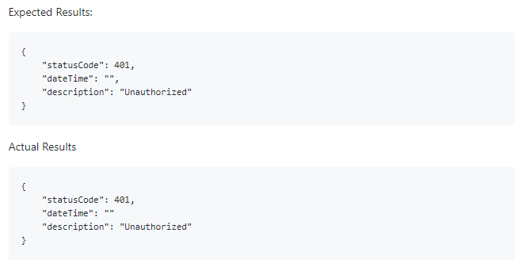

# What’s New

## 28/02/20

Firstly, thank you to all our Alpha partners for your feedback during the first week of the Alpha Phase. It has been incredibly useful in helping us make the necessary changes and updates that ultimately deliver a better experience for you.

Whilst we continue to update the system in the background, here are the highlights of the things we’ve been doing:  

**Changes**  
We have added a more informative way to display if the incorrect number of characters had been used in the ‘Summary’ and ‘Description’ fields on the ‘Submit’ app form. Previously, this wasn’t very obvious and resulted in delay when submitting an App.


**Fixes**  
Thanks to **Navin Mahendran** who reported an issue with the Scaffolder when trying to scaffold an app in the Windows Shell. I’m pleased to confirm this has been fixed and is ready to use immediately.


**Bugs - Interactive API Explorer**   
  
An issue was detected with the ‘CURL’ response, resulting in seeing an ‘Undefined’ error. This is now displaying the correct response.

A missing comma from the JSON response has been found and is now back in place. A well spotted bug from **Erol Ziya**.  

Also, we would like to give a quick thumbs up to those that have used the Live Chat feature and reported a bug directly on our board. It’s proving to be a great way for us to stay in communication and hopefully helping you navigate through the Developers Portal.

## 19-02-2020

What’s new? Well… everything! We have officially gone live with Reapit Foundations. Not only have we decided to create an independent Marketplace for all our Agency Cloud Users but it comes complete with a fully stocked Developers Portal, plus we’ve open sourced everything!

We want to share with you all we can in order to help you develop and interact with our Foundations Platform.

So, let's recap on a few things that we've been up to since the initial launch in Nov 19…

* Open sourced code ✔
* Easy to understand and follow documentation ✔
* Interactive APIs ✔
* Single-sign on and identity service ✔
* New cloud infrastructure ✔
* UI Storybook of usable components ✔
* Feature requesting ✔
* Public Roadmap. ✔

I think it's fair to say, we’ve been busy!

Our Developers have been working incredibly hard and we are all excited to see Reapit Foundations come to life. Each week, I’ll be featuring the best of our releases and talking about the exciting new features we have introduced into the Foundations Platform, as well as sharing updates on our APIs as they happen.

So, this week is the start of the very much anticipated Alpha launch. With that in mind, let me talk you through just a few of the features our new Developer Portal has to offer:

### GitBook Integration

Those of you familiar with [GitBook, ](https://www.gitbook.com)will know they are the leader in the industry for organising and detailing technical documentation. We’ve used the best of the best to ensure you can find and reference what you need as easily as possible. We know the importance of documentation and want you to have the right tools. You can access the documentation from within the developers' portal from the '[Docs](https://marketplace.reapit.cloud/developer/api-docs)' page. 

### Instant Support

Available for a **limited time only**, direct access to our Foundations Platform Product Owners and Developers. You can access this feature from the ‘[Help](http://marketplace.reapit.cloud/developer/help)’ section in the developer portal. We hope you won’t need us and that everything you need can be found within our documentation but it’s nice to know we’re here if you do.

### Full Visibility \([Roadmap](https://github.com/reapit/foundations/milestones?direction=asc&sort=due_date&state=open)\)

From every issue raised through to completion, you’ll have full visibility on what we’re doing. We want you to be a part of this exciting new platform, which is why we’ve opened sourced not only our cloud applications but also our developer portal! Giving you the ability to submit feature requests or to raise bugs directly on our Foundation Repo and track the progress.

These are only a but a few of the features we have included with many more still yet to come.    
  
If you're interested, we will also soon be including a release note section, giving you detailed information on everything that has been changed, fixed or showcasing something new.    

#### Finally... 

Feedback is important!  We have spent a long time creating the Developer Portal and we know it inside out but it helps to hear what you think. So, whilst you are reading through the Documentation, testing the endpoints, or simply navigating through the Portal, we want your feedback. We don't even mind bugs! It's the Alpha Launch, all feedback is welcome. Remember, you can use the [Request a Feature](https://github.com/reapit/foundations/issues/new?labels=feature-request&projects=reapit/foundations/3&body=Summary%20of%20Request:%0d%0dExpected%20Behaviour) or [Report a Bug](https://github.com/reapit/foundations/issues/new?labels=bug&projects=reapit/foundations/2&body=Summary:%0d%0dSteps%20to%20reproduce:%0d%0dExpected%20Results:%0d%0dActual%20Results) from the 'Help' section to get in contact. 

